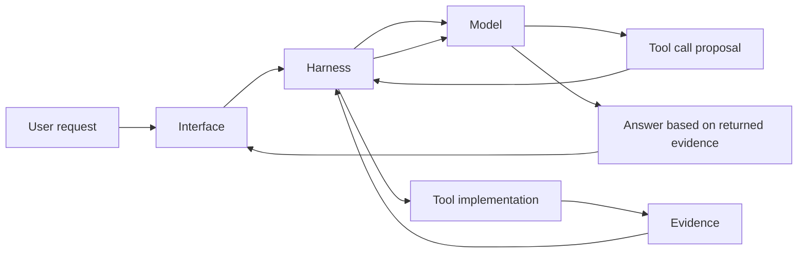
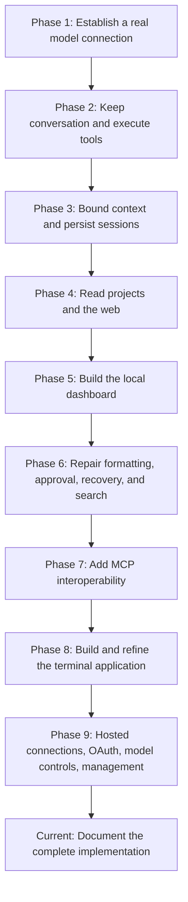

# History and foundations

[Handbook index](README.md) · [Next: architecture](architecture.md)

## 1. The project in ordinary language

Oryn began as a way to understand an agent harness, inspired by Hermes. We first established a real model connection, then added conversational state, tools, persistence, a browser interface, and a terminal interface. The later work focused on making the system usable: honest recovery, clear previews, better formatting, MCP integrations, model controls, and UI polish.

The ambition of performing well on agent benchmarks is a longer-term target. The current repository is an educational local assistant with concrete capabilities and tests. It is not yet a benchmark-leading multi-agent system, a packaged cross-platform product, or a cloud service.

## 2. Four concepts that explain nearly everything

### 2.1 The language model

The model receives a request containing instructions, conversation content, and descriptions of available tools. It predicts a response: ordinary text, tool calls, or both. It can choose `read_file`, but that choice is only structured data until another program handles it.

### 2.2 The harness

The harness is the Python program around the model. It chooses context, passes tool schemas, receives calls, invokes tools, asks approval, tracks cancellation, and decides when the turn has ended.

### 2.3 A tool

A tool is a named operation with an argument schema and a concrete implementation. For example:

```json
{
  "name": "read_file",
  "arguments": {"path": "README.md"}
}
```

The Python implementation reads an allowed file and returns text. Another request lets the model reason from that text.

### 2.4 An interface

An interface displays the conversation and captures user decisions. Oryn has three: the original REPL, the Textual TUI, and the React dashboard. Replacing the interface does not automatically replace the provider or tool engine.



## 3. Complete application commit timeline

This is the repository's application history through the documented snapshot. Commit titles are historical records; descriptions explain the mechanism added or improved. Several commits group multiple changes, so a row is a milestone rather than a claim that only one file changed.

| Date | Commit | Milestone and explanation |
| --- | --- | --- |
| 23 Sep 2026 | [`6c3ffd6`](https://github.com/MetalCloth/mini-hermes/commit/6c3ffd6) | **Initial project setup.** Established the educational project structure. A Codex provider and provider test already existed; many future subsystem files were placeholders. |
| 23 Sep 2026 | [`f7216f6`](https://github.com/MetalCloth/mini-hermes/commit/f7216f6) | **Codex provider demo.** Made it possible to send a prompt through a concrete entrypoint and see a model response. |
| 24 Sep 2026 | [`0957b20`](https://github.com/MetalCloth/mini-hermes/commit/0957b20) | **Plain-text conversation driver.** Added a conversation around the model rather than a one-shot request. |
| 24 Sep 2026 | [`585ff25`](https://github.com/MetalCloth/mini-hermes/commit/585ff25) | **Terminal and file tools.** Introduced operations the harness could execute on the selected project. |
| 24 Sep 2026 | [`a7ed987`](https://github.com/MetalCloth/mini-hermes/commit/a7ed987) | **Bounded conversation context.** Selected recent turns so history could not grow without limit in every request. |
| 24 Sep 2026 | [`b54727e`](https://github.com/MetalCloth/mini-hermes/commit/b54727e) | **SQLite sessions.** Conversations could survive process exit. |
| 24 Sep 2026 | [`c262447`](https://github.com/MetalCloth/mini-hermes/commit/c262447) | **Oversized tool result cap.** Stopped large tool outputs from overwhelming later requests. |
| 24 Sep 2026 | [`baa72b0`](https://github.com/MetalCloth/mini-hermes/commit/baa72b0) | **System prompt.** Established product identity and instructions about tools and answers. |
| 24 Sep 2026 | [`a8f6982`](https://github.com/MetalCloth/mini-hermes/commit/a8f6982) | **Project instructions.** Loaded the root `AGENTS.md` into the model's instructional context. |
| 24 Sep 2026 | [`5d30bee`](https://github.com/MetalCloth/mini-hermes/commit/5d30bee) | **Multiple sessions.** Replaced the assumption of a single permanent chat with independent saved conversations. |
| 24 Sep 2026 | [`3cc73b1`](https://github.com/MetalCloth/mini-hermes/commit/3cc73b1) | **Multiple project folders.** Bound chats to their active folder instead of assuming one developer-specific project. |
| 24 Sep 2026 | [`9770616`](https://github.com/MetalCloth/mini-hermes/commit/9770616) | **Firecrawl extraction and project search.** Added web-page reading and narrower file discovery. |
| 24 Sep 2026 | [`fd0aaea`](https://github.com/MetalCloth/mini-hermes/commit/fd0aaea) | **Browser interaction, streaming, session search.** Exposed progress, page actions, and retrieval of saved conversations. |
| 24 Sep 2026 | [`bbac2fd`](https://github.com/MetalCloth/mini-hermes/commit/bbac2fd) | **React dashboard.** Added a local browser interface around the existing Python harness. |
| 25 Sep 2026 | [`509e469`](https://github.com/MetalCloth/mini-hermes/commit/509e469) | **Dashboard UI iteration.** Developed the visual interface while the search path still needed repair. |
| 25 Sep 2026 | [`f4a9415`](https://github.com/MetalCloth/mini-hermes/commit/f4a9415) | **Tavily search.** Replaced the fragile search scraper with an authenticated search API and actionable configuration/errors. |
| 25 Sep 2026 | [`ddb04f0`](https://github.com/MetalCloth/mini-hermes/commit/ddb04f0) | **Markdown and session controls.** Improved answer rendering, including mathematical notation, and chat management. |
| 25 Sep 2026 | [`67d3261`](https://github.com/MetalCloth/mini-hermes/commit/67d3261) | **File approvals and recovery.** Improved reviewable edits, guarded file operations, undo-related behavior, and truthful incomplete-turn handling. |
| 26 Sep 2026 | [`98bb00c`](https://github.com/MetalCloth/mini-hermes/commit/98bb00c) | **First MCP integrations.** Added Context7, GitHub, and Playwright using the MCP SDK, discovery, routing, and policy decisions. |
| 26 Sep 2026 | [`b38f0c0`](https://github.com/MetalCloth/mini-hermes/commit/b38f0c0) | **Full-screen terminal UI.** Added Textual as a direct Python frontend over the same backend responsibilities. |
| 26 Sep 2026 | [`38fc615`](https://github.com/MetalCloth/mini-hermes/commit/38fc615) | **TUI refinement and MCP fixes.** Iterated layout, pickers, slash commands, and startup/settings behavior. |
| 27 Sep 2026 | [`c2f2cfa`](https://github.com/MetalCloth/mini-hermes/commit/c2f2cfa) | **Nine hosted connections and Notion OAuth.** Switched the external integration set toward official hosted servers and explicit Notion browser authorization. |
| 27 Sep 2026 | [`d40669d`](https://github.com/MetalCloth/mini-hermes/commit/d40669d) | **Model effort, speed, and picker improvements.** Read capabilities from the local Codex catalog, persisted settings per model/session, and repaired version/picker presentation issues. |
| 27 Sep 2026 | [`4a04a15`](https://github.com/MetalCloth/mini-hermes/commit/4a04a15) | **TUI MCP management and tool browser.** Added enable/disable/reconnect/login controls and compact searchable tool rows with separate details. |
| 27 Sep 2026 | [`b81462d`](https://github.com/MetalCloth/mini-hermes/commit/b81462d) | **Theme-matched scrollbars.** Replaced the conspicuous default blue scrollbar across scrollable terminal surfaces with narrow theme colors. |

## 4. Development phases and the reason for each



### Model connectivity before agent complexity

A model demo answered the first necessary question: can this program send a valid authenticated request and parse the response? Tools, sessions, and interfaces depend on that basic contract.

### Tools before product polish

The first tools made the assistant able to inspect and change a project. This introduced new problems that text chat did not have: argument validation, approval, command boundaries, output caps, call IDs, and failure handling.

### Context and persistence solve different problems

Persistence remembers a transcript after a restart. Context selection decides what portion of that transcript reaches the model now. Saving everything does not imply sending everything. Sending a bounded window does not imply deleting old messages.

### Web UI exposed practical defects

With an interactive dashboard, issues became visible: an input could be disabled throughout generation; failed tool histories could cause API errors; mathematical notation could appear as raw characters; incomplete answers could look finished. These were mechanism defects, not problems solved by changing the assistant's tone.

### MCP expanded the operation catalog

Adding MCP meant Oryn could obtain tool descriptions from server implementations instead of writing every integration itself. It also introduced asynchronous session ownership, server startup, external authentication, schema conversion, approvals, and reconnect behavior.

### TUI changed the presentation layer

The move to a terminal application reused the Python harness. The iterations reduced wasted space, moved model information below the composer, used Enter to send, attached slash completion to the composer, cleaned list rows, and preserved the chat behind dialogs. The user chose to retain the OpenCode-inspired visual direction for now; proposed alternative makeover images did not become the application's theme.

## 5. Major bug stories in plain language

| Symptom | What was wrong | Mechanism now used |
| --- | --- | --- |
| Cannot type while Oryn thinks | Generation state was used to disable the input | Keep editing available while separately blocking a second submission |
| HTTP 400: no tool output found | A stored function call lacked a matching output in the next request | Preserve completed call/result pairs and omit orphaned saved calls during serialization |
| Search says no readable results | HTML search scraping could receive human verification or unreadable output | Use Tavily's structured search API and distinguish empty results from service failure |
| LaTeX printed as raw syntax | The renderer did not understand the incoming delimiters and math structure | Normalize supported delimiters and use Markdown plus math plugins in the dashboard |
| Interrupted answer treated as complete | Partial text had insufficient completion metadata | Save status, display an incomplete label, and include both text and an interruption note in future context |
| File preview appeared as an opaque block | Unified diff text was presented without a clear visual structure | Parse change lines and show additions, removals, counts, and a file heading |
| Undo might overwrite later work | A naive restore could ignore intervening file changes | Compare current digest and mode with the recorded post-edit state before approval and again before restore |
| MCP cleanup failed | An async resource could be closed from a different task than the one that opened it | Keep connection lifetime and cleanup inside its owner task |
| npm notices appeared on the TUI | The subprocess wrote to the terminal outside Textual's renderer | Direct MCP subprocess stderr away from the terminal |
| `/session` also suggested `/new` | Description text matched the word “session” | Filter the terminal command list by command name prefix |
| Model required a newer Codex version | Requests advertised an old fixed client version | Prefer the catalog's client version, then installed CLI version, then a fallback |
| Picker descriptions wrapped messily | Long text was squeezed into selectable rows | Use short row labels, real width truncation, and a separate detail area |
| Bright blue scrollbar clashed with theme | Default widget scrollbar styling remained | Apply narrow track/thumb/hover styling to all relevant scrollable widgets |

Detailed failure paths and tests are in [Testing and troubleshooting](13-testing-troubleshooting-and-operations.md).

## 6. What “we trained Oryn” means here

There has been no model fine-tuning or update to model weights in this repository. Improvements came from:

1. Better instructions and tool descriptions.
2. Correct request construction and history handling.
3. More useful tools and external integrations.
4. Deterministic validation and approval.
5. Better recovery and interface behavior.
6. Tests that prevent specific regressions.

These change the system around the model. A stronger model can still perform badly if its tool result is dropped; a well-built harness can make an existing model far more reliable on real tasks.

## 7. Why commit history matters

A commit is a repository snapshot with a message, parent history, and metadata. It is useful for inspecting the change that introduced a feature, comparing versions, or reverting a deliberate change. It is separate from the live undo mechanism Oryn records for approved file edits.

To study a milestone locally:

```bash
git show --stat f4a9415
git show f4a9415 -- src/tools/web_tools.py
git log --oneline --reverse
```

These are inspection commands. The handbook itself does not check out old versions, reset the working tree, or alter Git history.

## 8. What this history cannot establish

The timeline proves which commits exist and which mechanisms are present. It does not prove that every external account is configured, that every hosted service always responds, that each screenshot in the conversation corresponds to a distinct commit, or that all roadmap issues are complete. Source, tests, and live checks provide different kinds of evidence; the handbook keeps those claims separate.
