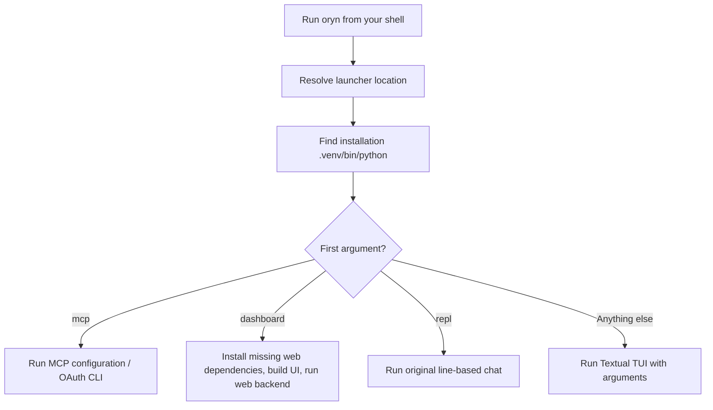
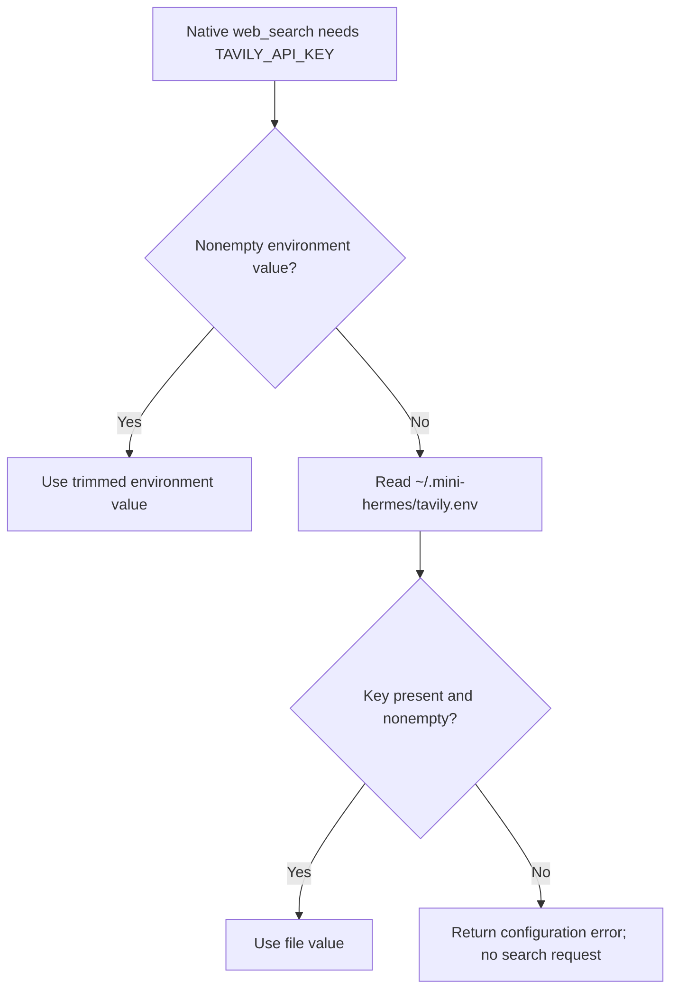

# Installation and configuration

[Handbook index](README.md) · [Previous: architecture](architecture.md) · [Next: provider](03-provider-and-models.md)

## 1. Supported setup versus future product packaging

The current entrypoint is the executable `oryn` script in this repository. It expects a `.venv` beside the source. Oryn is usable from other project folders, but it is not yet distributed as a global packaged command or a standalone desktop installer.

The documented development environment uses Linux and Python 3.14. Dependency metadata allows Python 3.10 for MCP and 3.9 for Textual, but the MCP error-unwrapping code uses Python's `BaseExceptionGroup`, introduced in 3.11. **Use Python 3.11 or newer for this snapshot.** The project's existing short README previously stated 3.10+, which did not account for that runtime path.

| Component | Needed for | Notes |
| --- | --- | --- |
| Python 3.11+ | All interfaces and the harness | Tested local environment: 3.14 |
| `mcp>=2,<3` | MCP integration | Installed SDK version during documentation: 2.2.0 |
| `textual>=8,<9` | Full-screen terminal UI | Rich supplies terminal Markdown rendering |
| Codex CLI with a valid local login | Model authentication and catalog | Oryn reuses CLI credentials |
| Node.js/npm | Dashboard build and local Playwright MCP | Locked Vite requires Node `^20.19.0` or `>=22.12.0`; Playwright setup expects Node.js 20+ |
| `rg` / ripgrep | `search_files` | Searches are delegated to ripgrep |
| `bwrap` / Bubblewrap | Native terminal tool | Linux command isolation; terminal execution refuses to proceed without it |
| Network access | Model, hosted MCPs, Tavily, Firecrawl | Local UI does not imply offline operation |

Dashboard package versions and build commands live in [package.json](../../web/package.json). The Python dependency bounds live in [requirements.txt](../../requirements.txt). No new dependency was introduced to write this handbook.

## 2. First setup

From the repository directory:

```bash
python3 -m venv .venv
.venv/bin/python -m pip install -r requirements.txt
codex login
./oryn
```

The launcher directly invokes `.venv/bin/python`, so activating the environment is optional for these commands. If you prefer activation:

```bash
source .venv/bin/activate
```

Fish uses:

```fish
source .venv/bin/activate.fish
```

No OpenAI API key field is required by the current provider. Its authentication source is the Codex CLI's local login file. Additional web services and MCP connections have their own authorization.

## 3. Launcher behavior

[oryn](../../oryn) resolves its installation directory, finds the local virtual environment, and supplies `PYTHONPATH` so Python can import `src` from that installation. It preserves the caller's working directory, which is the default active project.



For another project, either pass its path or invoke the installed launcher from that folder:

```bash
/path/to/mini-hermes/oryn --project /path/to/my-project
```

The placeholder paths in examples should be replaced with real directories. The repository does not need to live inside the project you want to inspect.

## 4. Interface commands

### Full-screen terminal UI

```bash
./oryn
./oryn --new
./oryn --project /path/to/project
./oryn --list
./oryn --search "a phrase in previous conversations"
./oryn --resume SESSION_ID
./oryn --model gpt-5.6-luna
```

The TUI also accepts effort and speed flags. Their values must be supported by the selected model's local catalog entry:

```bash
./oryn --model gpt-6-astra --effort high --speed fast
```

This is an example of setting a model ID, not a promise that that model or priority tier is enabled for every account. Unknown model capabilities retain defaults; unsupported settings are rejected.

### Original terminal REPL

```bash
./oryn repl
./oryn repl --project /path/to/project
./oryn repl --new
```

The REPL is useful for studying the harness without a full-screen renderer. It has console approvals and persistent sessions, but does not provide the TUI's picker interface.

### Local dashboard

```bash
./oryn dashboard
./oryn dashboard --project /path/to/project
./oryn dashboard --port 9120 --no-open
```

The default is `127.0.0.1:9119`. The launcher runs `npm ci` when web dependencies are absent, builds the frontend, and starts Python's dashboard server. `--no-open` suppresses automatic browser opening.

For UI development, run the backend and Vite in separate terminals:

```bash
.venv/bin/python -m src.web_app --no-open
```

```bash
cd web
npm ci
npm run dev
```

Vite proxies `/api` to the local backend on port 9119. Its configuration adjusts the origin used for that proxy to match the backend's local-origin checks. The production dashboard launcher serves the built files rather than the Vite development server.

## 5. Local data and credential inventory

`~` means the home directory of the user running Oryn. None of these examples contain a real secret.

| Path | Contents | Owner |
| --- | --- | --- |
| `~/.codex/auth.json` | Codex access/refresh tokens and account ID | Codex CLI; read/refreshed by provider |
| `~/.codex/models_cache.json` | Discovered model catalog and client version metadata | Codex CLI; read by Oryn |
| `~/.mini-hermes/sessions.sqlite3` | Saved transcripts and session metadata | SQLite store |
| `~/.mini-hermes/tavily.env` | Native Tavily search key | Native web tool configuration |
| `~/.mini-hermes/firecrawl.env` | Native Firecrawl extraction/browser key | Native web tool configuration |
| `~/.mini-hermes/mcp.env` | Keys for MCP presets | MCP configuration |
| `~/.mini-hermes/mcp-settings.json` | Enabled switches and known-server migration information | MCP preferences |
| `~/.mini-hermes/mcp-notion-auth.json` | Notion OAuth client/token data and metadata | OAuth token storage |

The database and OAuth cache are owner-readable/writable only in the implemented local paths. Credential files should also be restricted to the owner.

## 6. Native Tavily and Firecrawl setup

Create the configuration directory, then create the needed files in your editor:

```bash
mkdir -p ~/.mini-hermes
chmod 700 ~/.mini-hermes
```

`~/.mini-hermes/tavily.env`:

```env
TAVILY_API_KEY=
```

`~/.mini-hermes/firecrawl.env`:

```env
FIRECRAWL_API_KEY=
```

After filling the values locally:

```bash
chmod 600 ~/.mini-hermes/tavily.env ~/.mini-hermes/firecrawl.env
```

Run that last command only for files you have actually created. The blank examples are placeholders, not usable credentials.

### Configuration precedence

The helper [local_secret](../security/secrets.py) first checks a nonempty environment variable. If absent, it reads the specified local file. The parser accepts simple `KEY=VALUE` lines, skips blank/comment lines, trims whitespace, and removes matching surrounding quotes.



**Important:** the native `web_search` tool reads `tavily.env`, not `mcp.env`. The native Firecrawl tools read `firecrawl.env`. MCP presets can fall back to those native key files. The fallback works from MCP configuration toward native files; merely putting a key in `mcp.env` does not configure the native tool. A process environment variable can configure both paths.

Repository `.env.example` documents native placeholders. Oryn does not automatically load every `.env` file from the active project.

## 7. MCP configuration

Copy [mcp.env.example](../../mcp.env.example) to the local location, then fill only the services you want:

```bash
mkdir -p ~/.mini-hermes
cp mcp.env.example ~/.mini-hermes/mcp.env
chmod 600 ~/.mini-hermes/mcp.env
```

The keys include:

```env
GITHUB_PERSONAL_ACCESS_TOKEN=
CONTEXT7_API_KEY=
HF_TOKEN=
TAVILY_API_KEY=
FIRECRAWL_API_KEY=
EXA_API_KEY=
LINEAR_API_KEY=
NOTION_ACCESS_TOKEN=
```

Notion normally uses the implemented OAuth login rather than a manually copied token. A standard Notion integration key is not equivalent to the OAuth access token required by its hosted MCP connection.

If a file already contains your keys, edit it rather than copying a template over it. Never commit filled credentials.

### Activate and inspect connections

In the TUI:

1. Open `/mcps`.
2. Search or highlight the service.
3. Use Enter or Ctrl+E to enable/disable.
4. Use Ctrl+R to reconnect after updating credentials.
5. Use Ctrl+L for Notion login.

Reconnect reloads default-preset credentials, so changing the key file does not require closing the TUI. The CLI switches affect the next process startup:

```bash
./oryn mcp enable github
./oryn mcp disable github
./oryn mcp login notion
```

Connections with missing required credentials are marked unavailable. One connection failing does not disable native tools or all other connections.

## 8. Projects and sessions

The project root must be an existing allowed directory. File tools receive project-relative paths such as `src/example.py`. The root is not the same as the current chat title or model ID.

A saved chat is bound to its project. Resuming it restores that root; attempting to rebind the same session to a different root raises an error. This avoids a conversation about project A accidentally writing into project B.

The legacy `main` session is retained for backward compatibility. New sessions use UUID-based IDs. Different current directories and explicit project selection create/use the corresponding session flow rather than requiring a path hardcoded for one person.

## 9. Common setup mistakes

| Mistake | Result | Fix |
| --- | --- | --- |
| Launch without `.venv/bin/python` | Launcher cannot start the application | Create the repository virtual environment and install requirements |
| Missing Codex login | Provider cannot read usable tokens | Run `codex login` with the intended account |
| Key copied only into repository template | Tool still sees no configured key | Put it in the documented home configuration file or environment |
| Tavily key only in `mcp.env` | Tavily MCP may work, native search may fail | Also configure native `tavily.env`, or use environment configuration |
| Integration key supplied to Notion OAuth connection | Authorization fails | Use explicit Notion browser login or an actual compatible OAuth token |
| Playwright enabled without Node/npm | Local MCP startup fails | Install a compatible Node/npm runtime or disable that connection |
| No ripgrep | File search fails | Install `rg` for the supported platform |
| No Bubblewrap | Terminal tool refuses execution | Install supported Bubblewrap or avoid terminal calls |
| Launch dashboard without build via direct module | Static UI may return a build error | Use the launcher or run the frontend build |
| Catalog advertises stale client version | Newer models may reject the request | Upgrade/refresh Codex and its local catalog |

## 10. What setup does not include yet

There is no first-run wizard, account login page for Oryn itself, packaged desktop binary, global `pipx` release workflow, automatic installation of system tools, or general UI for adding arbitrary MCP URLs. The implemented MCP manager controls the known presets. These are product roadmap items, not hidden setup options.
