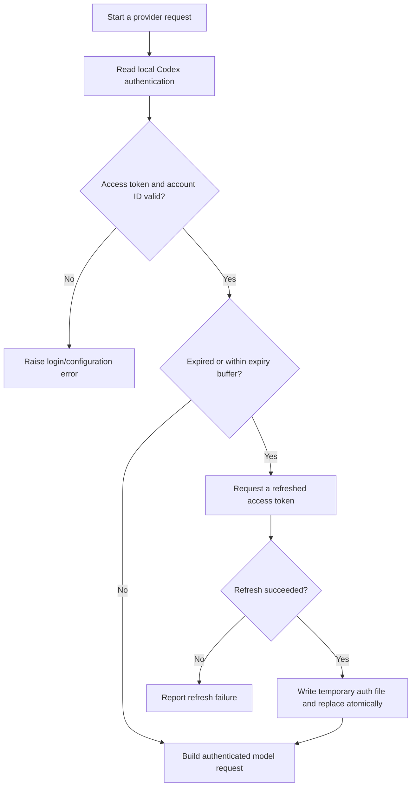
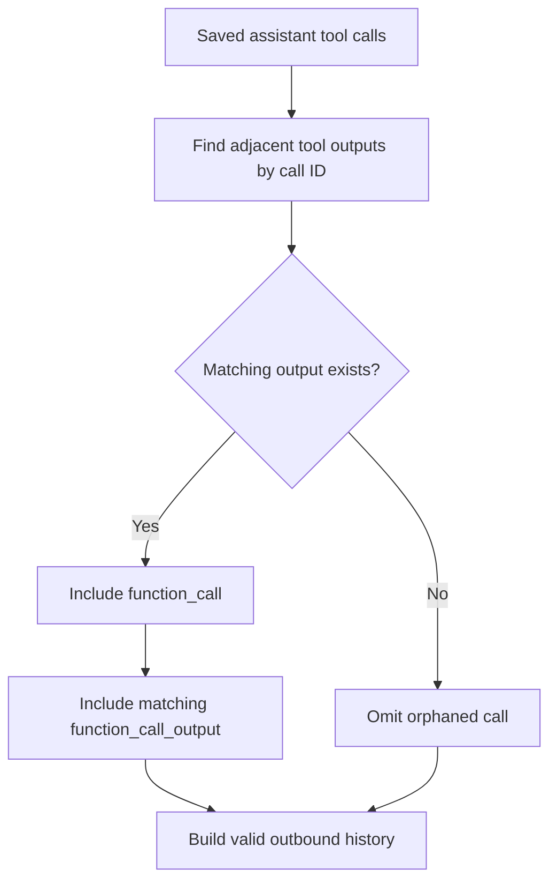
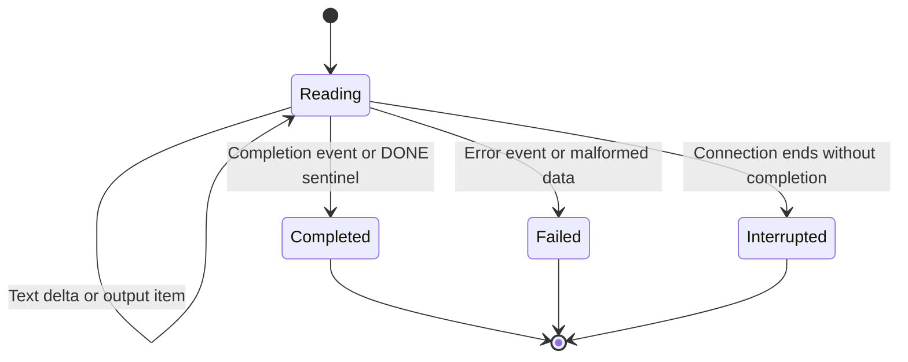
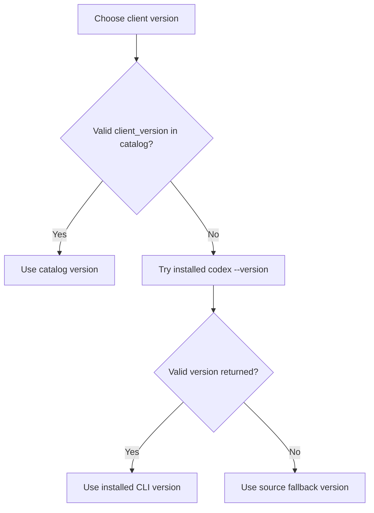

# Codex provider and model controls

[Handbook index](README.md) · [Previous: installation](02-installation-and-configuration.md) · [Next: loop and context](04-agent-loop-and-context.md)

Primary source: [codex.py](../providers/codex.py), [types.py](../providers/types.py). Tests: [test_codex.py](../tests/test_codex.py).

## 1. What the provider is responsible for

The provider translates between Oryn's Python representation and the remote model protocol. It owns authentication, request headers, model settings, Responses input serialization, and SSE response parsing. It does not choose which local file to edit, display an approval dialog, save a chat, or repeat tool rounds; those are other responsibilities.

The concrete class is `CodexProvider`. The other provider modules are placeholders. There is no working multi-provider router at this snapshot.

The endpoint currently embedded in this implementation is:

```text
https://chatgpt.com/backend-api/codex/responses
```

This documents the repository's actual endpoint usage. It is not a guarantee that an account endpoint is a stable public API contract. The compatibility/version handling in this chapter exists because that behavior can change.

## 2. Authentication: reusing a local Codex login

The provider reads `~/.codex/auth.json`, or an explicitly supplied auth-file path in code. It requires a usable access token and account ID. If missing or invalid, its error directs the user toward `codex login`.

The request includes:

| Header | Purpose |
| --- | --- |
| `Authorization: Bearer ...` | Authenticate the request |
| `ChatGPT-Account-ID` | Identify the account associated with the request |
| `Content-Type: application/json` | Describe request bytes |
| `Accept: text/event-stream` | Request streaming events |
| `Originator: codex_cli_rs` | Client identification used by this integration |
| `Version` and `User-Agent` | Advertise the selected compatible client version |
| `OpenAI-Beta: responses=experimental` | Protocol header used by the current implementation |

Secrets are not printed in this handbook. A token authenticates requests; it is not a tool description and does not teach the model which operations exist.

### Expiration and refresh

The code decodes the JWT payload to inspect expiration. It considers a token near expiry with a 60-second buffer. This local decoding is an expiration check; it is not a cryptographic verification of a person's identity.

If refresh is needed, `_refresh` sends a form-encoded refresh request to `https://auth.openai.com/oauth/token`, using the stored refresh token and the client ID configured in the source. It requires a valid new access token, retains the old refresh token if no replacement is returned, and updates the refresh timestamp.



The refreshed auth file is written beside the existing file and installed with `os.replace`. This reduces the chance of a partially written JSON file. Authentication is separate from Oryn session history: changing a model or opening a new chat does not create a new Codex login.

## 3. The local result types

The provider returns a small structure equivalent to:

```python
ToolCall(id="call_example", name="read_file", arguments={"path": "README.md"})
ModelResponse(text="I will inspect the file.", tool_calls=[...])
```

`arguments` must decode to a JSON object. Invalid JSON or a non-object shape is an error, not a shell command to execute. The loop receives ordinary Python data and selects the tool implementation.

## 4. Converting Oryn history into a request

Oryn history contains dictionaries such as:

```json
[
  {"role": "system", "content": "You are Oryn..."},
  {"role": "user", "content": "Read README.md"},
  {
    "role": "assistant",
    "content": "",
    "tool_calls": [
      {"id": "call_example", "name": "read_file", "arguments": {"path": "README.md"}}
    ]
  },
  {
    "role": "tool",
    "tool_call_id": "call_example",
    "name": "read_file",
    "content": "# Example project"
  }
]
```

The provider collects system/developer content into `instructions`. It converts user and assistant text into endpoint-compatible content items. A tool call and its output become separate input items:

```json
{
  "type": "function_call",
  "call_id": "call_example",
  "name": "read_file",
  "arguments": "{\"path\": \"README.md\"}"
}
```

```json
{
  "type": "function_call_output",
  "call_id": "call_example",
  "output": "# Example project"
}
```

Notice that the function arguments are serialized JSON text in the outbound item, while the local `ToolCall.arguments` is a Python dictionary. The call ID is the join key connecting the request and its result.

### The missing tool output bug

The reported endpoint error was essentially:

```text
No tool output found for function call call_example
```

A model API can require each included function call to have a corresponding result. An interruption or failure could previously leave an unanswered saved call. Sending it on the next turn produced HTTP 400.

The current provider scans an assistant call message and the immediately following tool-message run to identify matching IDs. It serializes only those completed calls. It sends a tool output only if that call was actually serialized. Assistant text can still be included even when an orphaned call is omitted.



The loop also groups completed calls and results before appending them. These are two checks at different boundaries: avoid creating new broken history, and tolerate legacy or interrupted history during serialization.

## 5. Outbound payload

A simplified request after serialization:

```json
{
  "model": "gpt-5.6-luna",
  "instructions": "Oryn instructions plus project instructions",
  "input": [
    {"role": "user", "content": [{"type": "input_text", "text": "Explain this function"}]}
  ],
  "stream": true,
  "store": false,
  "tool_choice": "auto",
  "tools": ["actual function schema objects go here"]
}
```

The final `tools` example is explanatory shorthand, not valid production schema. Real function schemas come from `tool_schemas` and the MCP adapter.

When no tools are supplied, the provider omits the tool fields. When effort and service tier remain `default`, it omits those optional fields and lets the endpoint choose defaults. Explicit settings add:

```json
{
  "reasoning": {"effort": "high"},
  "service_tier": "priority"
}
```

These settings must first pass catalog validation.

## 6. Reading the stream

`_response_text` reads server-sent events, not a complete answer string returned immediately. An event can contain one or more `data:` lines followed by a blank line. The parser collects the event, decodes JSON, handles it, and continues.

Relevant behaviors:

| Event / condition | Parser action |
| --- | --- |
| Text delta | Append text and call the text callback |
| Completed output item containing a function call | Validate and collect `ToolCall` |
| Completed response | Use final output as a fallback when no deltas/calls were already collected |
| Error or failed response | Raise an error |
| `[DONE]` sentinel | Recognize stream completion |
| End of connection without completion | Reject as an incomplete stream |
| Empty text and no tool calls | Reject an empty response |
| Invalid event shape or invalid function arguments | Report a parsing error |



This prevents an abruptly closed stream from being silently treated as a complete answer. The UI can retain the text already displayed and mark it failed.

## 7. Cancellation while waiting for network data

Checking a cancellation flag before the request is insufficient: a thread might already be blocked waiting for the next stream bytes. The provider starts a watcher when a cancellation event is supplied. It polls the event at a short interval and shuts down the response socket to wake the read. If the CPython response internals are unavailable, it falls back to closing the response.

The watcher uses a `finished` event so it exits after normal completion. The provider converts cancelled network failures into interruption behavior rather than presenting them as an unrelated endpoint error.

This is a practical CPython/urllib-specific implementation. It is not a universal cancellation primitive for every HTTP library. Cancelling a request also cannot retroactively undo a completed remote action.

## 8. Model catalog and available choices

`cached_models()` reads the catalog beside the auth file, normally `~/.codex/models_cache.json`. It selects entries advertised with `visibility == "list"` and usable model identifiers. Reading the cache makes the picker immediate and does not itself contact the model service.

`model_options()` reads the selected model's:

- `supported_reasoning_levels`.
- `default_reasoning_level`.
- `service_tiers`.

It always retains a provider-default choice. Unknown models or missing/malformed catalog entries do not invent effort levels or priority availability.

Illustrative metadata:

```json
{
  "slug": "example-model",
  "supported_reasoning_levels": [
    {"effort": "low", "description": "Lighter reasoning"},
    {"effort": "high", "description": "Deeper reasoning"}
  ],
  "default_reasoning_level": "low",
  "service_tiers": [{"id": "priority", "name": "Fast"}]
}
```

The actual cache belongs to the local Codex installation and account. This fabricated entry demonstrates fields, not a currently sold model.

### Effort and speed are separate

| Control | Changes | Does not guarantee |
| --- | --- | --- |
| Reasoning effort | The requested reasoning level | Correctness on every task or a fixed latency |
| Speed / service tier | Processing tier such as priority when advertised | A particular token rate or support on every model/account |
| Model | Model identifier | Identical capabilities and options across providers |

`standard` maps to `default`. `fast` maps to `priority` when that option is advertised. Invalid values produce a useful allowed-choice error. Higher effort can take longer; priority is a tier request rather than an application-side CPU speed knob.

The TUI saves settings per session and per model. Switching back to a model restores that model's valid choices. Settings no longer in the catalog fall back to defaults.

## 9. The outdated-version failure

An observed HTTP 400 said the selected newer model required a newer Codex version. Oryn was advertising an old fixed version. The provider now chooses:



The source fallback is `0.157.1` at this snapshot. The installed CLI check has a short timeout. Upgrade and refresh the catalog if a model rejects the advertised version; a code fallback cannot promise indefinite compatibility with future models.

## 10. Errors and present limits

HTTP errors include status/body information; unreachable endpoints get a connectivity error. There is no generic exponential retry loop, automatic model fallback, request cost meter, or alternate-provider routing. The request timeout is 120 seconds, and refresh uses a shorter timeout.

The provider receives already selected context, but the full payload also includes all advertised tools. An 80,000-character history budget is not a full request-token budget. The large MCP catalog can add significant payload beyond the transcript.

Provider tests verify serialization, pairing, stream completion, errors, cancellation, settings, and version selection. They mock transport behavior; they do not prove every account has access to every catalog model.
