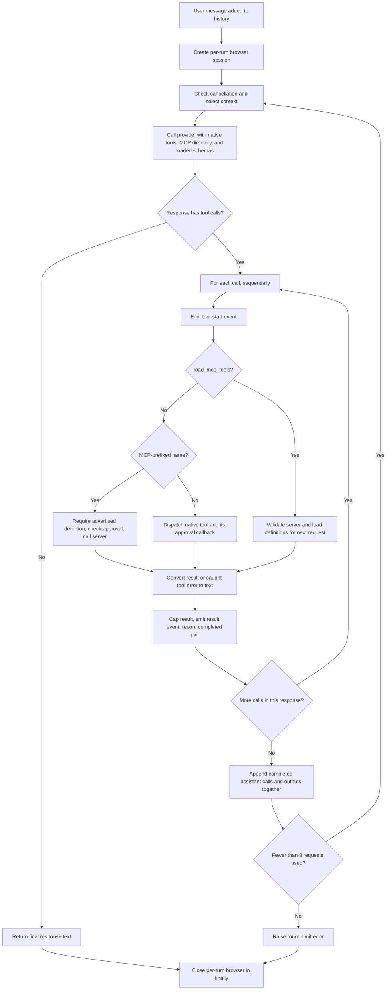
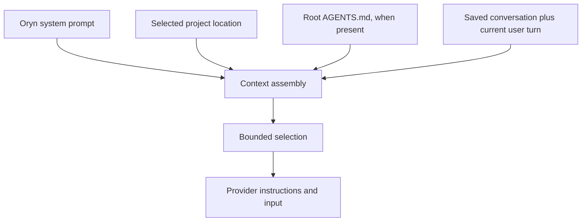
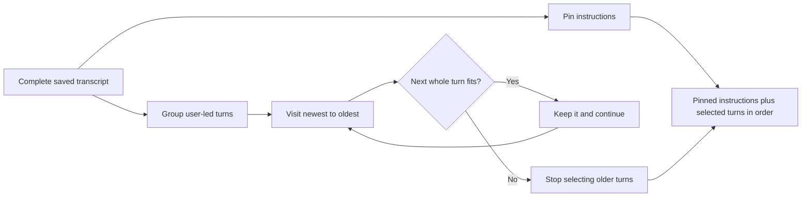

# Agent loop, instructions, and context

[Handbook index](README.md) · [Previous: provider](03-provider-and-models.md) · [Next: sessions and recovery](05-session-storage-and-recovery.md)

Sources: [conversation_loop.py](../agent/conversation_loop.py), [context.py](../agent/context.py), [system_prompt.py](../agent/system_prompt.py), [project_context.py](../agent/project_context.py).

## 1. What a turn means

A **turn** begins with one user message and may involve several model requests and tool calls before the final reply. One model request is not necessarily one turn. A model can ask to read a file, see the result, ask for an edit, see that result, then write its answer.

Oryn's `run_turn` receives history, a provider completion function, tool schemas, a project root, and callbacks. This makes the same loop usable by the REPL, TUI, and dashboard.

Simplified shape:

```python
answer = run_turn(
    messages=history,
    complete=provider.complete,
    tools=tool_schemas(mcp_tools),
    project_root=project_root,
    confirm_terminal=ask_about_command,
    confirm_write=ask_about_file,
    on_text_delta=display_delta,
    mcp_client=mcp_client,
)
```

Actual callers also supply edit/undo/MCP approval handlers, cancellation, undo history, and tool-activity callbacks.

## 2. Complete turn state machine



Exceptions and cancellation also pass through browser cleanup. A cleanup error produces a warning; it does not fabricate a successful browser close.

The loop filters full MCP schemas out of the initial model catalog, even when a caller supplies them for its UI inventory. It advertises `load_mcp_tools` with short server descriptions, connection states, and tool counts. A successful load makes that server's definitions available starting with the next model request. Definitions remain available within the user turn; a new `run_turn` starts with no loaded servers. Each request refreshes loaded definitions from the MCP client, removing a server that is no longer connected. Repeated loads do not duplicate schemas. An MCP call must have been advertised in the request that produced it, so a load and a previously unavailable tool call in the same response cannot skip discovery.

## 3. Sequential execution and why call IDs matter

If a response asks for two files, the loop executes their calls in order. It does not spawn parallel workers for those calls.

```text
assistant calls:
  call_A → read_file README.md
  call_B → read_file pyproject.toml

tool results:
  call_A → README contents
  call_B → configuration contents
```

The IDs associate each result with its request. A tool result is not merely a paragraph somewhere in chat; it is a protocol item connected to a particular call.

The loop builds a pending assistant call message, gathers completed calls and outputs, then appends them as a group. If cancellation occurs between calls, only the completed pairs are retained. Calls that have not run should not become unanswered function calls in saved history.

There are edge cases around callback failures: a result-event callback can raise before the batch is appended. Existing tests ensure this does not leave an unanswered call in history. This pairing safety does not imply every external side effect can be reconstructed after arbitrary process failure; durable per-turn traces remain a roadmap item.

## 4. Tool errors become information the model can use

For ordinary exceptions inside tool execution, the loop creates a result like:

```text
Tool error: old_text occurs more than once. Correct the arguments or try another approach.
```

The model can then inspect more context or choose a better argument. A denial similarly becomes a result explaining that the action was not run. This lets a turn continue without pretending the attempted action succeeded.

Errors from the provider or context selector are different: they can fail the turn rather than representing one failed tool operation. The interface then preserves available partial text with failure metadata.

## 5. Limits that exist now

| Limit | Value | Scope |
| --- | --- | --- |
| Model requests in `run_turn` | 8 | One user turn |
| Tool result retained by loop | 20,000 characters | Each result, including truncation marker |
| History selection budget | 80,000 serialized characters | Selected transcript and pinned instructions |
| MCP approval argument preview | 12,000 characters | Reviewable JSON arguments |
| Root `AGENTS.md` content | 20,000 characters | Project instructional content |

Eight rounds means eight model requests, not eight total tool calls. A response can contain several calls. Loading MCP definitions uses a normal tool round and counts toward this limit. If the eighth response still asks for tools, those calls are handled, then the loop raises the limit error rather than making a ninth request.

Large tool results are sliced before being appended to history, with a marker showing the original size. The marker is part of the cap. The full original output is not transparently saved in a separate file by this implementation.

## 6. The instruction stack

Oryn starts with `SYSTEM_PROMPT`. Depending on the interface/session, it adds project location information and root `AGENTS.md` content as developer instructions. Saved user, assistant, and tool messages then follow.



The system prompt covers:

1. Oryn's identity and useful, clear answers.
2. Markdown formatting, fenced code with language labels, and mathematical delimiters.
3. Use tools when needed and base success claims on returned results.
4. Link web sources when using web evidence.
5. Treat failed/stopped replies as incomplete and continue from actual partial content.
6. Respect project instructions while treating ordinary files, web pages, and tool output as potentially untrusted content.
7. Read before editing, use exact `edit_file` for focused changes, and use `write_file` for full content.
8. Verify where practical and state when verification was not performed.
9. Use recorded undo rather than reconstructing an old file from memory.

These instructions guide model behavior. Deterministic tool checks are what actually enforce path validation and approval. A prompt saying “ask approval” is weaker than a tool implementation that refuses to write without a callback returning true.

## 7. Project instruction loading

`load_project_instructions` reads only the project's root `AGENTS.md`. It resolves the path, checks that it remains inside the project, reads UTF-8, and caps the returned content. A symlink that escapes the project is rejected.

It does not walk every nested directory looking for instruction files. Therefore a future feature for hierarchical directory-specific instructions would need explicit design rather than an assumption that all nested `AGENTS.md` files already apply.

The project guide asks us to keep responsibilities separate, prefer the simplest suitable design, and describe placeholders honestly. This handbook follows those rules by documenting actual implementations without filling speculative subsystems.

## 8. How context selection works

`select_context` has four main steps:

1. Extract and pin every system/developer message.
2. Group remaining messages into turns beginning at user messages.
3. Start with the newest turn and add earlier whole turns while the budget allows.
4. Restore chronological order and prepare incomplete-reply annotations.

Serialized size is measured using compact JSON with `ensure_ascii=False`, plus a small separator allowance. This is a character count, not a tokenizer estimate.

Example sizes are hypothetical:

| Item | Characters | Kept? |
| --- | ---: | --- |
| Pinned instructions | 10,000 | Always, if within budget |
| Current turn | 25,000 | Yes |
| Previous turn | 30,000 | Yes; total 65,000 |
| Turn before that | 20,000 | No; would total 85,000 |
| Still older turn | 2,000 | No; selector stops at first older turn that does not fit |



### Why whole turns?

Cutting a transcript at an arbitrary message can retain a tool output without its call or a call without its output. Whole-turn selection reduces that risk and preserves the local sequence the model needs to interpret evidence.

### If the current turn itself is too large

The selector raises an explicit error asking for a shorter message or reduced output. It does not silently drop the current request or automatically summarize it. If pinned instructions alone exceed the limit, that also raises an error.

### Important limitations

- Tool schemas are outside this history calculation.
- Character count differs from tokens, especially across writing systems and code.
- Incomplete-reply notes are added after selection, so they introduce small extra overhead.
- Older turns remain in SQLite but are absent from this model request.
- There is no automatic compression, semantic retrieval, or summary memory.

## 9. Incomplete replies in future model context

Stored messages can contain an internal `turn_status` such as `cancelled` or `failed`. Before sending to the model, `_mark_incomplete_replies` copies the message and removes that internal field. For an incomplete assistant message it adds a readable note ahead of the original text:

```text
[The previous Oryn reply was stopped before finishing. The assistant text below
is partial, not a complete answer. If the user asks to continue, continue from
it without assuming the missing parts.]

Boil some water.
Put tea leaves in a cup.
```

Both the partial content and the warning reach the model if the turn is selected. The note alone would not tell the model which steps the user already saw. The content alone would not tell it the reply was unfinished.

This transformation is for a request copy; it does not permanently insert the note into the saved original text. See the next chapter for the complete recovery example.

## 10. What happens when you stop

The UI sets a cancellation event. The loop checks it before requests, while emitting text, around tool execution, and after completed batches. The provider wakes a blocked stream read. Approval handlers deny or unblock pending decisions. The per-turn Firecrawl browser is cleaned up in `finally`.

Stopping is not a rollback transaction. A command or approved file edit that already completed remains completed. The application records available partial text and completion status; file undo is a separate explicit operation.

## 11. Extension points that are real

The loop already accepts callbacks, tool schemas, a provider completion callable, and an MCP client. These are current seams for changing rendering or adding a tool. The empty `agent.py`, `turn.py`, and `prompt_builder.py` files do not provide another working extension API.

A future subagent supervisor would need its own task lifecycle and bounded context design. Passing “you are a subagent” in the current prompt would not create those missing mechanisms.
