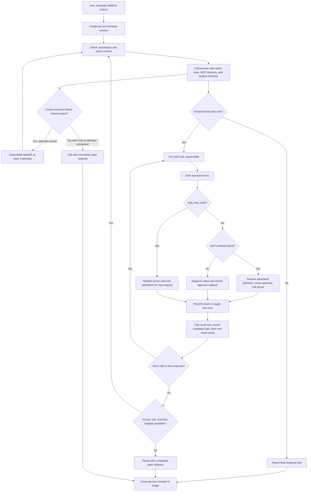
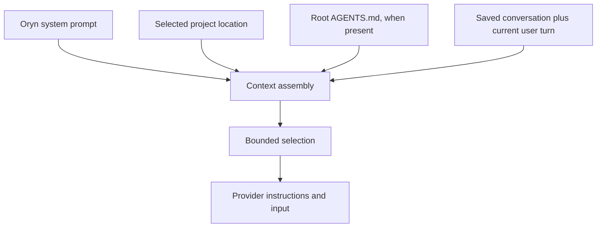
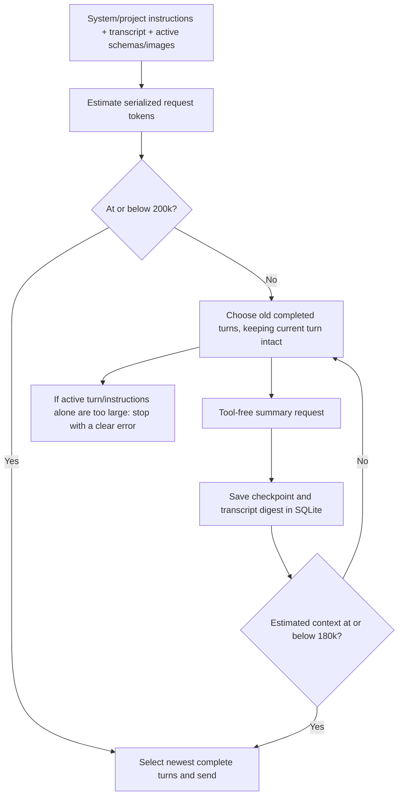
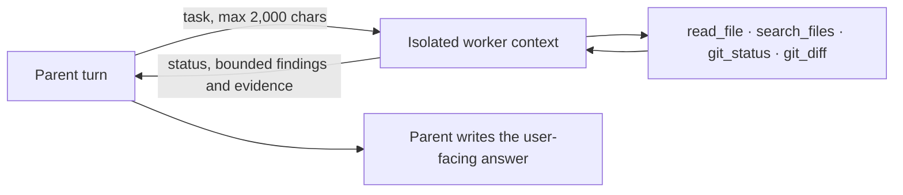

# Agent loop, instructions, and context

[Handbook index](README.md) · [Previous: provider](03-provider-and-models.md) · [Next: sessions and recovery](05-session-storage-and-recovery.md)

Sources: [conversation_loop.py](../agent/conversation_loop.py), [context.py](../agent/context.py), [system_prompt.py](../agent/system_prompt.py), [project_context.py](../agent/project_context.py), [skills.py](../agent/skills.py), [subagents.py](../agent/subagents.py).

## 1. What a turn means

A **turn** begins with one user message and may involve several model requests and tool calls before the final reply. One model request is not necessarily one turn. A model can ask to read a file, see the result, ask for an edit, see that result, then write its answer.

Oryn's `run_turn` receives history, a provider completion function, tool schemas, a project root, and callbacks. This makes the same loop usable by the REPL, TUI, and dashboard.

Simplified shape:

```python
answer = run_turn(
    messages=history,
    complete=provider.complete,
    tools=tool_schemas(mcp_tools),
    project_root=project_root,
    confirm_terminal=ask_about_command,
    confirm_write=ask_about_file,
    on_text_delta=display_delta,
    mcp_client=mcp_client,
)
```

Actual callers also supply edit/undo/MCP approval handlers, cancellation, undo history, tool-activity callbacks, `TurnLimits`, and an optional `on_status` callback for budget/retry messages.

## 2. Complete turn state machine



Exceptions and cancellation also pass through browser cleanup. A cleanup error produces a warning; it does not fabricate a successful browser close.

The loop filters full MCP schemas out of the initial model catalog, even when a caller supplies them for its UI inventory. It advertises `load_mcp_tools` with short server descriptions, connection states, and tool counts. A successful load makes that server's definitions available starting with the next model request. Definitions remain available within the user turn; a new `run_turn` starts with no loaded servers. Each request refreshes loaded definitions from the MCP client, removing a server that is no longer connected. Repeated loads do not duplicate schemas. An MCP call must have been advertised in the request that produced it, so a load and a previously unavailable tool call in the same response cannot skip discovery.

On a TUI `/computer` turn, `run_turn` also advertises the scoped computer tools. Their results can carry one screenshot alongside text. After the next model response, the loop removes the image bytes and replaces the old control listing with a short text outcome; call and result IDs remain paired. This keeps the same turn and context machinery while limiting repeated image payloads. The [computer decision record](21-cua-main-loop.md) explains the choice and its limits.

## 3. Sequential execution and why call IDs matter

If a response asks for two files, the loop executes their calls in order. It does not spawn parallel workers for those calls.

```text
assistant calls:
  call_A → read_file README.md
  call_B → read_file pyproject.toml

tool results:
  call_A → README contents
  call_B → configuration contents
```

The IDs associate each result with its request. A tool result is not merely a paragraph somewhere in chat; it is a protocol item connected to a particular call.

The loop builds an assistant call message and appends each completed call and its output to history before reporting the result to the UI. If cancellation or a budget stop occurs between calls, only the completed pairs are retained. Calls that have not run do not become unanswered function calls in saved history.

Previously, a result-event callback could fail before the batch was recorded, losing evidence of an executed action. Recording the completed pair first fixes that boundary; tests verify the pair survives a callback failure. This updates live history, which interfaces save when the turn finishes. It does not imply every external side effect can be reconstructed after process failure; local traces preserve bounded metadata, not the full conversation or effects.

## 4. Tool errors become information the model can use

For ordinary exceptions inside tool execution, the loop creates a result like:

```text
Tool error: old_text occurs more than once. Correct the arguments or try another approach.
```

The model can then inspect more context or choose a better argument. A denial similarly becomes a result explaining that the action was not run. This lets a turn continue without pretending the attempted action succeeded.

Errors from the provider or context selector are different: they can fail the turn rather than representing one failed tool operation. The interface then preserves available partial text with failure metadata.

Eligible provider failures get at most three attempts before any response output. Only known read-only MCP operations get transient retries, within their existing 90-second total deadline. Playwright calls and uncertain mutations are excluded. An interrupted operation produces a result asking the model to inspect effects before repeating it. Retry messages use the existing status callback; no independent retry supervisor or durable attempt log is implemented.

## 5. Limits that exist now

| Limit | Value | Scope |
| --- | --- | --- |
| Model rounds in `run_turn` | 40 by default; configurable 1–200 | One user turn; up to three transport attempts per round |
| Tool calls in `run_turn` | 200 by default; configurable 1–2,000 | One user turn, including loads, denials, and tool errors |
| Turn time allowance | 1,200 seconds by default; configurable 1–7,200 | One user turn, checked at execution boundaries |
| Tool result retained by loop | 20,000 characters | Each result, including truncation marker |
| Context compaction trigger | 200,000 estimated tokens | Instructions, selected transcript, active tool schemas, and image estimates |
| Post-compaction target | 180,000 estimated tokens | Leaves room for the next request and reduces repeated prompt size |
| Image history budget | 20 MiB total; 5 MiB per image; four images per message | Image bytes in selected conversation context |
| MCP approval argument preview | 12,000 characters | Reviewable JSON arguments |
| Root `AGENTS.md` content | 20,000 characters | Project instructional content |

A round means one model response, with up to three attempts when retry is safe. A response can contain several tool calls. Loading MCP definitions counts as a tool call and consumes a model round. `--max-rounds`, `--max-tool-calls`, and `--max-turn-seconds` configure the same validated `TurnLimits` in all three launchers; the selected limits are reported at turn start.

At a limit the loop raises `TurnLimitReached`, and the interface records `turn_status="paused"` with completed tool pairs and available partial text. For a multi-call response, calls beyond the tool allowance are never run or saved. A final text response can still finish after the last allowed tool call if another round and time remain.

Example: `--max-rounds 1` allows one response requesting `write_file`. After approval, the file is created and its call/result remain paired. The turn then pauses before a second request. A new user message saying “Continue” starts a new budget with that saved evidence. The loop does not rerun the creation automatically; any newly requested mutation still needs its usual approval and guards.

The time allowance sets the turn cancellation event and is checked before/after approvals, during retry waits, and between execution steps. The TUI and dashboard release pending approvals on expiry. Blocking native operations and connection opening retain their own timeouts; a REPL approval can wait until input returns, but a late approval cannot authorize an action past the deadline. Cleanup may extend elapsed time. This is a bounded execution allowance, not a hard operating-system kill deadline.

Large tool results are sliced before being appended to history, with a marker showing the original size. The marker is part of the cap. The full original output is not transparently saved in a separate file by this implementation.

## 6. The instruction stack

Oryn starts with `SYSTEM_PROMPT`. Depending on the interface/session, it adds project location information and root `AGENTS.md` content as developer instructions. Saved user, assistant, and tool messages then follow.



The system prompt covers:

1. Oryn's identity and useful, clear answers.
2. Markdown formatting, fenced code with language labels, and mathematical delimiters.
3. Use tools when needed and base success claims on returned results.
4. Link web sources when using web evidence.
5. Treat failed/stopped replies as incomplete and continue from actual partial content.
6. Respect project instructions while treating ordinary files, web pages, and tool output as potentially untrusted content.
7. Read before editing, use exact `edit_file` for focused changes, and use `write_file` for full content.
8. Verify where practical and state when verification was not performed.
9. Use recorded undo rather than reconstructing an old file from memory.

These instructions guide model behavior. Deterministic tool checks are what actually enforce path validation and approval. A prompt saying “ask approval” is weaker than a tool implementation that refuses to write without a callback returning true.

## 7. Project instruction loading

`load_project_instructions` reads only the project's root `AGENTS.md`. It resolves the path, checks that it remains inside the project, reads UTF-8, and caps the returned content. A symlink that escapes the project is rejected.

It does not walk every nested directory looking for instruction files. Therefore a future feature for hierarchical directory-specific instructions would need explicit design rather than an assumption that all nested `AGENTS.md` files already apply.

The project guide asks us to keep responsibilities separate, prefer the simplest suitable design, and describe placeholders honestly. This handbook follows those rules by documenting actual implementations without filling speculative subsystems.

## 8. Token counting and the 200k compaction trigger

`estimate_context_tokens` counts compact JSON message text and tool schemas with `tiktoken` when its vocabulary is available. It uses the selected model's known encoding, or `o200k_base` for an unknown model. If Oryn is offline before the vocabulary is cached, it falls back to UTF-8 byte count, which is a conservative upper bound and can compact earlier than a real tokenizer would. Counts include small per-message/tool overhead and an 8% margin. They are estimates, not provider billing or an exact guarantee of the remote tokenizer's count.

Text and function schemas count toward the same budget. Images are counted separately from their base64 bytes with a conservative high-detail 512-pixel tile estimate; the existing 20 MiB image-byte cap still applies. If older attachments exceed that cap in aggregate, Oryn summarizes old complete turns before checking the final request, preserving the newest images. The target is **200,000 estimated tokens before compaction**. When the complete request would exceed it, Oryn summarizes older complete turns until the assembled context is estimated at or below **180,000 tokens**, then selects the newest whole turns that fit.



Summaries run as separate model requests with no tools. The prompt treats prior messages and tool output as untrusted source data, follows the latest user corrections, retains approvals and side effects, marks incomplete replies as incomplete, redacts secrets, and asks for concise labeled continuation notes. It permits up to 80,000 estimated tokens of source plus prompt and rejects a summary above 6,000 estimated tokens. These are local bounds; the model can still omit a detail, so the original transcript is never deleted.

Each chat has one rolling checkpoint in `context_summaries`, separate from `messages`. It stores the summary, covered message count, and SHA-256 digest of the covered transcript prefix. Appending new turns keeps that prefix valid. If covered history changes, Oryn discards the stale checkpoint rather than letting a summary hide edited or replaced history. Summary checkpoints and selected recent turns are combined only in the request copy. The original chat remains available for review and evaluation.

Public prompt-writing guidance informed the structure: direct task framing, explicit untrusted-source boundaries, and labeled sections are common documented techniques. Oryn's summary prompt is written for this application and does not copy a vendor's private prompt. See [Anthropic's public prompt-template guidance](https://docs.anthropic.com/en/docs/build-with-claude/prompt-engineering/prompt-templates-and-variables), [OpenAI's input-token example](https://github.com/openai/openai-python/blob/main/examples/responses_input_tokens.py), and [tiktoken's model-to-encoding mapping](https://github.com/openai/tiktoken/blob/main/tiktoken/model.py).

Whole-turn selection keeps tool calls paired with their results. The selector starts at the newest turn and stops when the next older whole turn will not fit. If the system/project instructions and current turn cannot fit under the limit, Oryn fails before sending the request; it does not silently drop the current message or split a tool exchange.

## 9. Incomplete replies in future model context

Stored messages can contain an internal `turn_status` such as `cancelled`, `failed`, or `paused`. Before sending to the model, `_mark_incomplete_replies` copies the message and removes that internal field. For an incomplete assistant message it adds a readable note ahead of the original text:

```text
[The previous Oryn reply was stopped before finishing. The assistant text below
is partial, not a complete answer. If the user asks to continue, continue from
it without assuming the missing parts.]

Boil some water.
Put tea leaves in a cup.
```

Both the partial content and the warning reach the model if the turn is selected. The note alone would not tell the model which steps the user already saw. The content alone would not tell it the reply was unfinished.

This transformation is for a request copy; it does not permanently insert the note into the saved original text. See the next chapter for the complete recovery example.

Paused messages use “The previous Oryn reply reached its execution budget before finishing.” The retained content and completed call/result pairs still accompany that note when their turn is selected.

## 10. What happens when you stop

The UI sets a cancellation event. The loop checks it before requests, while emitting text, around tool execution, and after completed batches. The provider wakes a blocked stream read. Approval handlers deny or unblock pending decisions. The per-turn Firecrawl browser is cleaned up in `finally`.

Stopping is not a rollback transaction. A command or approved file edit that already completed remains completed. The application records available partial text and completion status; file undo is a separate explicit operation.

## 11. Local skills: load instructions only when selected

Oryn scans at most 32 skill folders under the active project's `.agents/skills/` and the user's
`~/.agents/skills/`. Each supported `SKILL.md` starts with a small frontmatter block containing
only `name` and `description`; the body must be UTF-8 text under 16,000 bytes. Names must be
lowercase letters, numbers, and hyphens; descriptions are limited to 300 characters. Project
skills are considered first. Duplicate names, symlinks, malformed metadata, missing files, and
oversized instructions are skipped and reported through status/diagnostics.

The model gets a compact name/description catalog and can call `load_skill` for an exact name. If more than one relevant skill is needed, it can request each in the same response to avoid a separate model round per skill.
Only that file body is added to the current turn. It cannot register tools or execute code, and
loaded names are saved in local diagnostics. A skill is user-provided guidance, not a security
boundary; it cannot authorize actions or replace system/developer/user instructions. Oryn does
not download or run skills from a registry and does not load executable plugins.

## 12. One bounded read-only subagent

`delegate_read_only` is for an independent inspection question. The worker receives only the
assigned task and the active project's root `AGENTS.md` as guidance; it does not inherit the
parent chat, saved summary, prior model messages, or loaded MCP catalog.



The worker can make at most 4 model rounds, 8 tool calls, and 90 seconds. It runs one worker at a
time, cannot delegate again, and has no write, terminal, browser, or MCP tools. The parent
cancellation signal is relayed to the worker. Results include status, up to 8,000 characters of
findings, up to eight bounded evidence excerpts, and usage counts; the existing turn tool-result
cap still applies. Timeout and provider/tool failures return structured results to the parent,
which can continue without delegation. Start/end records appear in the parent's local diagnostics.

## 13. Extension points that are real

The loop already accepts callbacks, tool schemas, a provider completion callable, and an MCP
client. These remain the seams for rendering and tool integration. `run_turn` is the shared turn
entry point used by the TUI, REPL, and dashboard; their local API and lifecycle contract is in
[chapter 17](17-shared-turn-gateway-and-api.md). The empty `agent.py`, `turn.py`, and
`prompt_builder.py` files do not provide another working extension API.
