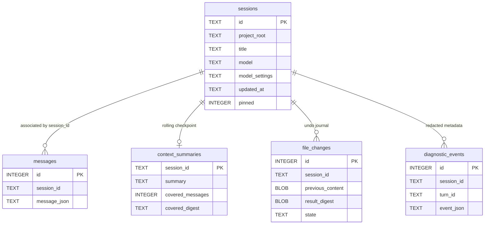
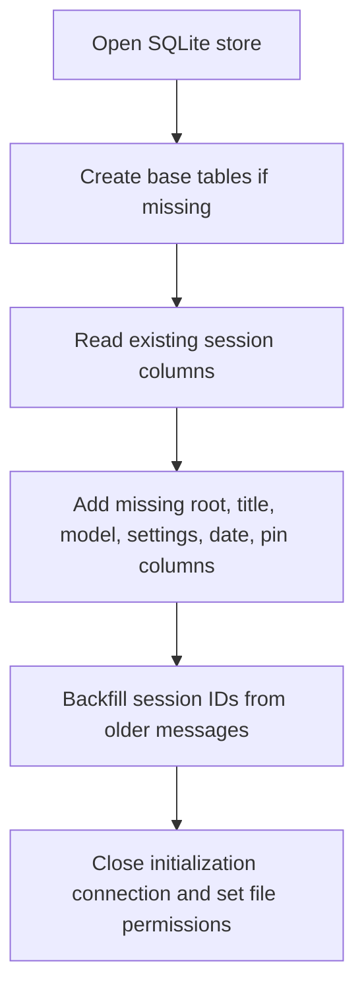
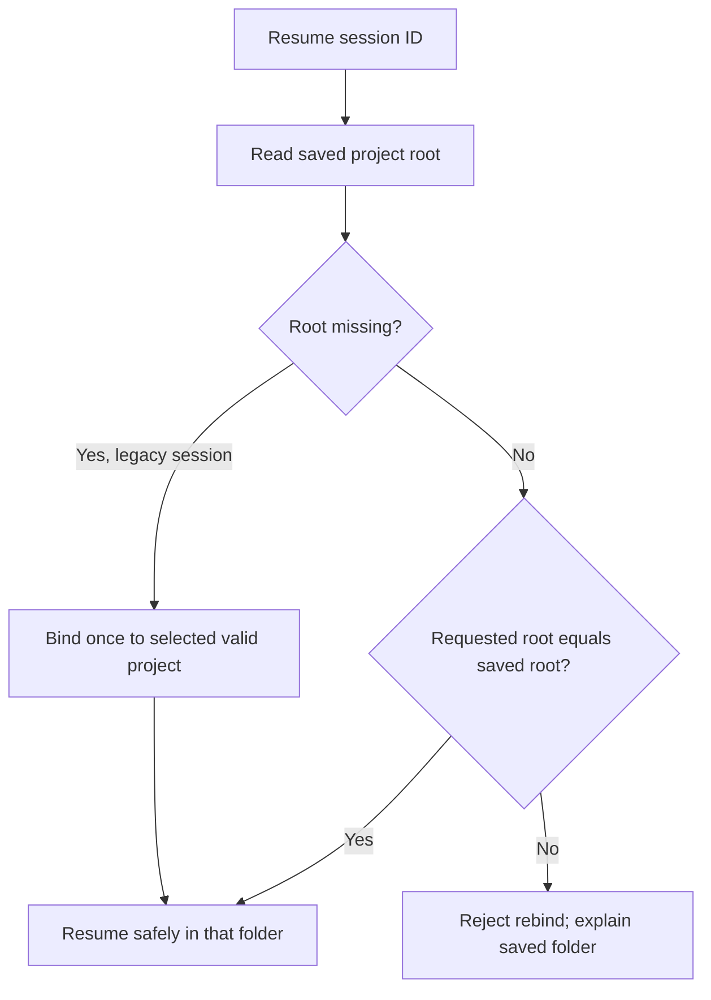
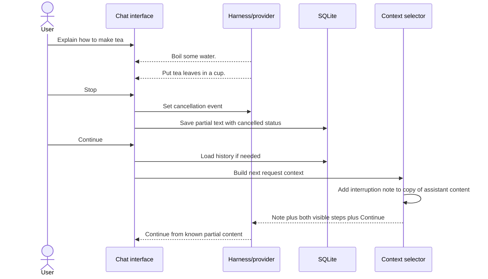

# Session storage and interrupted reply recovery

[Handbook index](README.md) · [Previous: loop and context](04-agent-loop-and-context.md) · [Next: file tools](06-tools-files-terminal-and-undo.md)

Sources: [sqlite_store.py](../session/sqlite_store.py), [context.py](../agent/context.py), [web_app.py](../web_app.py), [tui_app.py](../tui_app.py), [chat_demo.py](../chat_demo.py).

## 1. What a session contains

A session is a saved conversation with an identifier and metadata. Its messages can include user text, assistant text, assistant tool calls, and tool results. Metadata includes project root, optional title, selected model, per-model settings, updated time, and pin state.

A session is not a live model process. The model is called afresh with selected context for each request. Loading a session reconstructs the history that Oryn will use in future requests.

## 2. Why SQLite

Python includes SQLite support. The application can open a local file, create tables, append messages transactionally, and query history without running another service. This fits the project's local educational scope.

Default database:

```text
~/.mini-hermes/sessions.sqlite3
```

The default parent directory is owner-only (`0700`) and the database is set to owner read/write (`0600`). These permissions help protect local transcript data; they do not encrypt it. Messages may contain source text and external tool results.

## 3. Actual data model



The diagram shows the logical relationship. The current table definition does not declare a foreign-key constraint between these tables. Application methods maintain the association and delete both a session and its messages in one transaction.

`message_json` holds the whole message dictionary. This avoids a separate column for each tool-call structure. It also means the loader must parse and validate JSON, and report corrupted rows rather than treating them as valid history.

Example assistant message:

```json
{
  "role": "assistant",
  "content": "Boil some water.\nPut tea leaves in a cup.",
  "turn_status": "cancelled"
}
```

Example tool result:

```json
{
  "role": "tool",
  "tool_call_id": "call_example",
  "name": "read_file",
  "content": "the file contents returned by the tool"
}
```

## 4. Schema evolution without discarding old chats

The store creates tables if absent, examines existing columns through `PRAGMA table_info`, and adds missing columns. It also inserts session records for IDs already present in older message rows.



Legacy chats do not get invented activity dates. Unknown dates remain unknown in the session picker. That is a small example of honest migration: the program should not pretend it knows historical metadata that was never stored.

## 5. Creating, loading, and appending

`create_session` creates a UUID hex ID and stores the initial project root and time. Normal TUI launches create a fresh session and show the home page. Saved chats load through an explicit `--resume` or the session picker. The legacy ID `main` remains available for old chats and the original REPL's default behavior.

`load_messages` selects rows by session and orders them by their integer message ID. It parses each JSON value and requires dictionary-shaped messages. Invalid JSON or invalid shapes produce clear errors.

`append_messages` serializes a batch first and writes it inside one transaction. It creates a session row if needed and updates activity time. Empty batches do nothing.

Simplified:

```python
session_id = store.create_session(project_root)
store.append_messages([
    {"role": "user", "content": "Hello"},
    {"role": "assistant", "content": "Hello!"},
], session_id)
history = store.load_messages(session_id)
```

The UI callers append the new portion of a turn rather than saving the entire loaded transcript again. Base instructions are assembled separately for the active project; a transcript is not a frozen copy of every future prompt configuration.

If Ctrl-C interrupts an active REPL turn, the REPL now saves the user message, completed tool-call/result pairs, and any streamed partial assistant text with a `cancelled` status. It then returns to the prompt. On a later request, context selection keeps the partial text and adds a note that the reply stopped before finishing; the harness does not replay completed tools. Ctrl-C at the idle prompt exits cleanly. These paths handle caught keyboard interrupts, not a hard process kill or power loss.

## 6. Project binding and why it matters

`bind_session_to_project` fills an unset legacy root once. It refuses to move an already bound session to another root.



For example, a conversation that inspected `/projects/shop` should not silently continue writing into `/projects/blog` because the shell's current directory changed. You can start a new session for the other project.

## 7. Titles, dates, pins, search, and deletion

| Operation | Actual rule |
| --- | --- |
| Rename | Normalize whitespace; require 1–80 characters |
| Model ID | Require 1–120 characters from the validated identifier format |
| Pin | Toggle the stored `pinned` integer |
| Picker ordering | Pinned first, then recent activity, then insertion order |
| Search query | 1–200 characters, matched literally and case-insensitively |
| Search limit | 1–100 results, default 20 |
| Search text | User and assistant content; tool output is skipped |
| Search snippet | Nearby text around the match, whitespace normalized, ellipses for omitted ends |
| Delete | Delete messages, summary, undo journal, diagnostics, and session in one transaction |

Search scans recent transcript rows rather than using SQLite FTS. That simple implementation is suitable while local history is small; the source explicitly marks FTS as a later optimization if it becomes slow.

The TUI provides pin, rename, and two-step deletion shortcuts. The dashboard supports rename/delete and groups/searches sessions through its frontend behavior. UI controls and backend store capabilities are related but not identical.

Deleting a conversation does not undo its file edits, revoke external account permissions, or delete a remote GitHub repository. It removes local chat records and that chat's undo journal; project files remain as they are.

## 8. Model settings are stored per model inside each session

The `model_settings` column is JSON:

```json
{
  "example-model-A": {
    "reasoning_effort": "high",
    "service_tier": "priority"
  },
  "example-model-B": {
    "reasoning_effort": "default",
    "service_tier": "default"
  }
}
```

The setter requires exactly those two setting keys and valid string values, reads and updates the JSON under `BEGIN IMMEDIATE`, and writes it transactionally. Provider validation determines whether the selected model actually supports a value.

This allows model A and model B to retain different preferences in the same chat. The TUI restores valid values and defaults stale unsupported values. New chats inherit the current selection in the implemented TUI flow.

## 9. Recovery: the complete tea example

You ask:

```text
Tell me how to make tea, step by step.
```

Oryn begins streaming:

```text
Boil some water.
Put tea leaves in a cup.
```

Then you press Stop. The completed answer might have had additional steps, but the program cannot assume them. Here is what each layer sees:

| Layer | Representation |
| --- | --- |
| Visible chat | The two steps, with a stopped/incomplete status |
| SQLite | The two steps as assistant content, with `turn_status: "cancelled"` |
| Next model request | An interruption note **and** those two steps |
| User continuation | A new user message such as “Continue” |



The model does **not** receive only “the previous reply was stopped.” It receives the content too. The note tells it the two steps were incomplete; the content tells it which steps already reached the user.

This mechanism does not guarantee the model perfectly continues every answer. It gives the correct context and avoids falsely representing the partial answer as finished.

## 10. Failed versus cancelled

Cancellation means the user stopped the turn. Failure means an error prevented completion. Both preserve available text, but use different labels and future-context notes.

If no text was produced, the UI says **“No partial answer was returned.”** It should not fabricate an empty answer as if it contained useful partial work.

Tool call/results already completed remain in the turn history where recorded. A failed final answer does not imply those tools never ran. This distinction is essential when a tool changed a file or an external service.

## 11. What persists and what does not

| State | Survives application restart? |
| --- | --- |
| Saved chat messages | Yes |
| Turn completion status | Yes |
| Elapsed time stored on TUI assistant replies | Yes, in the existing message JSON |
| Session root/title/model/settings/pin | Yes |
| MCP enabled preferences | Yes, in their separate JSON file |
| Notion OAuth cache | Yes, in its separate private JSON file |
| Live provider stream | No |
| Pending approval | No |
| Current Firecrawl browser lifetime | No reliable resumption mechanism |
| Rolling context summary checkpoint | Yes; transcript remains intact |
| Approved file-change undo snapshots | Yes; latest 20 changes per chat, guarded by content/mode checks |
| Redacted diagnostic events | Yes; bounded local metadata only |
| Running terminal jobs | No; stopped when that chat/app closes |
| Semantic long-term memory | Not implemented |

A persisted transcript is not a resumable transaction log. Terminal processes and pending approvals do not survive restart. For approved `write_file` and `edit_file` changes, the SQLite journal records the old bytes and intended result before changing the file. On reopen, Oryn fingerprints the current file and reconciles an interrupted `prepared` or `undoing` record as applied, aborted/undone, or conflict. It refuses an ambiguous state rather than guessing. Undo still covers only these file tools; it does not reverse terminal or remote MCP effects.

The dashboard and TUI load a distinct latest-20 undo list for each chat. Chats that share a project still share its files, so a later edit by another chat or an editor causes the digest/mode guard to refuse undo. Removing a chat deletes its local summary, diagnostic records, and undo snapshots without changing project files.

## 12. Reading the database safely for learning

Prefer store methods when working inside the application. For read-only local inspection, SQLite can show metadata without exposing whole transcripts:

```sql
SELECT id, title, project_root, model, updated_at, pinned
FROM sessions
ORDER BY pinned DESC, updated_at DESC;
```

When sharing debugging output, avoid dumping `message_json` wholesale: it may include private source code or tool results. Back up the database before manually altering schema or data. Oryn's migration code, not ad hoc edits, is the normal schema-maintenance path.
