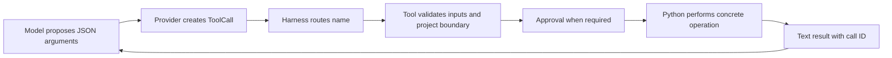
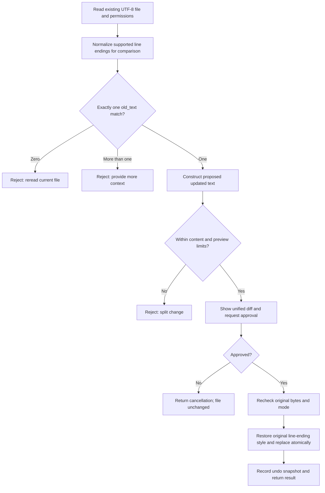
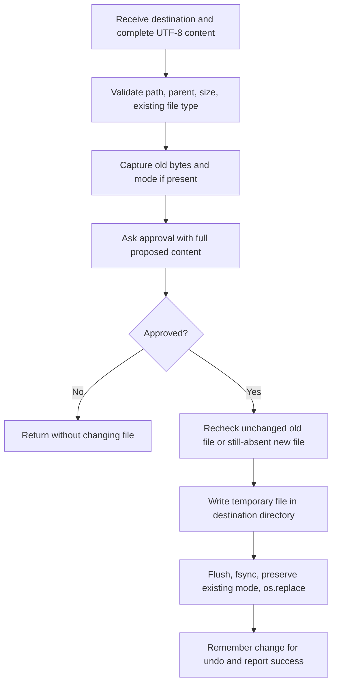
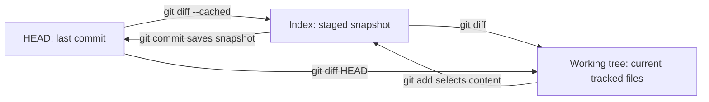
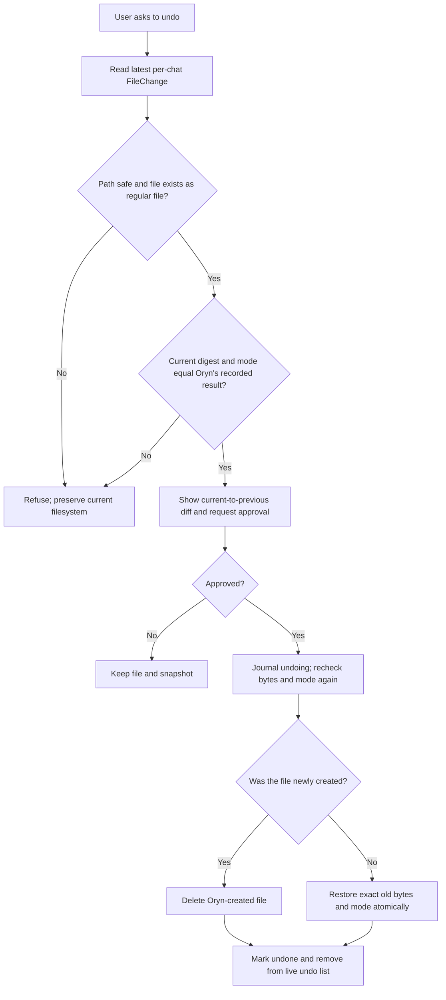
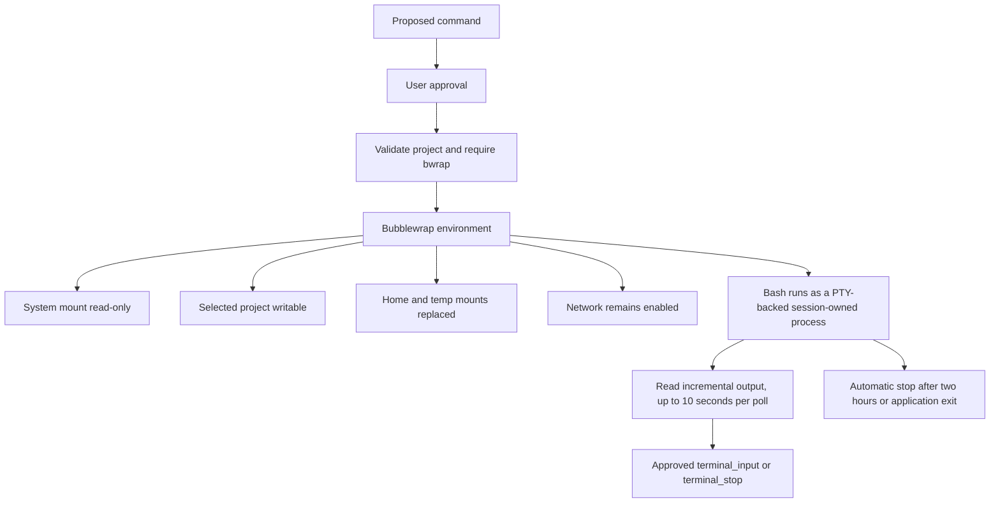

# Native tools: files, terminal, previews, Git, and undo

[Handbook index](README.md) · [Previous: sessions](05-session-storage-and-recovery.md) · [Next: web tools](07-web-search-extraction-and-browser.md)

Sources: [registry.py](../tools/registry.py), [file_tools.py](../tools/file_tools.py), [terminal_tool.py](../tools/terminal_tool.py). Exact model-facing arguments: [Native tool reference](15-native-tool-reference.md).

## 1. What the model actually does

The model does not open a file handle. It produces a tool name and arguments. The provider parses them; the harness dispatches them; Python performs the operation.

For example, the model proposes:

```json
{
  "name": "edit_file",
  "arguments": {
    "path": "calculator.py",
    "old_text": "    return a - b",
    "new_text": "    return a + b"
  }
}
```

The file tool interprets these strings. It reads the current file, checks the old text occurs once, builds the replacement, produces a diff, asks approval, rechecks the original bytes, and writes the result.



This is the fundamental answer to “how does the LLM change the code?” It chooses a structured request. The program does the actual change.

## 2. Native catalog and schema rules

There are 19 built-in tools: four terminal/job operations; file read/search/write/edit/undo; web search/extract; and eight browser operations. Their function schemas use object parameters, required fields, and `additionalProperties: false`; the registry marks native functions `strict: true`.

For example, although Python's `search_files` function has default arguments, its model schema requires all advertised search arguments. Python defaults and JSON schema optionality are separate concepts.

Tool descriptions tell the model when to use an operation, what inputs to provide, and what errors/limits to expect. The description is part of routing quality: “read a UTF-8 project file” is more actionable than a vague name such as `do_file_thing`.

`execute_tool` routes native names to functions. The loop separately routes `mcp__...` names to the MCP client. Unknown names produce an actionable result rather than being evaluated as Python code.

## 3. Project-relative paths and private paths

File targets are resolved against the selected project root. The resolved target must remain inside that root. Attempts to use `../` to escape or a symlink pointing outside are rejected.

Tool descriptions ask the model for project-relative paths. Write/edit/search explicitly validate that convention. The read function primarily enforces the resolved project boundary, so a directly supplied absolute path that still resolves inside the project can pass its implementation check. The advertised input convention and the exact runtime guard are not identical.

Private/generated path components include:

```text
.git  .venv  node_modules  __pycache__  .codex  .mini-hermes  .ssh
firecrawl.env  tavily.env  mcp.env  .env  .env.*
```

The implementation also explicitly protects the home Firecrawl key location. These are named path exclusions, not a universal detector of every file that might contain a secret. A random permitted `notes.txt` can still contain sensitive information.

The native file guard and the terminal environment are different boundaries. A terminal command runs with approved access to the selected project, so file-tool exclusions are not automatically a complete shell policy for every path within that project.

## 4. `read_file`: read first, then decide

`read_file` accepts a path and project root, resolves and validates it, requires an existing UTF-8 text file, and returns its content. Its own visible result caps content at 100,000 characters; the loop later applies its 20,000-character tool-result cap.

The file is read before the tool's character truncation. This is an output bound, not a guarantee that at most 100,000 bytes are read from disk. Binary/non-UTF-8 files return an error.

For editing, reading current content is important because the model's older context may be stale. `edit_file` uses exact text from the actual file, not a guessed line number from a previous reply.

## 5. `search_files`: find relevant lines without dumping the project

The tool calls ripgrep with an argument list. It does not interpolate the search pattern into a shell command. It supports regex or literal search, case sensitivity, a relative target path, filename include/exclude globs, and a match limit.

Example call:

```json
{
  "pattern": "append_messages",
  "path": "src",
  "include": "*.py",
  "exclude": "test_*.py",
  "literal": true,
  "case_sensitive": true,
  "max_results": 20
}
```

A result resembles:

```text
src/session/sqlite_store.py:302:    def append_messages(
```

That line number is illustrative; inspect the current file for its exact position. The model can then read the relevant file.

Bounds include a 500-character pattern, 1–50 result lines, ten seconds, 12,000 output characters, ripgrep's 2M maximum file-size setting, and previewed long lines. Hidden/ignored files are normally skipped and private/generated paths remain excluded even when include globs are used.

Search is useful because reading every project file would waste context and disclose unnecessary content. It is not semantic vector search; it is bounded text matching.

## 6. `edit_file`: one exact replacement

Start with:

```python
name = "Oryn"
a = 5
print(a)
```

To rename this local use of `a` to `b`, the model supplies a sufficiently specific span:

```json
{
  "path": "example.py",
  "old_text": "a = 5\nprint(a)",
  "new_text": "b = 5\nprint(b)"
}
```

The mechanism is fundamentally string replacement after validation:

```python
# Simplified mechanism; actual code includes all guards and approval.
position = current.find(old_text)
updated = (
    current[:position]
    + new_text
    + current[position + len(old_text):]
)
```

The real code rejects a missing match or any second match, including overlapping occurrences. If `old_text` appears twice, the model must include more surrounding text to identify one intended region.



### Line endings

The tool accepts a consistent LF, CRLF, or CR style. It compares text after normalization, then restores the original style when writing. A file mixing styles is rejected so a focused edit does not accidentally rewrite line endings throughout the document.

### No-op, size, and approval checks

If replacement produces identical content, the tool reports no change. The resulting file must be within 100,000 characters and the edit diff within 20,000 characters. A preview too large to review is rejected rather than silently applying an unseen large edit.

After approval, the tool checks that the bytes and permissions are still what it originally read. If an editor or another process changed the file during review, Oryn refuses to overwrite it.

## 7. `write_file`: complete contents

`write_file` creates or replaces a file from the complete supplied text:

```json
{
  "path": "greeting.py",
  "content": "print('Hello from Oryn')\n"
}
```

There is no `old_text` lookup. If `greeting.py` already exists, its entire content is replaced with the proposed content after approval and rechecks. The parent directory must already exist; the tool does not recursively create a folder tree.



New files inherit the temporary-file creation permissions, typically owner-only. Existing permissions are preserved. Content is limited to 100,000 characters; when undo recording is enabled, the previous file must fit the one-million-byte snapshot limit.

## 8. `edit_file` versus `write_file`

| Question | `edit_file` | `write_file` |
| --- | --- | --- |
| Input | Exact old text and replacement text | Entire desired final file |
| Existing file required? | Yes | No; may create |
| How target region is chosen | Unique string match | Whole file |
| Review | Unified before/after diff | Proposed full contents |
| Typical use | Change a function, fix a condition, rename a focused span | Create a new file or deliberately replace all contents |
| Main failure mode | Missing/ambiguous old text | Missing parent or replacing more than intended |
| Stale-file defense | Compare original bytes/mode after approval | Compare captured existing state, or reject a newly appeared target |
| Undo | Recorded durably when the interface has a session store | Recorded durably when the interface has a session store |

For a thousand-line file, a five-line edit is easier for the model and user to review than resending all thousand lines. This is a reason to prefer exact focused edits; it is not a claim that `write_file` is inherently invalid for existing files.

## 9. How the minus/plus preview is created

Python's `difflib.unified_diff` compares current text and proposed text. It does not ask Git for the last commit.

Minimal teaching example:

```python
import difflib

before = "a = 5\nprint(a)\n"
after = "b = 5\nprint(b)\n"
preview = "".join(difflib.unified_diff(
    before.splitlines(keepends=True),
    after.splitlines(keepends=True),
    fromfile="a/example.py",
    tofile="b/example.py",
))
print(preview)
```

Output:

```diff
--- a/example.py
+++ b/example.py
@@ -1,2 +1,2 @@
-a = 5
-print(a)
+b = 5
+print(b)
```

The diff prefixes are notation:

- `---` identifies the before file and `+++` the after file.
- `@@ -1,2 +1,2 @@` describes the old and new line ranges in that hunk.
- A line beginning `-` was removed from the old text.
- A line beginning `+` was added to the new text.
- A leading space indicates unchanged surrounding context.

The `a/` and `b/` names are conventional labels. They do not imply the preview came from Git.

The web approval component parses those lines into a heading, change counts, and colored rows. The TUI uses its own approval rendering. Rendering a diff and generating a diff are separate steps.

## 10. Git diff: three different comparisons

Git has a committed snapshot (`HEAD`), a staging area (index), and current working files.



| Command | Comparison |
| --- | --- |
| `git diff` | Working tree versus index |
| `git diff --cached` / `--staged` | Index versus `HEAD` |
| `git diff HEAD` | Current tracked state versus `HEAD`, combining staged and unstaged differences |
| Oryn edit preview | Current file immediately before this proposal versus proposed file after it |

Ordinary diffs do not show untracked files as full file changes. `git status` identifies them. Staging is not required for `git diff` to show unstaged changes; if the index still matches the last commit, that comparison often looks like a comparison to the last commit, but its actual baseline is the index.

### The three-day uncommitted example

Last commit:

```python
a = 1
print(a)
```

Your current uncommitted work from three days:

```python
# Your new explanation
a = 5
print(a)
```

Oryn proposes renaming `a` to `b`. Its operation preview shows the rename against **today's file**, preserving your explanation and value 5. A Git comparison against `HEAD` also shows your added comment and value change from 1 to 5.

The model does not need a clean Git baseline to construct an accurate focused edit. It needs the current file and a precise replacement. Git diff remains useful for reviewing the wider repository's accumulated changes, staging, and committing. It is optional evidence for that broader purpose, not the mechanism that applies `edit_file`.

## 11. Atomic write and its limits

`_atomic_write_bytes` creates a temporary file in the same destination directory, writes the complete bytes, flushes and fsyncs it, applies existing mode when provided, then replaces the target with `os.replace`. Cleanup removes leftover temporary files on failure.

This avoids truncating the existing target before the new file is ready. A failed replacement leaves the original file available and the temporary file cleaned up, covered by an existing test.

It is not a multi-file transaction, a filesystem snapshot, or a formal defense against every concurrent rename/symlink race. The implementation rechecks state around approval, but does not use a full directory-descriptor-based secure filesystem API. Describe these defenses accurately rather than claiming absolute isolation.

## 12. Undo: recorded state, not model memory

Each `FileChange` records:

| Field | Meaning |
| --- | --- |
| `path` | Canonical project-relative target |
| `previous_content` | Exact old bytes, or `None` if newly created |
| `previous_mode` | Old permission mode, when applicable |
| `result_digest` | SHA-256 digest of the bytes Oryn wrote |
| `result_mode` | Permission mode after the change |

The session store keeps at most 20 applied snapshots per chat, including exact previous bytes, prior mode, result digest/mode, and project root. A `prepared` row is written before the atomic file replace; successful writes transition it to `applied`. Undo records `undoing` before restoring, then marks the row `undone`. On restart, Oryn compares the current file's fingerprint against the saved previous and intended states. A matching intended state is safe to undo; a matching previous state means the write/undo completed before its status update; anything else becomes a conflict and cannot be undone automatically. New chats have a separate list; deleting a chat removes its snapshots. Chats sharing a project still share files, so later changes trigger refusal. Undo covers approved `write_file`/`edit_file`, not terminal commands or remote MCP actions.



If you edited the file after Oryn changed it, undo refuses. This protects your later work. It does not attempt to merge an inverse patch through arbitrary intervening changes. A failed or denied undo keeps its record; successful undo pops only the latest record.

For large restore diffs, the preview can be truncated with an explicit note while the full recorded file is restored. The tool distinguishes restoring an old file from deleting a newly created one.

## 13. Terminal tool

`terminal` requests a shell command. Every command requires approval. After approval, the implementation requires Bubblewrap and runs `/bin/bash -lc` inside the configured environment. In the chat interfaces it returns a session-local job ID; `terminal_read`, `terminal_input`, and `terminal_stop` poll output, send separately approved input, and stop the process.

The root `/`, `/proc`, `/dev`, `/sys`, and descendants of the system mounts are rejected as projects. The sandbox starts with a read-only bind of the system, private temporary `/home` and `/tmp`, a writable bind of the selected project, fresh process namespace, and configured working directory.



Network is deliberately not disabled by the current command line. Other system paths can remain visible read-only. The environment is a concrete Linux isolation configuration, not a guarantee against every secret exposure or external side effect.

The legacy direct `run_terminal` helper remains a one-shot 30-second call; the conversation tool uses PTY jobs capped at 200,000 buffered bytes, 4,800 bytes per read, eight running and 20 retained jobs per chat, ten seconds per read, and a two-hour lifetime. Stopping sends TERM then KILL. Jobs are not durable: closing the chat manager terminates remaining processes, and a new process cannot resume a previous job. Output is sanitized before it reaches the model. A command that already changed a project before it stops is not automatically reversed.

## 14. Things the current tools do not provide

No dedicated Git status/diff tool exists yet; Git inspection is possible through the approval-controlled terminal tool. There is no generic multi-file patch tool, redo stack, automatic directory creation in `write_file`, image/audio file editor, arbitrary Python evaluation tool, or subagent delegation tool. Placeholder filenames do not add those operations to the catalog.
