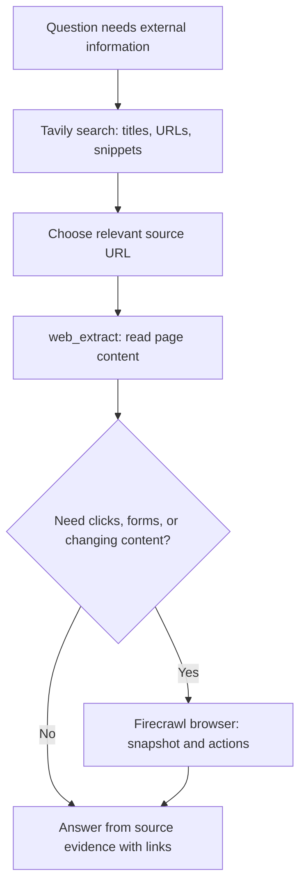
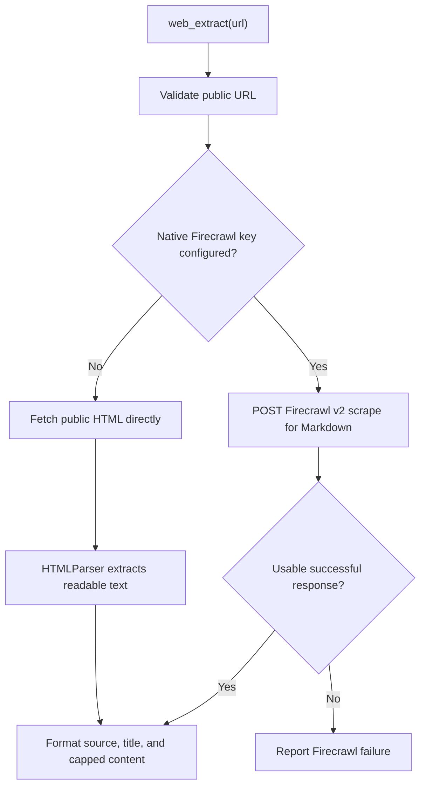
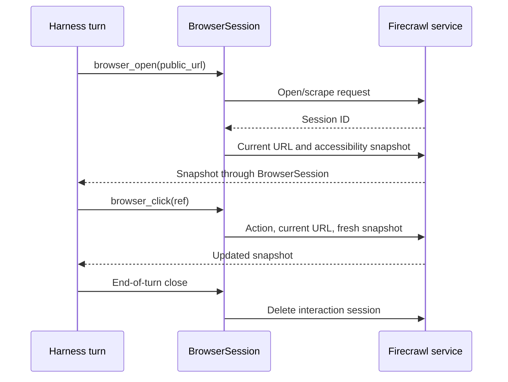
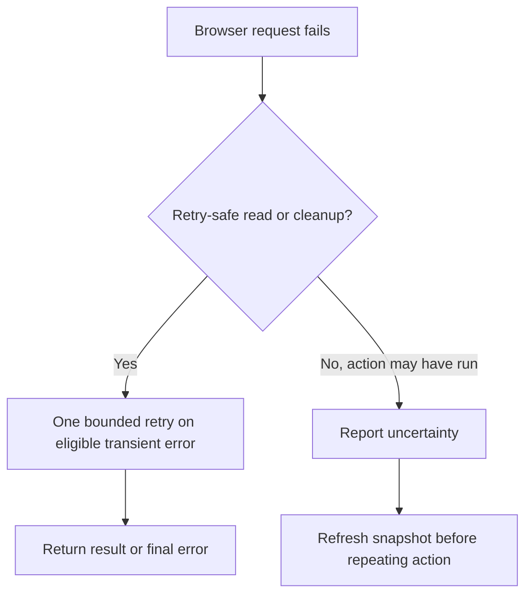

# Search, page extraction, and browser interaction

[Handbook index](README.md) · [Previous: native tools](06-tools-files-terminal-and-undo.md) · [Next: MCP fundamentals](08-mcp-fundamentals-and-connections.md)

Sources: [web_tools.py](../tools/web_tools.py), [browser_tools.py](../tools/browser_tools.py), [registry.py](../tools/registry.py), [secrets.py](../security/secrets.py).

## 1. Three different jobs

| Job | Native tool | Typical question |
| --- | --- | --- |
| Find relevant pages | `web_search` | “Where is the documentation for this feature?” |
| Read a particular page | `web_extract` | “What does this documentation page actually say?” |
| Interact with a page | `browser_open` and browser actions | “Open it, inspect controls, click a link, and read the changed page.” |

Search snippets, extracted page content, and an interactive browser snapshot contain different evidence. A useful research flow chooses the smallest operation that answers the question.



## 2. Why the old search failed

The reported error said DuckDuckGo returned no readable results, possibly due to human verification. A scraper expects readable result HTML. A service may instead return a challenge, blocked page, a changed layout, or output the parser cannot interpret. That is a retrieval failure; it does not establish that no matching information exists on the web.

The Tavily migration replaced this fragile scraping path with a structured search API. It supplies query data, receives JSON result objects, and reports service/authentication failures explicitly.

The separate “no tool output found” HTTP 400 came from model history serialization. Replacing the search backend alone would not repair that pairing problem. Two visible failures can happen during the same chat while having different causes.

## 3. Native Tavily search request

`web_search` requires a nonempty query and an integer result count from 1 to 5. It reads `TAVILY_API_KEY` from the environment or `~/.mini-hermes/tavily.env`.

The request goes to `https://api.tavily.com/search` with a bearer header. A simplified body:

```json
{
  "query": "Python asyncio cancellation documentation",
  "search_depth": "basic",
  "max_results": 3,
  "include_answer": false,
  "include_raw_content": false
}
```

The tool asks for results rather than a service-generated final answer. It validates returned entries and formats numbered title/URL/snippet evidence for the model.

```text
1. Example documentation title
   https://example.com/documentation
   A shortened readable snippet...
```

Titles and snippets are capped and whitespace normalized. Results with unusable field types or invalid HTTP(S) URLs are not blindly treated as good evidence.

### Errors versus empty results

| Condition | Meaning |
| --- | --- |
| No key | Search was not attempted; configure the key |
| 401/403 | Service rejected authentication |
| 429/432/433 | Rate or credit limits |
| Network/timeout | Could not obtain a usable response |
| Invalid JSON or wrong response shape | Service response was not usable |
| Valid empty results list | Search succeeded but returned no usable matches |

The request has a 20-second timeout and a two-million-byte response cap. Authenticated redirects are disabled so a redirect cannot casually forward the key to another destination. There is no automatic broad web-search fallback if Tavily fails.

## 4. Tavily and Firecrawl working together

The original question was whether the two can work “hand in hand.” Yes, because they solve different stages of research:

1. Tavily finds candidate URLs.
2. Firecrawl extracts readable content from a chosen URL.
3. If interaction is necessary, a browser tool can inspect or change the page state.
4. The model uses those returned results to produce a sourced answer.

This is the harness choosing multiple tools across rounds. Tavily does not automatically invoke Firecrawl inside `web_search`, and configuring one key does not configure the other.

Both services also have hosted MCP connections. Native Tavily/Firecrawl tools and their MCP counterparts are separate call paths, even if they use the same account credentials.

## 5. Public URL validation

Before native page extraction or opening a browser URL, `_check_public_url` validates:

- HTTP or HTTPS scheme and a hostname.
- Maximum URL length.
- No embedded username/password.
- No localhost or `.localhost` destination.
- DNS resolution whose returned addresses are globally routable.

Private, loopback, and other non-global address results are rejected. The direct-HTML redirect handler validates each redirected URL as well.

These checks reduce access to local/internal endpoints. They are not a complete network security proof: DNS validation and a later HTTP connection are separate operations, and browser navigation after opening a public page has its own behavior. Do not treat every remote page as trustworthy simply because its first URL passed validation.

## 6. `web_extract`: two implementations behind one operation



### With a Firecrawl key

The tool calls `https://api.firecrawl.dev/v2/scrape`, requests Markdown, and validates success/data fields. It extracts a title where available and formats source plus content. The server timeout request is 20,000 milliseconds; the local request timeout is 30 seconds, with a two-million-byte response cap.

The returned body is capped at 12,000 characters. A large webpage is therefore not fully inserted into model context.

**A configured Firecrawl failure does not silently fall back to direct HTML.** Direct HTML is selected when no Firecrawl key is configured. This distinction matters when diagnosing an invalid or depleted key: adding a broken key changes the chosen path.

### Without a Firecrawl key

The direct path uses urllib and Python's `HTMLParser`. It accepts HTML/XHTML content, decodes the response, ignores non-content regions such as scripts/styles/head/template, captures the title, and collects readable text.

The fetch uses a ten-second timeout and a one-million-byte response cap. It does not execute JavaScript, authenticate into private sites, or reproduce the visual page. A dynamic page that needs client-side rendering may be unreadable through this path.

## 7. Native Firecrawl browser lifetime

The loop creates one `BrowserSession` for the whole turn. The first `browser_open` validates a public URL, requires the native Firecrawl key, opens the service-backed session, validates its UUID-like scrape/session ID, and obtains an initial snapshot.

Subsequent actions share the same session ID. Opening a different page through `browser_open` closes the previous session first. The loop calls `close()` when the turn exits, including failures and cancellation.



This browser runs through Firecrawl's service. It is different from the local Playwright MCP browser subprocess. Disabling Playwright does not disable native Firecrawl browser tools.

## 8. Browser operations and validation

| Tool | Arguments / behavior |
| --- | --- |
| `browser_open` | Public URL; creates/open session and returns snapshot |
| `browser_snapshot` | No arguments; fresh URL and accessibility snapshot |
| `browser_click` | Element reference such as `@e12` from a snapshot |
| `browser_fill` | Element reference and bounded text; fills without automatically submitting |
| `browser_press` | Key from an explicit allowed set |
| `browser_scroll` | Allowed direction and 1–2,000 pixels |
| `browser_wait` | Allowed wait mode and bounded value |
| `browser_back` | Goes back in the current browser history |

The element reference must match the implemented pattern; arbitrary selector/code strings are not accepted. Fill text is limited to 1,000 characters, must not contain NUL, and is shell-quoted. Wait values are bounded and quote-safe. The implementation builds known `agent-browser` commands rather than accepting arbitrary browser code.

Snapshots are capped at 12,000 characters. Element references can become stale after navigation or page changes; obtain a fresh snapshot rather than guessing.

## 9. Retry rules: reads and uncertain actions

The browser HTTP helper can make two attempts when marked `retry_safe`, with a short delay after transient network/5xx failures. Snapshot reads and cleanup use that option. Page-changing actions do not.

Why? If a click request loses its response, the click might already have happened remotely. Retrying automatically could submit a form twice.



Deletion treats an already absent/expired session as successfully closed for the relevant 404/410 cases. On a cleanup failure, the session ID is retained inside the object so the failure is not falsely represented as completed cleanup.

This limited safe retry is implemented. A general model/MCP retry supervisor remains future work.

## 10. Current approval distinction

Native terminal and file mutations receive approval callbacks. The native Firecrawl browser dispatcher does **not** currently supply an approval callback for clicks/fills/keypresses. Input validation and bounded commands are present, but a universal “all external writes ask approval” claim would be false for this path.

MCP browser operations use the separate MCP approval policy. Read [Approvals and boundaries](12-approvals-security-and-boundaries.md) before treating the two browser implementations as having identical policy.

## 11. Sources and answer quality

The system prompt asks Oryn to link web sources and avoid claiming failed searches as verified evidence. The tools return URLs and readable text to support that behavior. A link being present does not prove a claim is supported; the model still must connect claims to the right evidence.

When debugging a poor web answer, inspect the tool result first: did search succeed, was the relevant page read, was its content truncated, and did the model represent it accurately? Changing Markdown styling cannot repair missing research evidence.
