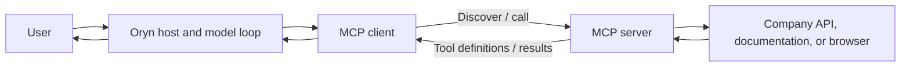
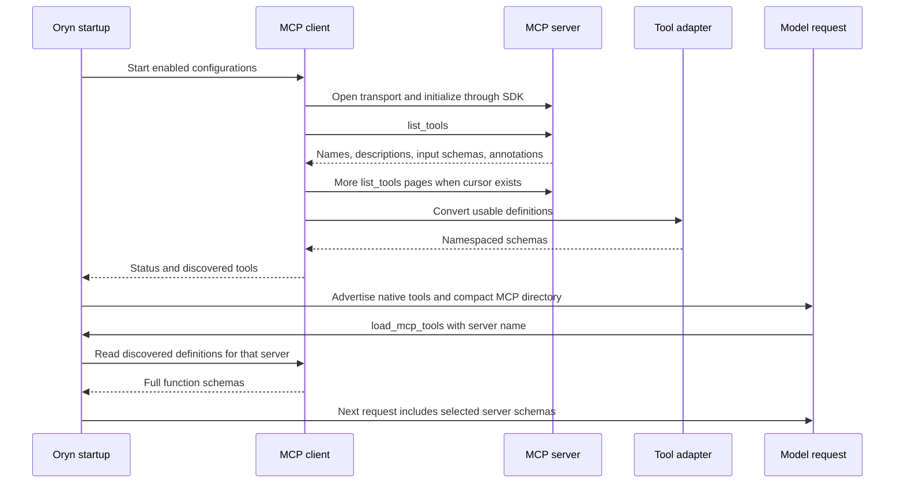
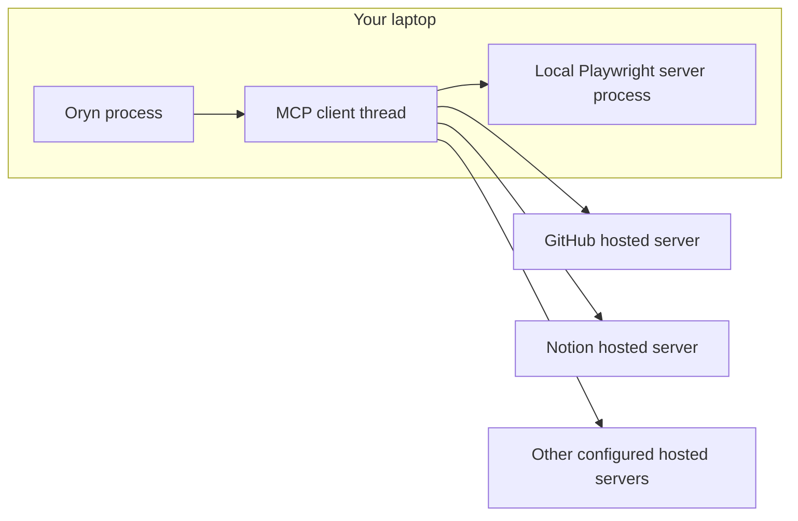
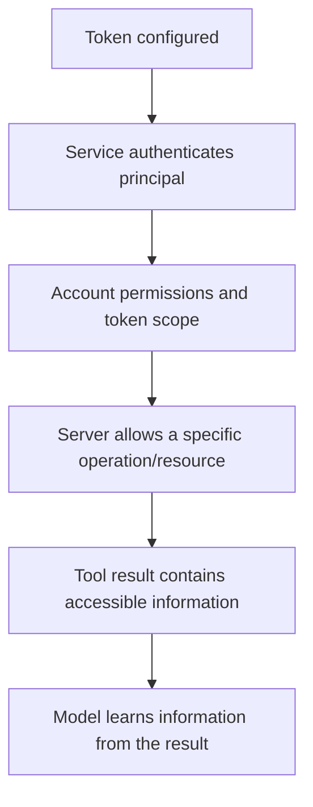

# MCP fundamentals and Oryn's configured connections

[Handbook index](README.md) · [Previous: web tools](07-web-search-extraction-and-browser.md) · [Next: management and OAuth](09-mcp-manager-and-oauth.md)

Implementation sources: [discovery.py](../mcp/discovery.py), [client.py](../mcp/client.py), [adapter.py](../mcp/adapter.py), [conversation_loop.py](../agent/conversation_loop.py).

## 1. Definition and analogy

**Model Context Protocol (MCP)** gives an application a common way to discover and call capabilities supplied by another program. For Oryn, the useful capability is primarily a server's tool catalog and its tool execution.

Think of Oryn as a workshop. The model is the person planning the work. Native tools are equipment already in the workshop. An MCP client is the workshop's standard connector to outside equipment. An MCP server is the adapter exposing that equipment's operations. Knowing a connector exists does not tell the planner all equipment capabilities; discovery supplies the operation names and instructions.

The analogy has a limit: MCP does not supply every account permission automatically. The server and external service still enforce authentication and access rights.

## 2. Host, client, server, and external service

| Role | In this project |
| --- | --- |
| Host | Oryn, the application managing the conversation and deciding when to use tools |
| MCP client | The SDK-backed integration in `MCPClient` |
| MCP server | An official hosted endpoint, or the local Playwright subprocess |
| External service | GitHub repositories, a Notion workspace, Linear issues, library documentation, and similar data/actions |



The harness starts connections and calls discovery before constructing the model's available tool list. The model uses `load_mcp_tools` to select which discovered definitions it needs for the current user turn.

## 3. What happens first, step by step

1. The application creates its `MCPClient` with known presets and enabled preferences.
2. The client starts its background asyncio loop.
3. Each enabled configuration is evaluated for missing credentials or runtime dependencies.
4. Oryn opens the transport: hosted HTTP or local stdio.
5. The SDK establishes the protocol session/initialization.
6. Oryn calls `list_tools`, following pagination.
7. The adapter validates each tool's name and object input schema.
8. Accepted tools become namespaced model function schemas and local routing bindings.
9. The first model request receives native schemas plus `load_mcp_tools` with a compact service directory.
10. The model selects a connected server through `load_mcp_tools`; the next model request includes its full schemas.
11. If the model requests an advertised MCP operation, the harness checks policy and calls the server's original tool name.
12. The server result is converted to readable text, capped by the loop, and returned as a tool result.



Discovery occurs at connection startup and reconnect. Loading definitions into a model request happens on demand and reuses that discovered inventory; it does not reconnect or rerun `list_tools` for every selection.

## 4. Concrete example: documentation lookup

Suppose a connected documentation server advertises this fictional shape:

```json
{
  "name": "lookup_docs",
  "description": "Find documentation for a named library topic",
  "inputSchema": {
    "type": "object",
    "properties": {
      "library": {"type": "string"},
      "topic": {"type": "string"}
    },
    "required": ["library", "topic"]
  }
}
```

Oryn exposes a corresponding model name:

```text
mcp__example_docs__lookup_docs
```

The model first calls `load_mcp_tools` with `{"server": "example_docs"}`. After the harness advertises the definition in the next request, the model emits:

```json
{
  "name": "mcp__example_docs__lookup_docs",
  "arguments": {"library": "Textual", "topic": "keyboard bindings"}
}
```

The routing binding knows the external name is `lookup_docs`, so the SDK calls that name with the argument object. The model-facing prefix does not have to be the server's own original tool name.

Simplified educational code:

```python
# The SDK client/transport is already connected here.
page = await client.list_tools()
for tool in page.tools:
    schema = provider_tool("example_docs", tool)
    model_tool_schemas.append(schema)

result = await client.call_tool(
    "lookup_docs", {"library": "Textual", "topic": "keyboard bindings"}
)
```

The example tool is invented to explain the flow. Actual tool names come from the connected server, not this document.

## 5. Adapter rules and present limitations

`provider_tool_name` creates `mcp__<server>__<tool>`. The complete name must match letters, digits, underscore, or hyphen and fit 64 characters. An unrepresentable name is skipped; the implementation does not sanitize it into a new guessed name.

An accepted input schema must be a dictionary whose type is `object`. Descriptions are capped at 4,000 characters. MCP function schemas use `strict: false` because arbitrary server schemas are not normalized into the native strict schema format.

The result adapter joins readable text blocks. If no text is present, it serializes structured content. Otherwise it returns a clear “no readable text” message. Server error flags are reflected in the result.

The local `computer` result path forwards one validated screenshot as an ephemeral model input for the current turn. It does not save the image in SQLite. Other MCP result paths remain text-focused; audio blocks are not forwarded.

## 6. The eleven configured connections

These are the exact presets in this source snapshot. Endpoints and server-advertised capabilities may change independently of Oryn. The table records configuration and intended role; `/tools` is the authoritative inventory for the currently connected account.

| Name | Transport / endpoint | Credential configuration | Role |
| --- | --- | --- | --- |
| `github` | Hosted: `https://api.githubcopilot.com/mcp/readonly` | Required `GITHUB_PERSONAL_ACCESS_TOKEN` | Read repository, issue, and pull-request information with configured toolsets |
| `context7` | Hosted: `https://mcp.context7.com/mcp` | Optional `CONTEXT7_API_KEY` | Current library documentation and examples |
| `microsoft_learn` | Hosted: `https://learn.microsoft.com/api/mcp` | None in preset | Public Microsoft documentation and code samples |
| `huggingface` | Hosted: `https://huggingface.co/mcp` | Optional `HF_TOKEN` | Models, datasets, papers, and advertised Hub operations |
| `tavily` | Hosted: `https://mcp.tavily.com/mcp/` | Required `TAVILY_API_KEY` | Advertised search/extract/map/crawl operations |
| `firecrawl` | Hosted: `https://mcp.firecrawl.dev/v2/mcp` | Optional `FIRECRAWL_API_KEY`; keyless operations may be limited | Advertised web search/scrape/crawl operations |
| `exa` | Hosted: `https://mcp.exa.ai/mcp` | Optional `EXA_API_KEY` in `x-api-key` header | Advertised search/page reading |
| `linear` | Hosted: `https://mcp.linear.app/mcp` | Required `LINEAR_API_KEY` in this implementation | Issues, projects, comments, and advertised operations |
| `notion` | Hosted: `https://mcp.notion.com/mcp` | Explicit browser OAuth, or an actual `NOTION_ACCESS_TOKEN` | Authorized workspace pages/databases and advertised operations |
| `playwright` | Local stdio through `npx` | No company account key in preset | Isolated headless browser operations |
| `computer` | Local stdio through pinned `@agent-sh/computer-use-linux@0.7.5` | Desktop permissions; no company account key | Explicit `/computer` one-window Calculator preview |

GitHub and Context7 originally belonged to the first locally launched MCP set. Their current presets are hosted. Playwright remains local.

The Playwright command configured by Oryn is:

```bash
npx -y @playwright/mcp@latest --headless --isolated --idle-timeout=300000
```

Oryn launches it as a managed subprocess. Running the command manually is useful for diagnosing installation, but Oryn cannot attach to arbitrary terminal stdin/stdout from an unrelated process. A stdio server uses the pipes of the client that started it.

## 7. Are the servers running on my laptop?



The client is local. Nine server endpoints are remote. The local browser server is managed by the Oryn process while connected; browser idle behavior is controlled by its configured timeout and server implementation. This is different from manually maintaining ten independent server windows.

## 8. Authentication, identity, and private GitHub repositories

A GitHub token authenticates service requests and carries whatever repository/account access the token and account allow. Oryn supplies it to the server. GitHub knows the authenticated principal; the model does not automatically receive a biography or username merely because a secret exists in a header.

To discover identity, the model needs an available identity/account tool or another concrete source, such as a repository's origin. The current read-only endpoint/toolset choice can limit which identity operations are advertised. Therefore a chat asking for a username is not proof the token is invalid; it can mean the model failed to inspect available capability or had no identity operation available.

Private repositories can be accessible when the account and token authorize them and the server operation supports the request. A valid token alone does not guarantee access to all private repositories or organization resources.



Oryn currently requests GitHub `repos`, `issues`, and `pull_requests` toolsets with read-only headers. It does not expose GitHub mutation tools through that preset simply because a powerful token could authorize them elsewhere.

## 9. Tool, MCP, connector, and plugin

| Term | Meaning in practical use | Oryn status |
| --- | --- | --- |
| Tool | One operation with parameters and result | Native and MCP tools implemented |
| MCP | Communication/discovery protocol | SDK-backed client implemented |
| Connector / integration | Product-facing connection to a service | Ten known MCP presets; native web services too |
| Plugin | Packaged extension that might include tools, MCP config, skills, or assets | Plugin files are placeholders |
| Skill / instructions | Guidance on how to do a class of work | Scoped local `SKILL.md` loader implemented; executable plugins remain out of scope |

A product can show “Linear” as an app/connector without the UI telling you its internal protocol. Do not infer another product's architecture from its icon or label alone. Oryn's Linear path is concretely the configured MCP endpoint above.

Official public MCP endpoints let compatible clients connect subject to authentication, supported protocol behavior, and service terms. They do not make proprietary accounts, private data, or another application's complete architecture public.

## 10. On-demand model catalog

All accepted schemas remain in the local inventory, and `/tools` can display them. The model initially receives the current native schemas and, when any server is enabled, one `load_mcp_tools` definition containing server names, short descriptions, states, and counts. Credentials and request headers are excluded from this directory. A clean default configuration enables no servers and supplies no loader.

```json
{"name": "load_mcp_tools", "arguments": {"server": "github"}}
```

The loader validates the server, requires a connected configuration with usable tools, and returns its namespaced tool names. The next model request includes their full parameter schemas. No external operation or approval is performed merely by loading definitions. When the model subsequently calls an advertised tool, normal routing, cancellation, result caps, and approval policy apply.

Definitions stay loaded for the current user turn, including across tool rounds, and reset on the next user turn. Repeated loads are deduplicated. Each request refreshes loaded schemas so disconnected servers are dropped. An unloaded call, unknown server, invalid loader argument, or disabled/unavailable server becomes an actionable tool error paired with its call ID. Tool names in older chat history do not automatically grant access to unloaded definitions.

Tool count remains variable: it depends on enabled connections, credentials, server versions, filtering, and which services this turn loaded. A screenshot showing 81 tools is an observed UI inventory, not a constant number of schemas sent to each model request. A selected server's complete catalog still adds context; selecting individual functions within a very large server is not implemented. Startup connection cost remains. The shared turn limit is now configurable, with 40 model rounds by default.

## 11. Read-only retry boundary

`call_tool` permits three attempts within the same 90-second total deadline for known read-only operations. GitHub's read-only preset, Context7, Microsoft Learn, and Tavily qualify; other tools require an accepted read-only annotation. All Playwright calls are excluded. Terminal/file actions and MCP mutations are never retried by this path.

Only classified timeouts, connection/remote-protocol errors, and HTTP 429/500/502/503/504 qualify. TLS and permanent/unknown errors do not. Cancellable backoff and bounded `Retry-After` handling reuse the provider helper, and an optional callback reports attempts to the interface. A server's structured tool-error result is returned to the model rather than triggering a transport retry. This does not automatically reconnect a dead session or replay an action with uncertain effects.
