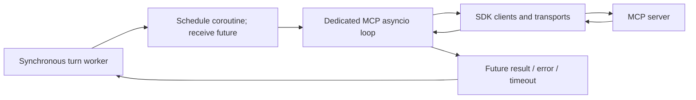
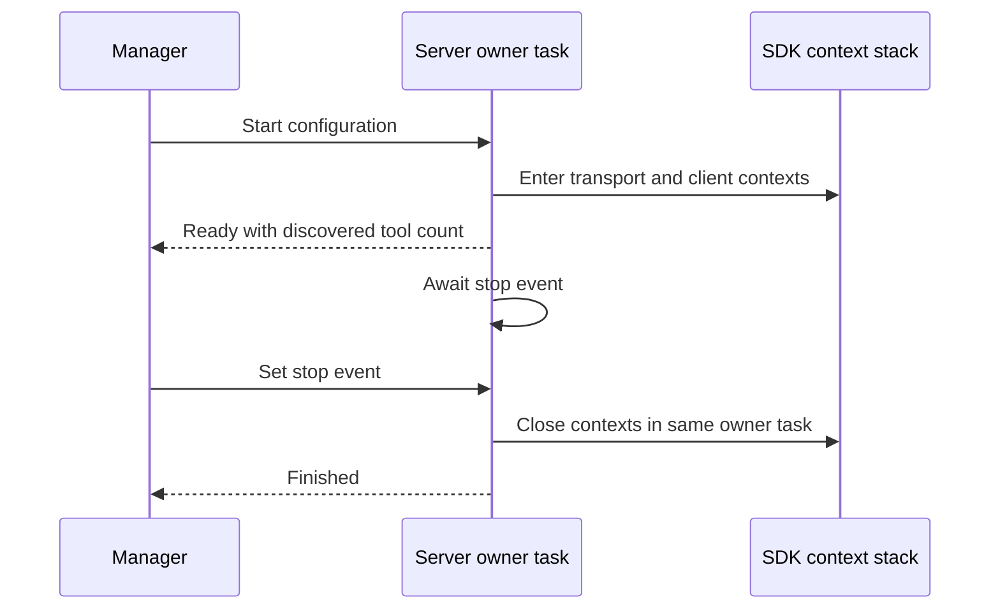
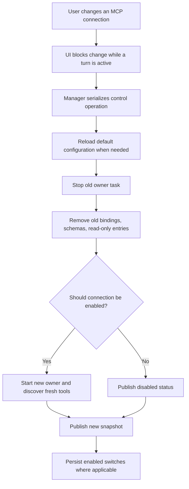
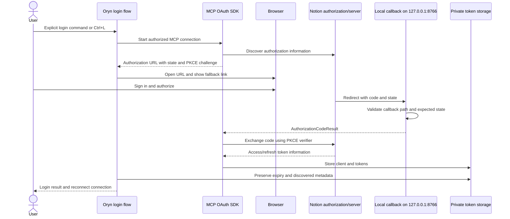
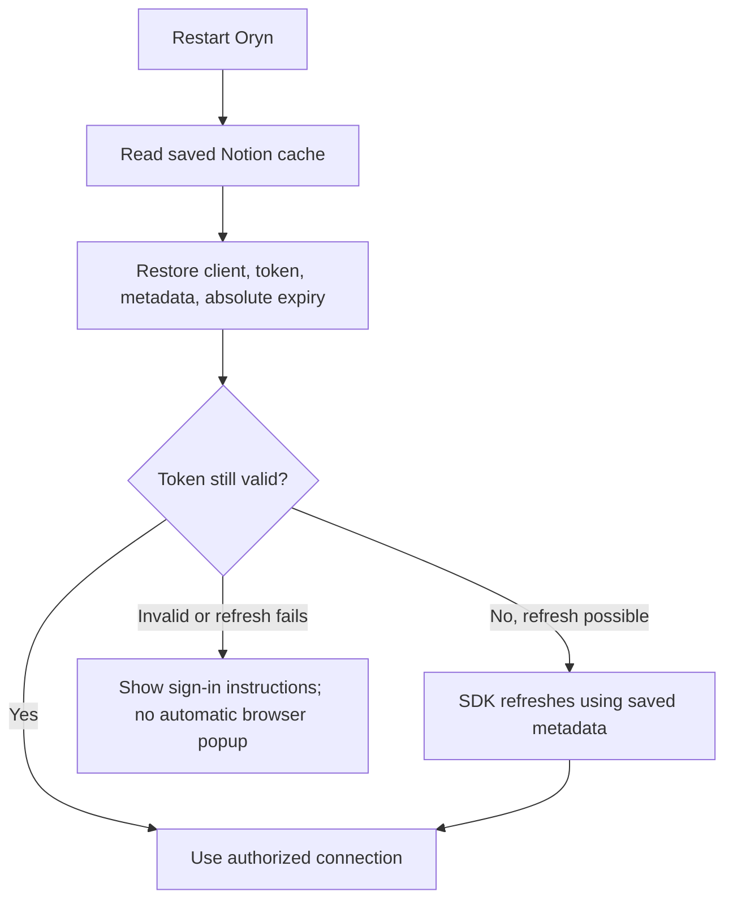

# MCP management, async ownership, and Notion OAuth

[Handbook index](README.md) · [Previous: MCP fundamentals](08-mcp-fundamentals-and-connections.md) · [Next: TUI](10-tui-guide-and-rendering.md)

Sources: [client.py](../mcp/client.py), [discovery.py](../mcp/discovery.py), [oauth.py](../mcp/oauth.py), [tui_app.py](../tui_app.py), [test_mcp.py](../tests/test_mcp.py), [test_tui_app.py](../tests/test_tui_app.py).

## 1. Why an async thread exists

The core turn loop uses synchronous calls. The MCP SDK uses asynchronous transports and resource contexts. Instead of rewriting every caller into an async harness, `MCPClient` owns a background asyncio event loop and bridges synchronous callers into it with `asyncio.run_coroutine_threadsafe`.



The UI event loop remains free to draw, accept drafts, and respond to controls. The bridge is an implementation detail; the user does not need to start the thread manually.

## 2. Startup and failure isolation

`start()` is guarded so repeated calls do not repeatedly launch servers. It creates the loop/thread and schedules connections. Servers are connected concurrently, so one slow server need not serially delay every other one.

Important limits:

| Operation | Bound |
| --- | --- |
| Overall startup wait | 240 seconds |
| Individual connection startup | 75 seconds |
| Tool call | 90 seconds |
| Synchronous call cancellation polling | Up to 0.2 seconds between checks |
| Reconfiguration wait | `90 × changed server count + 15` seconds |

A disabled configuration stays disabled. An enabled configuration with missing required credentials becomes unavailable with setup instructions. Failure to find `npx` affects the local server that needs it, not every native tool.

Startup errors are shortened and credential values are redacted from status text. Environment/header fields are excluded from the configuration object's printable representation. These precautions reduce accidental secret display; they do not justify logging raw requests elsewhere.

## 3. The owner-task lifetime repair

Async SDK transports can own cancellation scopes tied to the task that entered them. Opening a context in task A and closing it from task B can cause task/scope errors.

Oryn now creates a server owner task. That task opens the client/transport contexts, announces readiness, waits on its stop event, and closes its own stack in `finally`.



This is a lifecycle fix, not merely hiding an exception on shutdown. The test suite includes a fake live session asserting closure occurs in the task that opened it.

## 4. Discovery and routing state

For each accepted discovered tool the client stores:

- Model-facing schema.
- Binding from namespaced name to server name, original name, and SDK client.
- Read-only annotation where provided.
- Server status and tool count.

Paginated catalogs are followed, duplicates are registered once, and invalid adapter definitions are rejected. Playwright tools containing markers for arbitrary code evaluation, screenshots, or saved browser state are hidden.

Disabling/reconnecting must remove all of that server's old bindings and schemas before replacing them. Otherwise the model could see duplicate or stale tools backed by a closed client.

## 5. Enable, disable, reconnect



`set_enabled` changes only servers whose switch changed. `reconnect(name)` validates the name, requires it to be enabled, reloads preset credentials, and replaces that one connection.

A control mutex serializes configuration changes. These are process-wide connections, so a turn must not race with removal of the tools it is using. The dashboard rejects changes while any turn is active; the TUI uses its active-turn and `mcp_busy` guards.

UI persistence failures are handled by attempting to restore the prior live enabled set rather than presenting unsaved preferences as durable. This is a practical rollback of switches, not a transaction spanning external servers and disk.

## 6. Preferences and migration

`mcp-settings.json` stores non-secret data. A clean install starts with no enabled server:

```json
{
  "enabled_servers": [],
  "known_servers": ["github", "context7", "microsoft_learn", "huggingface", "tavily", "firecrawl", "exa", "linear", "notion", "playwright"]
}
```

Enabling an entry is an explicit user action. Oryn starts no MCP server by default, including the local Playwright subprocess. If a preferences file is malformed or contains unknown values, the fallback is the empty set.

`known_servers` preserves older user decisions when new presets are added. Previously known disabled servers stay disabled; newly introduced servers stay disabled until the user enables them. Malformed preference data fails closed to the empty set.

Writes use a temporary sibling JSON file, set owner-only permissions, then replace the destination. Preferences do not contain API keys.

## 7. `/mcps` controls in the TUI

| Control | Action |
| --- | --- |
| Type in search | Filter connection rows |
| Up/Down | Highlight a server |
| Enter / Ctrl+E | Enable or disable highlighted server |
| Ctrl+R | Reconnect and reload its credentials |
| Ctrl+L | Start Notion sign-in where supported |
| Esc | Close the dialog, or cancel a pending login first |

Rows show status rather than a wall of schema text. The detail area explains access, transport, connection state, and available operations. Compact buttons provide the same management actions.

A reconnect job runs away from the renderer. The app keeps the draft and prevents new turns while reconfiguration is active. After the job completes, the schema list and tool count are refreshed.

The current manager starts an OAuth flow only for Notion. Other services use their configured key path; the presence of a “Login” control does not mean every server has a general browser login implementation.

## 8. Tool-call approval policy

For non-Playwright connections, GitHub, Context7, Microsoft Learn, and Tavily are treated as the known read-oriented presets. Other servers bypass approval only for tools annotated `readOnlyHint: true`; otherwise approval is required.

Playwright uses an explicit safe-operation set for navigation, snapshots, tabs, history navigation, reload, waiting, console, and network observations. Navigating to a private/unverified destination still requires approval. Non-HTTP(S) navigation and malformed URLs are rejected.

An unknown binding is approval-required and will fail as unavailable if called. The policy is specific to this configured client; MCP's existence is not itself a sandbox.

## 9. Notion login: what OAuth adds

A browser login authorizes access without asking the user to paste a long-lived integration secret into the UI. The MCP SDK handles OAuth discovery, authorization code exchange, PKCE, and refresh. Oryn supplies explicit launch behavior, callback handling, and persistent storage.

PKCE connects the authorization request to the code exchange using a verifier/challenge mechanism. The callback `state` checks that the response belongs to the login Oryn initiated. These solve different problems; both matter.



Ordinary startup never opens a browser to ask for Notion login. Missing authorization shows an unavailable status and instructions.

## 10. Callback handling and UI cleanliness

The flow listens on `http://127.0.0.1:8766/callback`. It validates the callback path, a nonempty expected state with constant-time comparison, and a code or explicit authorization error. The issuer field is passed into the SDK result when present.

The callback handler disables ordinary request logging so authorization codes do not appear in logs. The wait is bounded: the callback waits up to 300 seconds, with an enclosing login bound. Cleanup shuts down the server thread and cancels pending waits.

The CLI can print the authorization URL. Inside Textual, `on_authorize` routes it into a compact visible link rather than writing raw stdout across the screen. If the browser did not open, the user can use the link.

The callback port is fixed and supports one login at a time. Port conflicts or concurrent-login needs would require a different design. The current flow is deliberately simple.

## 11. Persisted tokens and expiry across restarts

`NotionTokenStorage` records validated client information, token fields, absolute `expires_at`, OAuth metadata, and protected-resource metadata. It uses a temporary owner-only file and replacement in `~/.mini-hermes`.

Why absolute expiry? A token initially valid for 3,600 seconds should not appear to get a fresh hour merely because the app restarts. `get_tokens` converts the stored absolute deadline into the remaining lifetime. The provider restores expiry and metadata into the SDK context so a refresh can occur after restart.



An explicit login can repair an invalid/incomplete cache. Startup does not silently erase it and begin an unsolicited flow.

## 12. Stderr, credentials, and subprocess environment

Local stdio subprocesses receive a selected environment rather than every variable from Oryn's process. It includes necessary PATH/home/locale/cache/proxy/certificate variables plus explicit server configuration. This reduces accidental inheritance of unrelated application secrets.

The MCP server's stderr goes to a non-terminal destination in the current implementation, preventing npm notices from corrupting Textual's rendering. The tradeoff is reduced raw subprocess diagnostics in the UI; connection status remains the supported diagnostic surface.

Hosted credentials are headers, not URL query strings. Exa uses its configured `x-api-key` header; bearer presets use authorization headers. Avoid adding debugging code that dumps those headers.

## 13. What was verified and what remains

Tests cover discovery, routing, schemas, duplicates, failure isolation, timeout, settings persistence, redaction, same-task cleanup, credential reload, OAuth storage/refresh, and TUI controls. A live Microsoft Learn check verified connect, reconnect without duplicate schemas, disable, and re-enable.

Notion's TUI flow was tested with controlled mocks; that is not a claim that a real personal Notion authorization was completed during these changes. External account permissions and service availability remain runtime conditions.

On-demand tool schemas are implemented in the shared conversation loop; see [the MCP catalog](08-mcp-fundamentals-and-connections.md#10-on-demand-model-catalog). A live read-only Codex/Microsoft Learn turn verified loading definitions before a documentation search and final sourced answer. Automatic disconnected-server recovery, arbitrary server registration, OAuth login for all services, and general rich image/audio MCP results remain future work.
