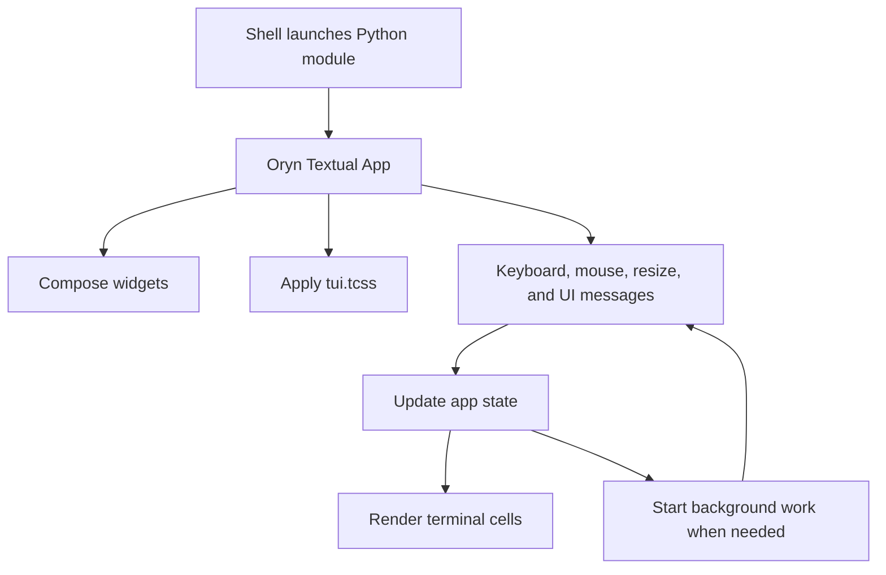
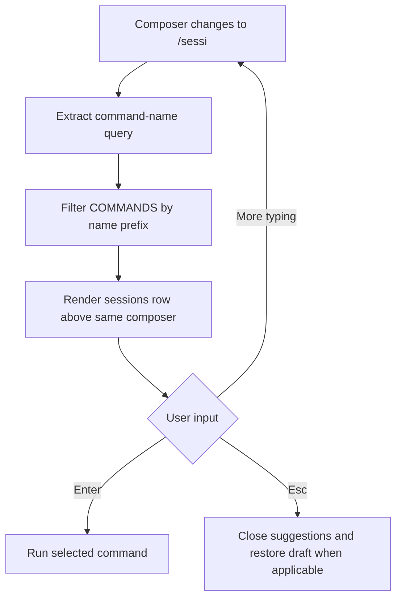
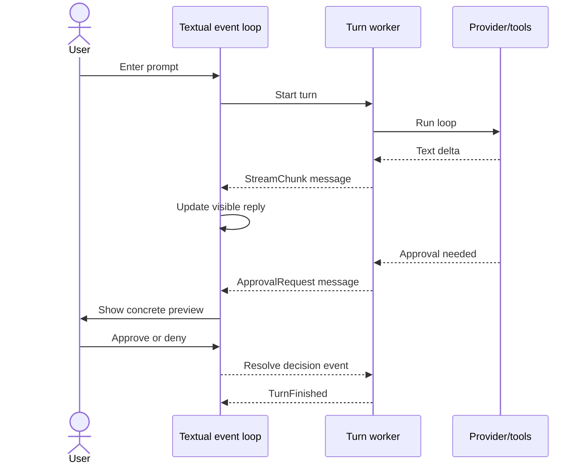

# Terminal UI: usage, rendering, and the design iterations

[Handbook index](README.md) · [Previous: MCP management](09-mcp-manager-and-oauth.md) · [Next: dashboard and Markdown](11-web-dashboard-and-markdown.md)

Sources: [tui_app.py](../tui_app.py), [tui.tcss](../tui.tcss), [test_tui_app.py](../tests/test_tui_app.py).

## 1. What a TUI actually is

A terminal user interface draws structured screens inside a terminal. It can have input fields, selectable lists, scrolling, keyboard shortcuts, and mouse interaction. It is more capable than a simple line-by-line prompt, while remaining a terminal program.

Oryn's TUI uses Python and Textual. Rich renders assistant Markdown and code. TCSS styles widgets using Textual's terminal-oriented styling rules. The provider, tools, and storage stay in Python and are imported directly.



Textual renders terminal cells, not browser DOM elements. Styling dimensions are generally terminal columns/rows or container units; a web CSS pixel layout cannot be copied directly.

## 2. Why Python rather than Go

The user considered a Go TUI. Go can produce excellent terminal applications. For this project, the backend was already Python. A Go frontend would need an IPC/API boundary to Python or a rewrite of the provider/loop/tools/store.

Using Textual keeps one main application executable and direct function calls. The existing MCP async thread and background turn workers still exist, but those are within the Python process. The language decision was a reuse decision, not a claim that Go is unsuitable.

## 3. Current visual layout

The user asked to remove the sidebar, avoid the model label at the upper-right, reduce oversized boxes, expand the transcript, move model controls below the composer, and keep dialogs from blacking out the chat. Those requests shaped the current layout.

Conceptual transcript view:

```text
┌─────────────────────────────────────────────────────────────────────┐
│ Project/session context                                             │
│                                                                     │
│   You: compact prompt                                               │
│                                                                     │
│   Oryn                                                              │
│   Rendered answer, code, tool activity, and status                    │
│                                                                     │
│   ...scrollable transcript...                                       │
│                                                                     │
│   [slash suggestions, when open, same width as composer]             │
│   > editable composer                                               │
│   model · effort · speed                         useful key hints   │
│                                                                     │
│ project/footer and application shortcuts                            │
└─────────────────────────────────────────────────────────────────────┘
```

The home screen and an active transcript have different layout needs. The home view presents Oryn's mark and a bounded composer; a chat expands the available transcript. Responsive sizing avoids reserving an excessive right margin or letting the composer float far above the bottom.

Normal launches open this home screen with a fresh chat, including when launched from Oryn's own repository. Saved conversations remain available through `/sessions`, Ctrl+O, or an explicit `--resume SESSION_ID`. Previously, launching from the repository automatically loaded the legacy `main` conversation.

This is still the OpenCode-inspired direction the user chose to keep. Alternative makeover concepts were discussed/generated, but were not adopted as the current theme.

## 4. Widget responsibilities

| Widget / screen role | Responsibility |
| --- | --- |
| Main app | Own active session/project/model, turn state, tools, draft, and workers |
| `ChatComposer` | Multiline input with send/newline behavior and palette integration |
| Transcript `VerticalScroll` | Message cards and tool activity |
| Message rendering | Plain user text, Rich Markdown for assistant content, and elapsed time in the reply footer |
| Attached command palette | Filter commands beside the active composer |
| `ChoiceScreen` | Common searchable choice list, selection, details, and hints |
| `ToolsScreen` | Grouped tool catalog with compact rows and full selected description |
| `MCPManagerScreen` | Connection status and management controls |
| Text prompt screen | Enter a project path or rename value |
| Info screen | Scrollable quick guide |
| Approval screen | Show command/content/diff and obtain an explicit decision |

Shared picker behavior is reused because models, sessions, effort, speed, and tools need similar keyboard interaction. Each specialized screen still owns the meaning of its choices.

## 5. Complete command and shortcut reference

| Command | Action | Keyboard access |
| --- | --- | --- |
| `/new` | Start a new session | Ctrl+N |
| `/help` | Open the quick guide | Through palette |
| `/mcps` | Manage known MCP connections | Through palette |
| `/models` | Choose model | F2 |
| `/effort` | Choose reasoning effort | F3 |
| `/speed` | Choose service tier | F4 |
| `/project` | Open another project folder in a new session | Through palette |
| `/sessions` | Search/resume saved sessions | Ctrl+O |
| `/tools` | Browse currently available tools | Through palette |
| `/exit` | Exit application | Ctrl+C while idle |

Aliases: `/model` → `/models`, `/mcp` → `/mcps`, `/quit` and `/q` → `/exit`.

Other controls:

- **Enter:** send, or choose a highlighted command/picker item where appropriate.
- **Shift+Enter:** insert a newline in the composer.
- **Ctrl+P:** open command palette.
- **Up/Down:** navigate visible choices.
- **Esc:** close overlay and return focus; pending OAuth uses its cancellation behavior.
- **Ctrl+C during a turn:** stop that turn.

Terminal support for modified Enter varies. If a terminal sends plain Enter for Shift+Enter, that terminal's key encoding needs attention. The application binding exists; the terminal still has to transmit the distinction.

Commands such as `/agents`, `/plugins`, `/compact`, and `/fork` from other tools are not implemented merely because their screenshots inspired the layout.

## 6. Slash completion and the `/session` bug

The terminal palette lives above the composer and matches its width. It leaves the rest of the chat visible instead of replacing the full screen with a command dialog.

Filtering uses command-name prefixes. A query like `/sessi` should suggest `/sessions`; `/new` should not match solely because its description contains “session.” This was the root cause of the reported unrelated suggestions.



Ctrl+P can temporarily insert/open slash command selection while remembering a previous draft. Closing the palette restores that draft in the implemented flow. Typing ordinary text should not accidentally become a destructive session action.

## 7. Keep typing while Oryn works

The composer is not disabled simply because a turn is active. You can draft the next message while the current answer streams. A second turn in the same active TUI conversation is blocked until the current one ends.

Typing `/` or pressing Ctrl+P still opens the attached command menu during a tool operation. Filtering and arrow-key navigation remain available. `/help`, `/tools`, and `/mcps` can open their views; MCP connection changes remain disabled until the turn ends. Selecting a session, project, model, or setting command during the turn keeps the typed command and reports that it must wait. Esc restores a draft opened through Ctrl+P. If the turn finishes while a dialog is open, that dialog retains keyboard focus.

The active-turn behavior is:

| Concern | During active turn |
| --- | --- |
| Edit draft | Allowed |
| Open and filter `/` commands | Allowed |
| Submit another turn | Blocked |
| Stop current turn | Available |
| Change session/project/model/connection state | Guarded until safe |
| Inspect help, available tools, or MCP status | Available |

An editable input is not a queued-message subsystem. Oryn retains a draft; it does not implement a general queue that automatically submits every draft after completion.

### Elapsed reply time

When the TUI accepts a prompt, it records `time.monotonic()`. The turn worker measures the elapsed seconds when it finishes, including model requests, tools, browser cleanup, and approval waits. This measures the complete turn, rather than time to the first token or model computation alone.

The existing reply footer shows `▣ Oryn · 12.4s`, or `▣ Oryn · 2m 5.4s` for longer turns. Stopped and failed replies also show their elapsed time alongside their existing status. Saved assistant replies carry `elapsed_seconds` in their existing message JSON, so reopening or switching back restores the footer. Older messages and invalid timing values retain the plain Oryn footer. The context preparation step removes this UI metadata before sending the next model request.

## 8. Worker-to-UI messages

Network and tool operations must not block Textual's renderer. The turn worker posts application messages:

| Message | Contents / purpose |
| --- | --- |
| `StreamChunk` | Newly streamed text |
| `ToolActivity` | Start/result phase, call, and result |
| `TurnFinished` | Answer, error, or cancelled outcome, plus elapsed seconds |
| `MCPReady` | Startup status, schemas, and connection snapshots |
| `ApprovalRequest` | Review title/preview and a decision event |



The worker waits for an approval event rather than drawing directly to the terminal. The UI resolves the event and the tool can continue or cancel. MCP startup uses an explicit message handler so a ready event is actually consumed and the status no longer falsely appears disconnected.

## 9. Models, effort, and speed pickers

Model choices come from the Codex cache. Effort/speed choices come from the selected model's metadata. Their pickers show short selectable labels, then put the longer explanation in a dedicated details area.

This repaired the “dirty text” problem where long descriptions wrapped across several rows and pushed controls out of sight. The visible model label and settings remain below the composer rather than consuming the top-right header space.

Changing settings preserves the draft and persists valid choices per model/session. A failed save restores prior provider settings rather than presenting an unsaved choice as committed state.

## 10. Session picker

Sessions are grouped with meaningful date labels such as Today or a recorded date. Older chats without known dates retain an unknown/older grouping rather than being assigned invented timestamps. Pinned chats have priority ordering.

Controls include Ctrl+F to pin/unpin, Ctrl+R to rename, and Ctrl+D for the guarded two-step deletion flow. Search narrows choices. Selecting a session restores its bound project, transcript, selected model, and valid model settings.

Switching is blocked during an active turn so callbacks from the old worker do not get appended to a newly selected conversation.

## 11. Tool browser: compact rows and separate detail

The user preferred a list resembling:

```text
read_file            Read a UTF-8 project file...
search_files         Find matching project lines...
edit_file            Replace one exact text span...
mcp__context7__...   Query connected documentation...
```

The tool browser groups native and server tools, shows a highlighted short row, and displays the selected full description below. Selecting a row inspects it; it does not execute the tool.

An important implementation detail: setting Rich's `no_wrap` flag was insufficient because Textual converts renderables into its own content representation. The fix truncates the actual row text to the measured scrollable content width, with ellipsis. This fixes the shared rendering path instead of shortening every tool's true description.

Resize handling computes visible row limits so details, action buttons, and navigation hints remain reachable. Highlight scrolling is applied after refresh so the selected row stays visible. A common `_max_rows` hook handles specialized screens without competing resize handlers overwriting each other's layout choices.

## 12. Transparent dialog backgrounds

Modal screens can still capture focus and require selection while keeping their background transparent. Oryn uses that behavior to retain visible chat around model/session/MCP/tool dialogs. It does not paint an opaque full-screen backdrop merely because a picker is open.

The dialog itself has a dark panel so its content remains legible. Transparency of the surrounding screen and opacity of the dialog panel are separate style decisions.

## 13. Scrollbar makeover

The final change addressed the wide blue scrollbar in help/tools/approval surfaces. The theme now styles `VerticalScroll`, `OptionList`, and `TextArea` scrollbars consistently:

| Token | Value / use |
| --- | --- |
| Canvas | `#0a0a0a` |
| Panel | `#141414` |
| Element surface | `#1e1e1e` |
| Main text | `#eeeeee` |
| Muted text / scrollbar thumb | `#808080` |
| Active/hover peach | `#fab283` |
| Accent | `#9d7cd8` |

Scrollbars use one column/row, blended tracks/corners, a muted normal thumb, and peach hover/drag state. The transcript track matches the canvas; the palette track matches its element surface. This change retains useful scrolling rather than merely hiding an oversized indicator without replacing affordance.

## 14. Markdown and mathematical limitations in a terminal

Assistant messages use Rich Markdown, including readable headings/lists and syntax-aware fenced code. User text remains plain rather than accidentally interpreting a user's code or Markdown as interface markup.

The TUI does not use the browser's KaTeX plugin. A terminal cannot display the same browser mathematical layout by importing `remark-math`; Rich's Markdown support is a separate renderer. Unicode mathematical symbols may be legible, but do not claim parity with the dashboard's typeset equations.

Similarly, terminal font, Unicode width, emoji, right-to-left text, and key encoding depend on the terminal environment. The current test suite does not establish comprehensive multilingual terminal layout correctness.

## 15. Screenshots and visual inspection

Textual can export SVG screenshots. Some exports add a decorative terminal/window frame with three traffic-light dots. Those dots are screenshot chrome, not three buttons implemented inside Oryn's terminal UI.

The UI changes were inspected at normal and narrow terminal sizes, converting SVG captures to PNG for viewing. Temporary screenshot files were not application assets or release artifacts. For repeatable review, use the manual checklist and existing TUI test cases, and inspect narrow layouts rather than relying solely on a large terminal screenshot.
