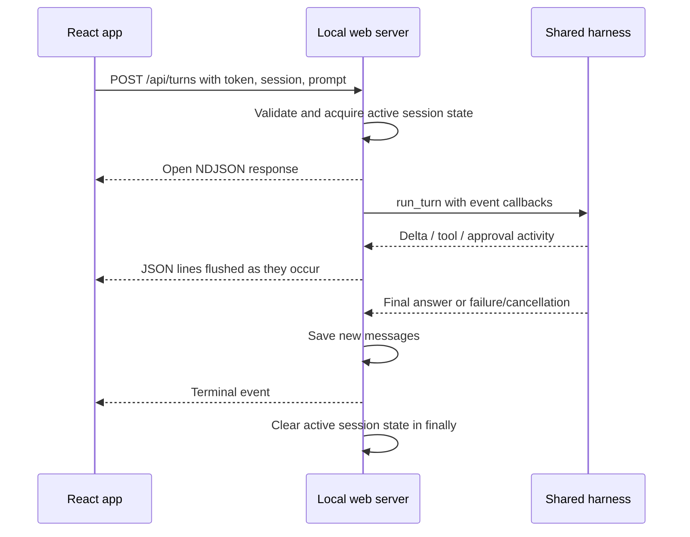

# Browser dashboard, streaming, Markdown, and mathematics

[Handbook index](README.md) · [Previous: TUI](10-tui-guide-and-rendering.md) · [Next: approval boundaries](12-approvals-security-and-boundaries.md)

Sources: [web_app.py](../web_app.py), [App.tsx](../../web/src/App.tsx), [api.ts](../../web/src/api.ts), [components.tsx](../../web/src/components.tsx), [markdown.ts](../../web/src/markdown.ts), [styles.css](../../web/src/styles.css).

## 1. Local website versus application

The dashboard is a React application rendered in a browser and served by a local Python backend. The TUI is a terminal application using that backend logic directly. Both run on the user's laptop, while model and hosted service calls go over the network.

The dashboard is not deployed as a public multi-user website. Its backend binds localhost and has local request protection. A future installable product needs packaging, onboarding, platform support, and account/configuration work; removing the browser alone does not solve all of that.

## 2. Frontend stack

| Dependency | Actual job |
| --- | --- |
| React / React DOM | Components and stateful rendering |
| TypeScript | Checked message, session, and event shapes |
| Vite | Development server and production build |
| Tailwind's Vite integration plus CSS | UI styling infrastructure |
| `lucide-react` | Icons |
| `react-markdown` | Parse and render assistant Markdown |
| `remark-gfm` | Tables, task lists, strikethrough, and related Markdown extensions |
| `remark-math` | Recognize math notation |
| `rehype-katex` | Typeset recognized formulas |
| `thinking-orbs` | Animated activity indicator |

Reusable prompt/activity components live in `web/src/components/ui`. The project structure does not imply a complete plugin-generated component system; the actual files and package configuration define what exists.

## 3. Backend routes

| Method and path | Purpose |
| --- | --- |
| `GET /api/bootstrap` | Initial token, projects, sessions, model, MCP statuses |
| `GET /api/sessions/<id>` | Saved user/assistant/tool content and turn statuses |
| `POST /api/sessions` | Create a session for a recognized project root |
| `PATCH /api/sessions/<id>` | Rename a session |
| `DELETE /api/sessions/<id>` | Delete a non-active session |
| `POST /api/turns` | Start one streamed user turn |
| `POST /api/turns/cancel` | Set cancellation and deny matching pending approvals |
| `POST /api/approvals` | Resolve a specific active decision |
| `POST /api/mcp` | Update global enabled connection switches when no turn is active |
| Static `/` and assets | Serve the built frontend |

The session response intentionally contains a presentation-friendly subset. It does not dump raw assistant `tool_calls` to the UI; the backend still retains protocol history in SQLite for future model requests.

Requests are validated for body type, content type, length, known session/project identifiers, and appropriate active state. The web prompt is bounded to 10,000 characters; JSON bodies have an overall limit.

## 4. Browser event streaming

The provider consumes SSE from the remote endpoint. The web backend emits **NDJSON**, one JSON object followed by a newline, to the browser's `fetch` response stream.

```jsonl
{"type":"delta","text":"I will inspect "}
{"type":"tool_start","id":"call_example","name":"read_file","detail":"README.md"}
{"type":"tool_result","id":"call_example","name":"read_file","result":"# Example"}
{"type":"done","answer":"Here is the explanation..."}
```

Possible events:

| Event | UI behavior |
| --- | --- |
| `delta` | Append streamed assistant text |
| `tool_start` | Add a running tool card |
| `tool_result` | Fill the matching card and update activity |
| `approval` | Add a concrete allow/deny card |
| `done` | Finalize answer and completion state |
| `cancelled` | Mark available partial reply stopped |
| `error` | Mark failure and preserve available text |



The browser decoder buffers partial chunks until it sees a newline. A network chunk is not necessarily one JSON event; that is why splitting each raw chunk immediately would be incorrect.

Tool-result cards get a shorter display preview than the history's retained result. A collapsed card showing a small preview does not mean the model saw only that preview.

## 5. Per-session frontend state

The app keeps timeline items, statuses, drafts, running-session IDs, selected session/project, and stop state. Updates target the session that started a turn, not whichever session happens to be visible when a delta arrives.

This matters if the user switches chats while a previous conversation is working. A late delta belongs to its original turn. Mixing it into the currently selected chat would corrupt the interface's mental model even if backend storage were correct.

The backend prevents a second active turn for the same session. Different dashboard sessions can run concurrently, but MCP connection changes are global and therefore blocked while any turn is active.

## 6. The input-lock bug and its repair

The earlier screenshot showed “Oryn is answering...” in an unusable chat box. The mistake was treating “a response is generating” as “the user must not edit the input.”

Current `PromptInputBox` separates editing from submission:

```tsx
// Representative lines from the component's behavior.
const unavailable = isLoading || disabled;

<textarea disabled={disabled} value={value} onChange={...} />

// Submission checks unavailable; generation alone does not disable textarea.
```

`isLoading` changes hints and shows Stop. The editor remains usable while the current response streams. Submission is blocked until the active turn is finished. Initial bootstrap and the brief stopping state can still disable editing through their separate `disabled` path.

The textarea grows with its draft up to a bounded height. Enter sends when appropriate; Shift+Enter adds a newline. During generation, Enter is not used to start a second turn. IME composition is checked so Enter used to commit a character does not unexpectedly submit a message.

## 7. Sessions and project sidebar

The dashboard has a sidebar separate from the TUI's sidebar-free design. It supports project grouping, session selection, search, rename/delete controls, collapse behavior, and resizing. Pointer and keyboard resize paths fit the available viewport.

Changing project changes the context for new sessions. Existing sessions retain their bound root. A chat title is presentation metadata and does not grant or change filesystem access.

MCP settings in the dashboard show known connections and enable/disable preferences. The richer reconnect/login management is currently implemented in the TUI.

## 8. Approval cards and diff rendering

The backend pauses at an approval callback, emits an approval event with an ID, and waits for the user's decision. The frontend submits `{id, allow}` to the dedicated endpoint. A timeout or cancellation denies the action.

Diff previews are parsed into file header, hunk/context/add/remove lines, and added/removed counts. Colors and symbols help the user see the proposal. Code/content strings remain rendered as data, not arbitrary executable HTML.

A pretty card is useful only because the backend produced a concrete reviewable action. If the file changes while the card is waiting, the file tool's recheck still refuses to overwrite it after approval.

## 9. How plain-looking text became Markdown

There are two halves:

1. **Generation guidance:** the system prompt asks for useful Markdown, fenced code with a language tag, and recognized mathematical delimiters.
2. **Rendering:** the frontend parses assistant content into structured elements and applies styles/plugins.

The model still returns text. Markdown characters in that text describe structure. For example:

```text
## Example

Use `total` for the accumulator.

- Read the file.
- Apply the focused edit.
```

The renderer turns that into a heading, inline code, and a list. Without a Markdown renderer, the same bytes appear as ordinary symbols and line breaks.

```mermaid
flowchart LR
    M["Model output text"] --> N["Normalize supported legacy math delimiters"]
    N --> R["ReactMarkdown parses structure"]
    R --> G["remark-gfm handles extended Markdown"]
    G --> A["remark-math recognizes formulas"]
    A --> K["rehype-katex creates mathematical layout"]
    K --> C["CSS styles paragraphs, code, tables, and formulas"]
    C --> V["Readable answer in browser"]
```



No fine-tuning is required for this rendering pipeline. Better prompts help generate the intended structure, but correct rendering determines how it appears.

## 10. Code blocks

An assistant should use a fenced block for code:

````markdown
```python
def square(x):
    return x * x
```
````

`react-markdown` creates `<pre><code class="language-python">...`. Styles provide a dark readable code surface and horizontal overflow. The language class preserves meaning and enables future highlighting, but the current dashboard does not install a general syntax-highlighting plugin for all answer code blocks.

The TUI's Rich renderer handles code through its own syntax rendering. Dashboard code-block rendering and TUI syntax rendering are different implementations.

Existing frontend tests check language labels for Python, JavaScript, JSON, and Bash. A language label is metadata; it does not validate or execute the code.

## 11. The regression equation example

The reported answer showed raw constructs such as `\hat{y}` and `\frac{...}{...}` instead of readable mathematical layout. A properly structured Markdown answer can contain:

```markdown
The simple linear regression model is:

$$
\hat{y} = b_0 + b_1 x
$$

where $b_0$ is the intercept and $b_1$ is the slope.

$$
b_1 = \frac{\sum_i (x_i-\bar{x})(y_i-\bar{y})}
           {\sum_i (x_i-\bar{x})^2}
$$

$$
b_0 = \bar{y} - b_1\bar{x}
$$
```

`remark-math` recognizes inline `$...$` and display `$$...$$` spans. KaTeX typesets the hat, subscripts, fractions, and sums. Formula CSS makes oversized expressions horizontally scrollable rather than breaking the whole chat layout.

Mathematical formatting does not verify mathematical correctness. A beautifully typeset wrong equation is still wrong.

## 12. Legacy delimiter normalization and edge cases

Some model output uses `\(...\)` and `\[...\]`. `normalizeLatexDelimiters` converts supported pairs to the delimiters recognized by the rendering pipeline.

| Input | Normalized behavior |
| --- | --- |
| `\(x^2\)` | Inline `$x^2$` |
| Standalone `\[x^2\]` | Display formula with `$$` boundaries |
| `\[x^2\]` inside prose or a table cell | Inline form rather than injecting a block into the line |
| Unmatched opener | Leave literal text |
| Escaped delimiter | Leave literal text |
| Backtick inline code | Preserve exactly |
| Backtick or tilde fenced code | Preserve exactly, including LaTeX-like strings inside |

Why protect code? This is a Python string, not mathematical prose:

```python
expression = r"\[x^2\]"
```

Changing it to dollar delimiters would corrupt the user's intended code example. The normalizer tracks code fences and inline backtick runs before converting ordinary text.

The algorithm also checks preceding backslashes to distinguish real and escaped delimiters, requires a nonempty formula, and checks whether bracket math is alone on its line. It does not attempt to repair every malformed expression or convert arbitrary naked brackets into equations.

KaTeX is configured with `throwOnError: false`, so malformed mathematics is displayed as an error representation rather than crashing the whole answer component. Ordinary Markdown HTML is not enabled through an unsafe raw-HTML plugin.

## 13. Unicode, human languages, and programming languages

These are different concerns:

| Concern | Current evidence |
| --- | --- |
| UTF-8 text storage and transport | Python/JSON paths preserve Unicode; frontend decoder handles streamed UTF-8 |
| Programming-language code fences | Tests cover common language labels |
| Natural-language answer quality | Depends on model and prompt; no comprehensive multilingual benchmark here |
| Arabic/Hebrew directionality | No complete specialized RTL layout implementation verified |
| Terminal glyph width/emoji | Depends on terminal/font and Rich/Textual behavior |
| Mathematical symbols | Dashboard math pipeline implemented; TUI is a separate renderer |

Suggested manual prompts for future checks:

```text
Explain a Python loop in Hindi, with a Python code block.
Explain the same equation in Japanese, retaining LaTeX math.
Answer in Arabic with a list, English identifier, and code block.
Show a JSON object containing emoji and accented characters.
```

These are a checklist, not a claim that all cases were run and passed. A code-fence test for `javascript` is not a test of Japanese or Hindi prose.

## 14. Activity animation and accessible state

The thinking indicator uses the installed `thinking-orbs` package. It reflects a state such as thinking/working rather than replacing an answer. Status regions, labels, button names, and conversation log semantics make the interface more understandable to assistive technology.

The CSS includes reduced-motion behavior. Scrolling, focus, and decision controls must remain usable regardless of animation. A generation indicator should not become an invisible blocker over the composer.

## 15. Present dashboard limitations

The backend is a local server with a shared configured model; it does not expose the full TUI's per-session model/effort/speed picker experience. There is no user account database, cloud deployment configuration, hosted login page, collaborative workspace, or desktop window package.

The NDJSON reader expects newline-delimited server events. Browser disconnect recovery is not a durable exactly-once protocol, and an arbitrary process crash can still leave uncertainty about remote side effects. Saved partial replies and cancellation handling repair specific failure paths, not every distributed-systems failure.
