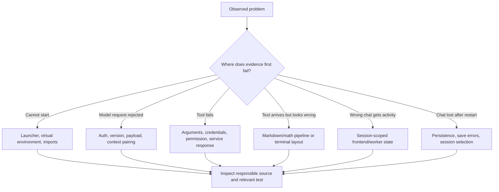

# Testing, troubleshooting, and operating the current system

[Handbook index](README.md) · [Previous: approval boundaries](12-approvals-security-and-boundaries.md) · [Next: roadmap](14-roadmap-and-benchmark-readiness.md)

Sources: [Python tests](../tests), [Markdown tests](../../web/src/markdown.test.ts), [web scripts](../../web/package.json). End-to-end checks: [Smoke checklist](smoke-checklist.md).

## 1. Different kinds of evidence

| Evidence | What it establishes | What it does not establish |
| --- | --- | --- |
| Source inspection | The implemented mechanism and its conditions | That every runtime condition succeeds |
| Unit/integration test with controlled data | Behavior under defined scenarios | Every external account or service works |
| Headless TUI pilot | Widget interaction, layout, and state transitions | Every terminal/font/key encoding behaves identically |
| Screenshot inspection | Visible appearance at captured sizes | Correct backend authorization or hidden edge cases |
| Live MCP check | One real service flow worked at that time | Permanent availability of all MCPs |
| User testing | A reported real workflow works for that user | Comprehensive regression coverage |
| Agent benchmark | Performance on a controlled task distribution | All safety properties or all product UX requirements |

The user reported successful partial-reply continuation and a working Tavily migration. Those observations complement automated checks; they do not replace them.

## 2. Existing Python suite: 91 test methods

The source snapshot contains these test methods, counted from its test definitions:

| File | Count | Main coverage |
| --- | ---: | --- |
| [test_chat_demo.py](../tests/test_chat_demo.py) | 6 | REPL history, persistence, safe preview, approval EOF, interrupted tool pairing, search CLI |
| [test_codex.py](../tests/test_codex.py) | 14 | Stream parsing/completion, function calls, payloads, orphaned calls, errors, cancellation, capabilities, version |
| [test_conversation_loop.py](../tests/test_conversation_loop.py) | 6 | Tool rounds, multiple calls, result cap, tool errors, cancellation, callback failures |
| [test_mcp.py](../tests/test_mcp.py) | 19 | Hosted/stdio flows, preferences, redaction, schema validation, duplicate names, owner lifetime, reconnect, OAuth, timeout, deferred definitions |
| [test_session_store.py](../tests/test_session_store.py) | 5 | Migration, metadata, ordered history, transaction behavior, empty DB, search |
| [test_tools.py](../tests/test_tools.py) | 25 | File boundaries, read/search/write, atomic failure, terminal approval/isolation, Tavily, Firecrawl, browser validation/retry |
| [test_tui_app.py](../tests/test_tui_app.py) | 9 | Home-page startup/resume, elapsed reply time, commands during active tools, per-chat undo, effort/speed persistence, MCP controls/login, compact tools, model/session controls, attached palette layout |
| [test_web_app.py](../tests/test_web_app.py) | 7 | Static/bootstrap/session routes, MCP preferences, streamed turns, approval/denial, stop, partial failure persistence |
| **Total** | **91** | Mechanism regression coverage |

The count describes test methods, not code coverage percentage or benchmark score. Some methods exercise many scenarios internally.

### Commands

```bash
.venv/bin/python -m unittest discover -s src/tests
```

Focused suites:

```bash
.venv/bin/python -m unittest src.tests.test_codex
.venv/bin/python -m unittest src.tests.test_mcp
.venv/bin/python -m unittest src.tests.test_tui_app
.venv/bin/python -m unittest src.tests.test_web_app
```

The `.venv` matters: MCP SDK major-version differences and Textual versions can alter imports or rendering behavior.

## 3. Frontend checks

From `web`:

```bash
npm run typecheck
npm run test:markdown
npm run build
```

The Markdown suite contains five tests:

1. Convert legacy inline and standalone math delimiters.
2. Preserve inline and fenced code literally.
3. Preserve unmatched/escaped delimiters.
4. Keep bracket math inside prose/tables inline.
5. Render common code-fence language labels.

The build runs TypeScript checking and Vite production compilation. A successful build is not a browser end-to-end test. The current project does not provide a complete automated browser UX suite covering every session/race/accessibility interaction.

## 4. Verification recorded before this documentation task

- The full Python suite passed **86 tests** after MCP-manager/tool-browser changes.
- After the final scrollbar-only update, the **five TUI tests** passed again.
- Live Microsoft Learn MCP checks covered connection, reconnect without duplicate tools, disable removing schemas, and re-enable restoring them.
- Normal and narrow terminal screenshots were visually inspected for picker/control/scrollbar appearance.
- The TUI Notion login workflow was exercised with controlled mocks. A real personal Notion login was not claimed by that test.

These are historical verification results from the implementation work. Writing this handbook did not rerun live account mutations or repeat the whole application suite merely to edit Markdown. Documentation checks are reported separately in the task result.

### Follow-up: on-demand MCP definitions

All **87 Python tests** passed after the loader implementation. The new regression method covers the compact initial catalog, invalid arguments, unknown/disabled servers, empty catalogs, unloaded calls, repeated loading, per-turn isolation, dropped connections, approval denial, credentials excluded from requests, and call/output pairing. Existing oversized-result coverage now loads its MCP definition before calling it.

A live read-only Codex/Microsoft Learn check also passed. The first request contained sixteen native schemas plus the loader (17 total, 11,109 serialized characters). The model called `load_mcp_tools`, received Microsoft Learn's three definitions (20 schemas, 15,140 characters), used `microsoft_docs_search`, and answered with a Microsoft Learn source link. This confirms one real discovery/use flow; it is not a formal task benchmark or an assertion that every server is currently available. Loading adds a model round, so a smaller initial catalog alone does not establish lower total task cost.

The broader suite initially stalled during asyncio executor shutdown inside the restricted execution sandbox. The same checks passed outside it, including local dashboard sockets and MCP subprocess tests.

### Follow-up: TUI undo isolation

The focused undo regression passed with an offline model response through the TUI turn dispatcher. It covers separate histories for chats in the same folder, empty history in new chats/projects, returning to an earlier chat, denied undo, refusal over later user edits, and history cleanup when deleting a chat. This brings the available suite to 88 methods; the earlier full-suite result above records the 87 methods present after MCP loading.

```bash
.venv/bin/python -m unittest -v src.tests.test_tui_app.TUILayoutTests.test_undo_history_stays_with_its_chat_across_switches_and_deletion
```

### Follow-up: commands during active tools

The focused active-command regression passed while a controlled read-file operation was paused in the actual turn worker. It covers slash suggestions and filtering, arrow navigation, Enter opening help/tools/MCP views, Ctrl+P draft restoration, blocked session/model changes retaining their input, prevention of a second turn, and dialog focus when the operation finishes. The available suite now contains 89 methods.

```bash
.venv/bin/python -m unittest -v src.tests.test_tui_app.TUILayoutTests.test_commands_work_during_a_tool_operation_and_preserve_drafts
```

### Follow-up: elapsed reply time

The focused timing regression passed using a controlled monotonic clock and offline provider responses through the actual TUI turn worker. It checks a turn with a tool call, completion/failure/cancellation, reset between turns, seconds/minutes and rounding boundaries, invalid timing values, persistence through a new app/store, transcript refresh in a narrow terminal, and removal of UI timing metadata from model context. The available suite now contains 90 methods.

```bash
.venv/bin/python -m unittest -v src.tests.test_tui_app.TUILayoutTests.test_reply_duration_covers_the_turn_and_survives_reopening
```

### Follow-up: home-page startup

The focused startup regression passed with an existing legacy `main` conversation. It exercises repeated default launches, `--new`, and `--project`, confirms fresh IDs and empty transcripts, preserves the old messages/model, and verifies explicit `--resume`. It also mounts the actual home layout and switches to the saved conversation. The available suite now contains 91 methods.

```bash
.venv/bin/python -m unittest -v src.tests.test_tui_app.TUILayoutTests.test_default_launch_opens_home_and_explicit_resume_keeps_saved_chats
```

## 5. Diagnostic method: find the broken boundary



Do not begin by changing the system prompt for every failure. If the API rejected an orphaned call, formatting guidance cannot make that request valid.

## 6. Error: missing tool output, HTTP 400

**Symptom:** endpoint says no output was found for a function call.

**Root mechanism:** outbound history contained a function call without its required matching result. Interruptions, failures, or legacy saved state can create that mismatch.

**Current defenses:** loop appends completed pairs together; provider filters saved orphaned calls/outputs. Test names include `test_provider_skips_saved_tool_call_without_output` and cancellation/callback pairing tests.

**If it recurs:** inspect the message sequence and IDs using safe local debugging. Check that outputs immediately follow the assistant batch and are serialized only for sent calls. Do not delete all chats as the first repair or blame web search without evidence.

## 7. Error: DuckDuckGo returned no readable results

**Symptom:** old search path returns unavailable/human-verification text.

**Cause:** a scraper could not obtain or parse ordinary readable result HTML.

**Current change:** native search uses Tavily JSON API. Missing key, rejected key, quota, connectivity, invalid response, and valid empty results are different cases.

**If still seen:** verify you are running current code rather than an old process/build. The current native search implementation should not be invoking that old scraper. Check the launcher location and source version.

## 8. Error: newer model requires newer Codex

**Symptom:** HTTP 400 says the chosen model requires an upgrade.

**Cause observed:** Oryn previously advertised an old fixed CLI version in headers.

**Current change:** choose valid version from model cache, installed CLI, or fallback. Catalog capabilities drive settings.

**Diagnosis:** inspect `codex --version`, refresh the installed CLI/catalog, and verify the selected model belongs to the account's current options. Avoid assuming that a hardcoded model name grants access.

## 9. Cannot type while the answer streams

**Cause observed:** a busy flag disabled the composer.

**Current change:** editing and submitting have separate conditions. The input can retain a new draft while the existing turn continues. Stop and brief startup/stop state still have dedicated handling.

**Regression check:** start a long reply, type a draft, stop or wait, and confirm the draft remains. Confirm Enter did not begin a competing same-session turn.

## 10. Equation still looks like raw LaTeX

First identify the interface. The dashboard has React Markdown/math/KaTeX. The TUI uses Rich and does not have identical typeset math support.

For the dashboard, check:

1. Did the model produce recognized delimiters?
2. Did legacy delimiter normalization preserve code while converting prose?
3. Did `remark-math` identify the span?
4. Did KaTeX receive valid LaTeX?
5. Are formula styles and overflow available in the built frontend?
6. Is the browser loading a freshly rebuilt frontend?

Naked `[ ... ]` text with stripped escaping is not automatically the same as recognized display math. No parser can reliably infer every intended formula from arbitrary punctuation.

## 11. TUI startup indentation error

An earlier screenshot showed `IndentationError: unexpected indent` in `src/tui_app.py`. That is a Python source syntax problem before any model request. It was repaired during the TUI iteration; starting the module and the test suite now exercises importability.

If a similar error appears, inspect the indicated file/line and the actual checkout being launched. Rebuilding the React dashboard or changing an MCP key cannot fix Python indentation.

## 12. MCP says not connected

Use `/mcps` to identify the server and its actual status:

| State | Interpretation |
| --- | --- |
| Starting | Connection/discovery still in progress |
| Disabled | User switch prevents connection |
| Unavailable | Enabled, but missing credentials/dependency, timeout, or service failure |
| Connected | Accepted session and discovered tool inventory |

For GitHub/Linear/Tavily, check required local configuration. For Notion, use explicit login. For Playwright, check Node/npm. After filling keys, reconnect to reload them. Check that the startup-ready message handler has refreshed the UI before concluding a live connection failed.

The status does not prove every advertised operation will succeed. Account scope and tool-specific arguments are evaluated at call time.

## 13. MCP cleanup or reconnect errors

Async context resources must be closed by the owning task. The owner-task structure exists to satisfy that lifecycle requirement. Tests verify it, and reconnect removes old schemas/bindings before adding new ones.

If duplicate tools appear, inspect `_reconfigure` removal and adapter name deduplication. If old keys appear to persist, confirm the connection uses default presets and reconnect rebuilt its configuration. If a tool times out, the 90-second call limit is distinct from startup limits.

## 14. npm text overwrites the TUI

The screenshot showing npm notices over the slash palette came from subprocess output bypassing Textual's renderer. Stdio MCP stderr now goes away from the terminal. Notion authorization URLs also use a UI callback instead of unconditional printing inside the TUI.

The rule is simple: the renderer owns the screen. Background workers should post messages, not `print` over it. Console output is appropriate in the separate REPL/CLI context.

## 15. Dirty rows, giant boxes, and unrelated slash suggestions

These were separate presentation mechanisms:

- Oversized cards/composer: excessive sizing/padding and layout anchoring.
- Right-side waste: overly constrained content width and margins.
- Full-screen blackout: opaque modal background.
- Wrapped tool descriptions: full long text in list rows; `no_wrap` insufficient after Textual conversion.
- Wrapped effort descriptions: metadata mixed into option labels.
- `/new` while typing `/session`: description search instead of command-name prefix.
- Bright blue scrollbar: default widget theme not overridden across all scrollables.

Current checks cover attached palette dimensions, narrow pickers, details, and shortcuts. Screenshot inspection complements those tests because an element can be technically present and still look poor.

## 16. File operation refuses a change

Read the error before retrying. Common reasons include an outside/private path, missing parent, non-UTF-8 file, no exact match, multiple matches, mixed line endings, oversized edit, or bytes/mode changed while approval was pending.

The correct response to a stale match is to reread and construct a new focused proposal. The correct response to changed undo state is to leave the file untouched, not reconstruct an inverse operation from memory and overwrite user work.

Live undo lists are caller-owned and scoped by session in both the dashboard and TUI. A new chat or project has an empty list; switching back in the same process selects that chat's earlier records. Check the active session when undo is unavailable, and remember that restarting loses the live snapshots. Later changes to shared project files can still make an earlier undo refuse safely.

## 17. Search/command timeouts and oversized context

Narrow the path, pattern, result count, or task. The current system reports bounded failures rather than automatically splitting a huge task into subagents. Character limits are explicit; automatic compression is not implemented.

If history selection rejects the current turn, restarting into a shorter/new conversation can reduce input, but do not confuse this with a fix to token-aware budgeting. The tool schema catalog can still consume additional context.

## 18. Safe operational checks

Useful read-only commands:

```bash
git status --short
git log -5 --oneline
.venv/bin/python --version
codex --version
rg --version
bwrap --version
node --version
npm --version
```

Avoid pasting complete auth files, all environment variables, or raw database transcripts into reports. A good report contains interface, selected project/model, relevant error, reproduction steps, expected behavior, actual behavior, and a redacted status/trace.

## 19. What the suite still lacks

There is no complete production benchmark harness, comprehensive multilingual UI suite, full cross-platform terminal matrix, durable crash/replay journal, or exhaustive external-account integration suite. Persistent undo and dedicated edit/undo edge-case coverage deserve further work; existing write/atomic tests do not prove every undo scenario.

Future checks should follow demonstrated risks: context overflow, uncertain side effects, race conditions, large tool catalogs, unsupported terminals, and actual task completion. Increasing test count alone is not a performance strategy.
