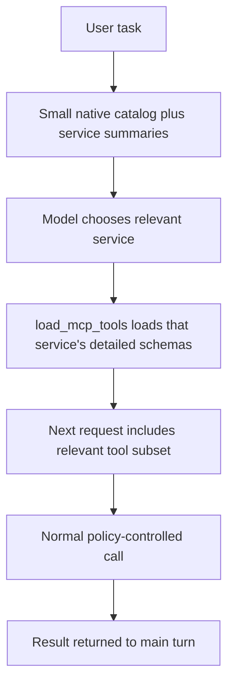
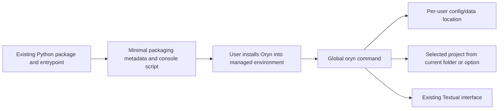
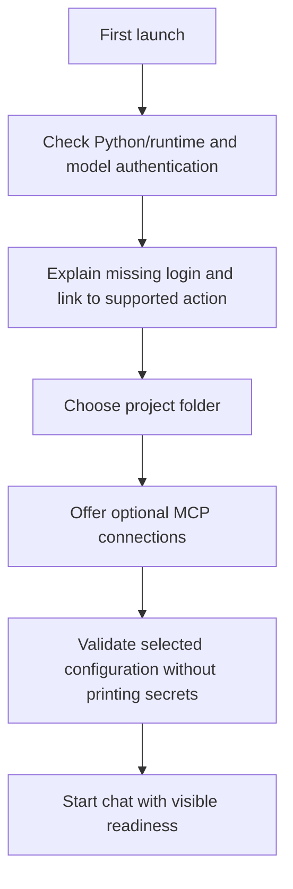
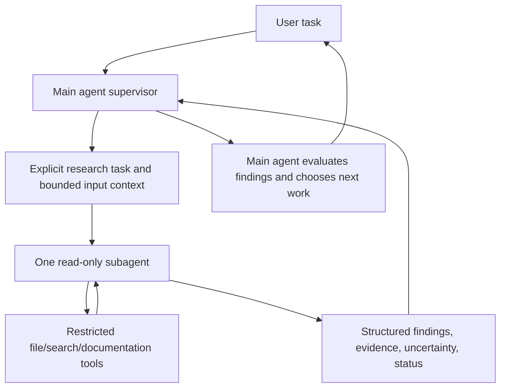
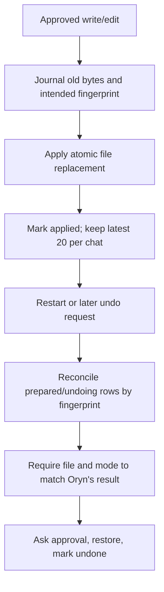
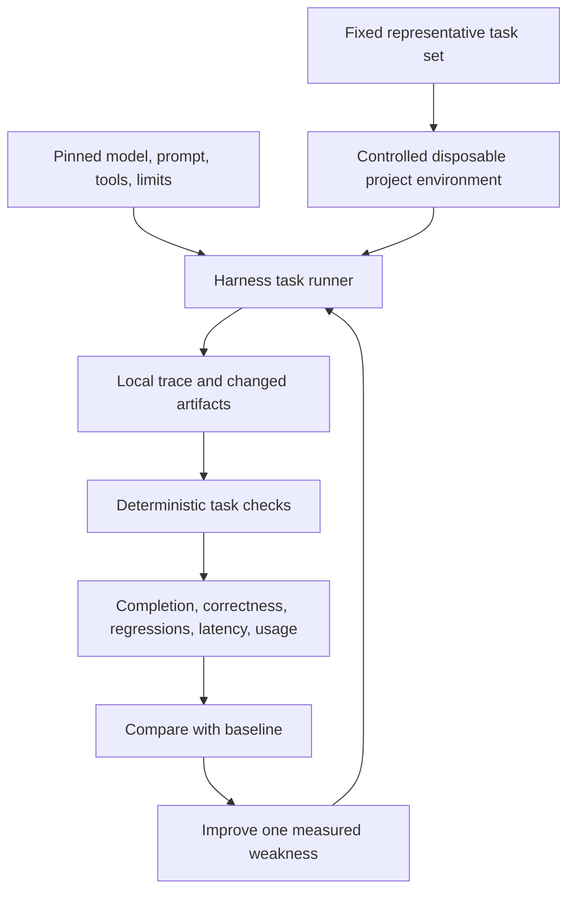

# Current status, roadmap, and gradual benchmark preparation

[Handbook index](README.md) · [Previous: testing](13-testing-troubleshooting-and-operations.md) · [Next: native tool reference](15-native-tool-reference.md)

This chapter distinguishes running code, partial support, and proposals. It records the repository issue list inspected on 27 September 2026; all ten listed issues were open at that time. An open issue can contain partially completed work.

## 1. Capability inventory

| Capability | Status | Evidence / remaining boundary |
| --- | --- | --- |
| Codex login/provider streaming | Implemented | Concrete provider and transport tests |
| Multi-round native tool use | Implemented | Shared bounded conversation loop |
| Configurable turn budgets | Implemented | 40 rounds / 200 tool calls / 1,200 seconds by default; saved pause and user continuation |
| Project roots and root instructions | Implemented | Root validation, project binding, `AGENTS.md` loading |
| Saved conversations | Implemented | SQLite transcript and metadata |
| Session search/title/pin/model preferences | Implemented, interface coverage varies | Store methods and TUI controls; dashboard subset |
| Native read/search/write/edit/undo | Implemented with limits | Undo snapshots persist per chat and reconcile interrupted file changes |
| Terminal command execution | Implemented for Linux setup | Approval, Bubblewrap, PTY jobs; network enabled and jobs stop at app exit |
| Tavily search and Firecrawl access | Implemented | Native APIs and configured hosted MCP options |
| Dashboard Markdown/math | Implemented | Renderer/normalizer/plugins and frontend tests |
| Full-screen terminal application | Implemented | Textual app and responsive picker tests |
| MCP client and known presets | Implemented | Nine hosted presets and local Playwright |
| TUI MCP enable/disable/reconnect | Implemented | Management worker, preference persistence, tests |
| Notion browser OAuth | Implemented | SDK flow/storage; TUI integration mock-tested |
| Partial text recovery | Implemented | Status persistence plus future-context annotation |
| Bounded transient recovery | Implemented with limits | Three provider attempts before output; read-only MCP retries; uncertain mutations are not replayed; retry/turn events are saved locally |
| Token-aware budgeting/compression | Implemented with estimates | 200k input trigger, 180k target, tool-free rolling summary, original transcript kept |
| Persistent file undo | Implemented with limits | Latest 20 changes per chat, SQLite snapshots and fingerprint-based recovery |
| Local turn diagnostics | Implemented, redacted | Metadata only; inspect using `./oryn repl --diagnostics [SESSION_ID]` |
| Offline task evaluation | Implemented, small baseline | Six deterministic scripted-provider tasks; not a real-model benchmark |
| On-demand MCP schemas | Implemented | Compact service directory, per-turn loading, existing approvals |
| Read-only Git tools | Implemented | Project-scoped status and staged/unstaged diff previews; no repository mutations |
| Read-only subagent | Implemented with limits | One isolated child with four read-only tools, bounded task, runtime, rounds, calls, and result |
| Local skills | Implemented with limits | Valid local `SKILL.md` instructions load selectively; they cannot add tools or execute code |
| Executable plugins | Not implemented | Trust and permission boundary remains a future design |
| Scheduler and semantic memory | Not implemented | Placeholder areas; no queued work or cross-session learned facts |
| Shared local turn/API contract | Implemented | Current interfaces share `run_turn` and SQLite; scheduler and remote gateway are not implemented |
| Global packaged CLI / desktop installer | Not implemented | Repository `.venv` launcher |
| Oryn user login/cloud accounts | Not implemented | Codex/MCP authentication is separate |
| Formal agent benchmark suite | Not implemented | Small offline smoke evaluations exist; broad model-quality benchmark remains |

## 2. The ten GitHub issues

| Issue | Intended work | Current relationship to implementation |
| --- | --- | --- |
| [#1: Per-turn traces and safe upstream errors](https://github.com/MetalCloth/mini-hermes/issues/1) | Local diagnostic record for each turn and useful redacted failures | Implemented: SQLite traces retain allowlisted turn/tool events and sanitized Firecrawl status, request ID, and detail |
| [#2: Repeatable harness evaluation set](https://github.com/MetalCloth/mini-hermes/issues/2) | Fixed tasks and measurable regression results | Implemented: six deterministic offline scenarios report expected/observed outputs; broad benchmark scoring remains separate |
| [#3: Context budgeting and oversized results](https://github.com/MetalCloth/mini-hermes/issues/3) | Safe recovery from budget/large-output conditions | Partial: estimated-token compaction, complete-turn selection, visible truncation, and clear current-turn refusal exist; an explicit response-token reserve remains |
| [#4: Persistent file-change snapshots](https://github.com/MetalCloth/mini-hermes/issues/4) | Undo surviving restart | Implemented: up to 20 applied changes per chat, 1 MB prior-file cap, 30-day retention, fingerprint checks, crash reconciliation, and delete cleanup |
| [#5: First supported local release](https://github.com/MetalCloth/mini-hermes/issues/5) | Define/harden/install the release boundary | Implemented for a single-user Linux source checkout: clean install steps, loopback-only dashboard, startup login warning, redacted diagnostics, and threat boundary; global packaging stays out of scope |
| [#6: Policy-controlled MCP client](https://github.com/MetalCloth/mini-hermes/issues/6) | Connect external tools with discovery and controls | Implemented: local stdio and hosted connections, validation, limits, approval policy, and explicit opt-in defaults; local stdio tool use runs through the agent loop |
| [#7: Supervised read-only subagent](https://github.com/MetalCloth/mini-hermes/issues/7) | Bounded context-isolated delegated research | Implemented with limits: one serialized child per parent turn, isolated task/context, read-only allowlist, bounded execution, structured evidence, cancellation, and failure recovery |
| [#8: Scoped skills and trusted plugins](https://github.com/MetalCloth/mini-hermes/issues/8) | Instructions and extension boundary | Skills implemented: validated local metadata, selective loading, size caps, audit event; they cannot register tools or execute code. Executable plugins remain deferred as scoped |
| [#9: Read-only Git status/diff tools](https://github.com/MetalCloth/mini-hermes/issues/9) | Inspect staged, unstaged, untracked work explicitly | Implemented: bounded project-scoped status and staged/unstaged previews; untracked paths are identified separately and no index/worktree mutation occurs |
| [#10: Shared gateway](https://github.com/MetalCloth/mini-hermes/issues/10) | Route interfaces/future scheduled work through a common entrypoint | Implemented for current local interfaces: shared `run_turn` and SQLite semantics, dashboard API/event contract, and documented future queue lifecycle; no scheduler or remote API |

Issue #3 remains open because the current request estimator does not reserve an explicit allowance for the generated response. The other issue scopes above are implemented and verified in this snapshot; close state is tracked in GitHub after the final suite passes.

## 3. Five practical next targets

The latest discussion emphasized consolidating the core before adding uncontrolled complexity. The first two targets below are now implemented; the others remain proposals:

1. **Load MCP tool details on demand — implemented.** Measure task completion and schema payload on representative workloads.
2. **Recover from eligible transient failures — implemented with limits.** Three attempts before model output or for known read-only MCP operations; uncertain side effects are not replayed.
3. **Package an installable `oryn` command.** Remove dependence on a specific repository `.venv` launcher.
4. **Add first-run configuration.** Guide a new user through model login, project selection, and optional connections.
5. **Add the first read-only research subagent.** Keep its task, context, tools, and result explicit and bounded.

Persistent undo, clear traces, and context limits remain important alongside this list. Priority should follow observed failures and the user's chosen milestone rather than a fixed feature checklist.

## 4. Implemented: on-demand tool catalog

The shared conversation loop now advertises native tools plus `load_mcp_tools` with a compact server directory. Full definitions for a selected connected server become available in the next request and remain loaded for that user turn. A new user turn resets selection. The UI still displays the full discovered inventory.

The implementation reuses discovered bindings/schemas and the existing action approval path. Regression checks cover the smaller initial catalog, invalid selections, no duplicate schemas, no credentials in the directory, new-turn isolation, disconnected definitions, and denied actions. A live read-only Codex/Microsoft Learn flow verified load, search, and a sourced answer. Loading consumes a normal tool round. Individual function selection within a large server and a formal task-level evaluation suite remain future work.

Success measures: fewer schema bytes/tokens per turn, unchanged ability to complete representative tasks, and no stale/disconnected bindings advertised.

## 5. Implemented: bounded request recovery

Recovery is implemented within the existing provider, conversation loop, and MCP client. There is no separate supervisor subsystem or durable attempt log.

The important design is classification. A read-only documentation request can be retried more safely than a mutation whose acknowledgement was lost. Model HTTP 429/500/502/503/504, eligible temporary connection failures, and metadata-only interrupted streams qualify before any response text/function data. Partial streams, permanent failures, TLS errors, Playwright calls, and uncertain mutations do not qualify. The native Firecrawl snapshot/action distinction remains a separate, smaller retry path.

Requests permit three attempts total with cancellable backoff and bounded Retry-After handling. MCP retries share the existing 90-second call deadline. Retry and budget-pause events reach the current interfaces and are recorded in the local per-turn trace. The loop also accepts validated round/tool/time limits and retains completed pairs before UI result callbacks, so a paused turn can continue from known work.

Avoid retrying forever, hiding all failures, repeating a form submission, or changing models without explaining the altered task conditions.

## 6. Proposal: installable local product

**Proposed, not implemented.**

A terminal product does not require Electron, Tauri, or Go. Packaging the current Python program is the first small step. The release must state its real platform dependencies, especially Bubblewrap and terminal support, and avoid assuming the developer's home folder.

A future graphical desktop window is a separate UI/packaging decision. It is not required to make the current TUI usable as a product.

## 7. Proposal: first-run setup

**Proposed, not implemented.**

A first version should expose existing configuration behavior rather than inventing an account system. Codex login, Notion OAuth, and other service keys have different purposes; the setup should explain them clearly.

Success means a new user can launch the application from an unrelated project without source edits, understand unavailable optional connections, and retain their preferences.

## 8. Proposal: first subagent

**Proposed, not implemented.**

The first delegated worker should be read-only. It should receive a concrete question, relevant files/sources, allowed tools, a time/round budget, and a result format. The main agent remains responsible for checking findings and for any approved mutation.

Required mechanics include independent context, task status, cancellation, cleanup, and result delivery. A second model call with a role prompt is insufficient to claim a robust subagent system.

Do not copy the main transcript wholesale into every worker. Context isolation matters both for cost and for keeping unrelated instructions/evidence from leaking between tasks.

## 9. Implemented: persistent undo and diagnostics

The SQLite journal records `prepared`, `applied`, `undoing`, and `undone` states. A crash between journal and filesystem operations is reconciled after restart by comparing old bytes/mode and the intended digest/mode. A file matching neither state becomes a conflict; Oryn does not guess. Terminal and remote MCP effects remain outside this undo journal.

## 10. Benchmark ambition: what is missing today

A strong benchmark result needs a reproducible environment, task dataset, runner, artifact capture, scoring, and fixed baseline. It also needs a clear definition of what the model is allowed to do, which tools are available, and how resource limits work.

`src/evaluation/run.py` now exercises six controlled tasks with a scripted provider and temporary project directories: a direct answer, a file read, a denied write, a provider failure, an interrupted tool cycle, and an oversized current turn. It reports pass/fail checks, expected and observed evidence, elapsed time, model requests, tool calls, and estimated context size. It uses no model credentials or network. This is a smoke baseline for harness mechanisms, not a model-quality benchmark or public benchmark score.

Useful next tasks include a known bug fix, symbol search, guarded edit, partial-reply recovery, and correct documentation-tool use. Public benchmark integration can follow after broader tasks, pinned model/provider conditions, artifact capture, and repeatable scoring are in place.

## 11. Suggested measurable dimensions

| Dimension | Example measurement |
| --- | --- |
| Task success | Did the requested behavior satisfy deterministic checks? |
| Tool routing | Did it choose the right tool rather than hallucinating access? |
| Evidence quality | Did the answer reflect actual returned results? |
| Change scope | Were unrelated user edits preserved? |
| Recovery | Did cancellation/failure retain truthful partial context? |
| Resource use | Model requests, tool calls, schema size, wall time |
| Policy | Were approval and boundaries enforced? |
| UX | Could the user understand progress, review, and failure? |

Benchmarks should not be optimized by claiming success without checking, weakening approval boundaries, or hiding failed attempts. A good harness makes evidence and limitations observable.

## 12. How to keep the next work small

Before adding a subsystem, answer:

1. Which observed user/task problem does it solve?
2. Which existing responsibility should own it?
3. Can the current code or standard library cover it?
4. What state must survive restart?
5. What is the smallest clear failure case and check?
6. What user approval is needed for the architecture or external side effects?

The user owns the architecture. This handbook supplies concrete proposals and evidence; it does not silently implement them or reinterpret placeholders as completed work.
