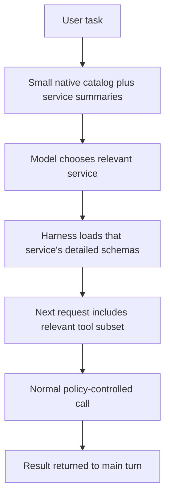
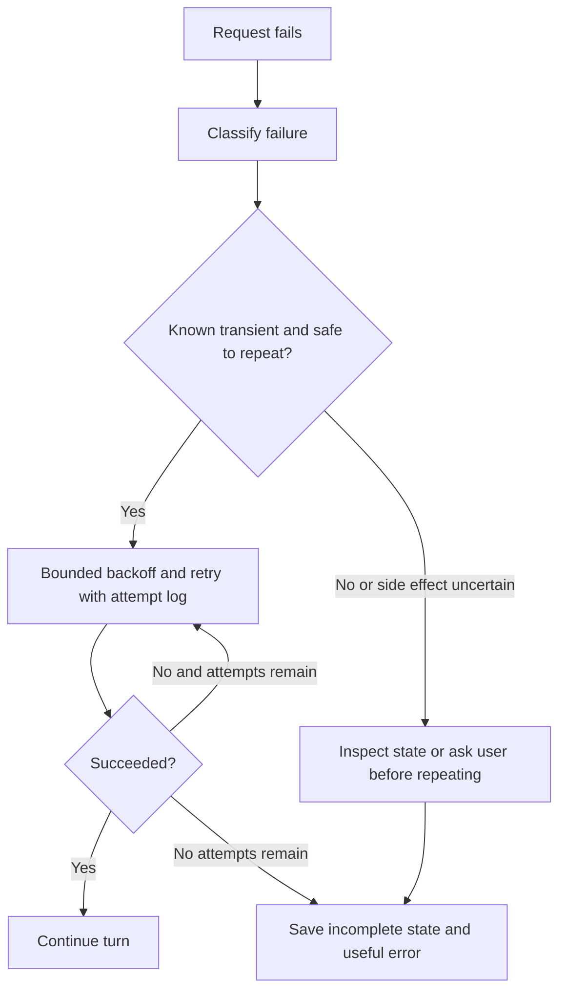
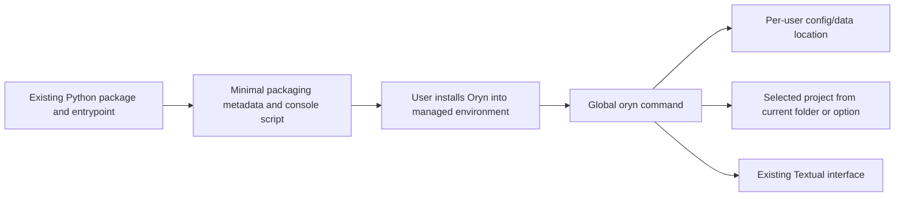
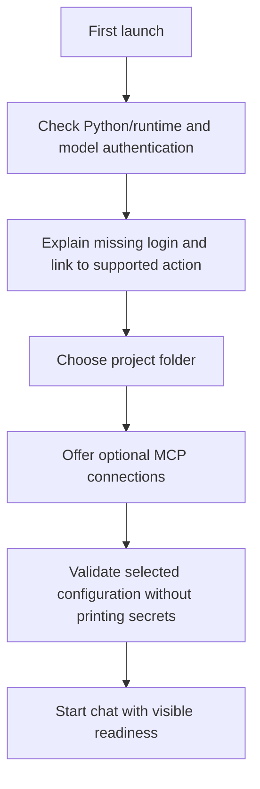
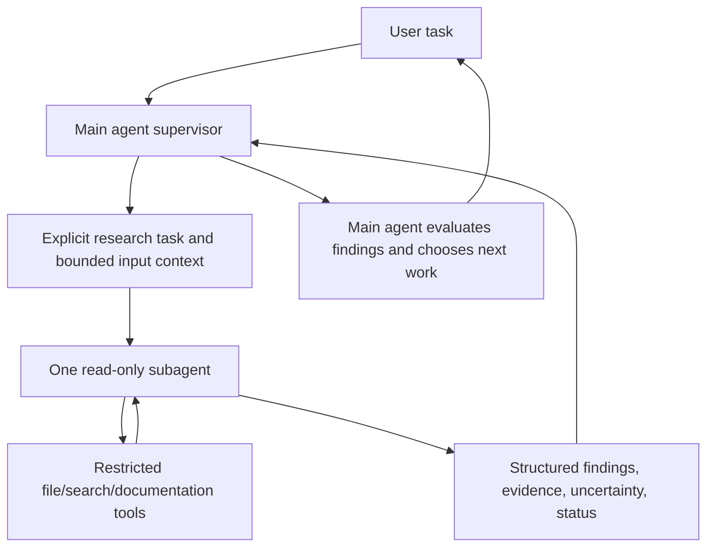
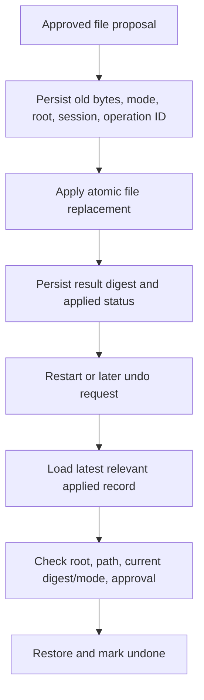
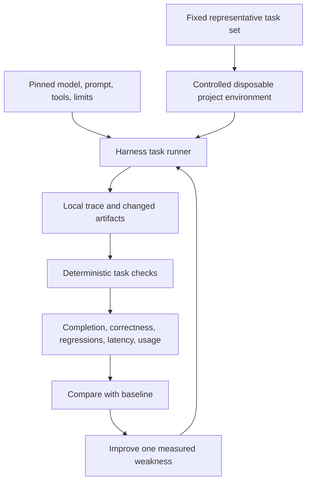

# Current status, roadmap, and gradual benchmark preparation

[Handbook index](README.md) · [Previous: testing](13-testing-troubleshooting-and-operations.md) · [Next: native tool reference](15-native-tool-reference.md)

This chapter distinguishes running code, partial support, and proposals. It records the repository issue list inspected on 27 September 2026; all ten listed issues were open at that time. An open issue can contain partially completed work.

## 1. Capability inventory

| Capability | Status | Evidence / remaining boundary |
| --- | --- | --- |
| Codex login/provider streaming | Implemented | Concrete provider and transport tests |
| Multi-round native tool use | Implemented | Shared bounded conversation loop |
| Project roots and root instructions | Implemented | Root validation, project binding, `AGENTS.md` loading |
| Saved conversations | Implemented | SQLite transcript and metadata |
| Session search/title/pin/model preferences | Implemented, interface coverage varies | Store methods and TUI controls; dashboard subset |
| Native read/search/write/edit/undo | Implemented with limits | Undo memory-only and caller-scoped |
| Terminal command execution | Implemented for Linux setup | Approval, Bubblewrap, timeout; network enabled |
| Tavily search and Firecrawl access | Implemented | Native APIs and configured hosted MCP options |
| Dashboard Markdown/math | Implemented | Renderer/normalizer/plugins and frontend tests |
| Full-screen terminal application | Implemented | Textual app and responsive picker tests |
| MCP client and known presets | Implemented | Nine hosted presets and local Playwright |
| TUI MCP enable/disable/reconnect | Implemented | Management worker, preference persistence, tests |
| Notion browser OAuth | Implemented | SDK flow/storage; TUI integration mock-tested |
| Partial text recovery | Implemented | Status persistence plus future-context annotation |
| Generic automatic retries/recovery | Partial | Native browser safe read/cleanup retry; provider/MCP supervisor absent |
| Token-aware budgeting/compression | Partial/absent | Character budget exists; compression placeholder empty |
| Persistent file undo | Not implemented | Live snapshots only |
| On-demand MCP schemas | Not implemented | All connected accepted schemas advertised |
| Read-only Git tools | Not implemented | Terminal can inspect Git with approval |
| Subagents | Not implemented | Empty files |
| General skills/plugins | Not implemented | No working loader/registry/hooks |
| Scheduler, memory, gateway | Not implemented | Placeholder areas |
| Global packaged CLI / desktop installer | Not implemented | Repository `.venv` launcher |
| Oryn user login/cloud accounts | Not implemented | Codex/MCP authentication is separate |
| Formal agent benchmark suite | Not implemented | Mechanism tests and manual smoke checks exist |

## 2. The ten GitHub issues

| Issue | Intended work | Current relationship to implementation |
| --- | --- | --- |
| [#1: Per-turn traces and safe upstream errors](https://github.com/MetalCloth/mini-hermes/issues/1) | Local diagnostic record for each turn and useful redacted failures | Tool/status/error events exist, but no durable unified run-trace subsystem |
| [#2: Repeatable harness evaluation set](https://github.com/MetalCloth/mini-hermes/issues/2) | Fixed tasks and measurable regression results | Unit/integration tests exist; a task-level evaluation harness remains |
| [#3: Context budgeting and oversized results](https://github.com/MetalCloth/mini-hermes/issues/3) | Safe recovery from budget/large-output conditions | Character selection and result caps exist; token accounting/compression/recovery still limited |
| [#4: Persistent file-change snapshots](https://github.com/MetalCloth/mini-hermes/issues/4) | Undo surviving restart | In-memory guarded undo exists; durable snapshots absent |
| [#5: First supported local release](https://github.com/MetalCloth/mini-hermes/issues/5) | Define/harden/install the release boundary | Working local interfaces; packaging/onboarding/platform scope still unfinished |
| [#6: Policy-controlled MCP client](https://github.com/MetalCloth/mini-hermes/issues/6) | Connect external tools with discovery and controls | Substantial work implemented, including hosted services and management; open issue does not imply MCP is absent |
| [#7: Supervised read-only subagent](https://github.com/MetalCloth/mini-hermes/issues/7) | Bounded context-isolated delegated research | Not implemented |
| [#8: Scoped skills and trusted plugins](https://github.com/MetalCloth/mini-hermes/issues/8) | Instructions and extension boundary | Not implemented as a general subsystem |
| [#9: Read-only Git status/diff tools](https://github.com/MetalCloth/mini-hermes/issues/9) | Inspect staged, unstaged, untracked work explicitly | Dedicated tools absent; approved terminal available |
| [#10: Shared gateway](https://github.com/MetalCloth/mini-hermes/issues/10) | Route interfaces/future scheduled work through a common entrypoint | Shared loop exists; gateway files remain empty |

These issues organize future work. This documentation task did not close them, add comments, or change external repository state.

## 3. Five practical next targets

The latest discussion emphasized consolidating the core before adding uncontrolled complexity. These are recommended implementation targets, not started subsystems:

1. **Load MCP tool details on demand.** Reduce schema payload and improve routing.
2. **Recover from eligible transient failures.** Separate safe retries from uncertain side effects.
3. **Package an installable `oryn` command.** Remove dependence on a specific repository `.venv` launcher.
4. **Add first-run configuration.** Guide a new user through model login, project selection, and optional connections.
5. **Add the first read-only research subagent.** Keep its task, context, tools, and result explicit and bounded.

Persistent undo, clear traces, and context limits remain important alongside this list. Priority should follow observed failures and the user's chosen milestone rather than a fixed feature checklist.

## 4. Proposal: on-demand tool catalog

**Proposed, not implemented.**

A first version should reuse existing bindings/schemas rather than reconnecting a server for each call. It needs a clear selection operation, size accounting, and tests that a model can discover the needed tool without hiding all useful capabilities.

Success measures: fewer schema bytes/tokens per turn, unchanged ability to complete representative tasks, and no stale/disconnected bindings advertised.

## 5. Proposal: recovery supervisor

**Proposed, not implemented.**

The important design is classification. A read-only documentation request can be retried more safely than a mutation whose acknowledgement was lost. The native Firecrawl snapshot/action distinction is an existing small example to reuse.

Avoid retrying forever, hiding all failures, repeating a form submission, or changing models without explaining the altered task conditions.

## 6. Proposal: installable local product

**Proposed, not implemented.**

A terminal product does not require Electron, Tauri, or Go. Packaging the current Python program is the first small step. The release must state its real platform dependencies, especially Bubblewrap and terminal support, and avoid assuming the developer's home folder.

A future graphical desktop window is a separate UI/packaging decision. It is not required to make the current TUI usable as a product.

## 7. Proposal: first-run setup

**Proposed, not implemented.**

A first version should expose existing configuration behavior rather than inventing an account system. Codex login, Notion OAuth, and other service keys have different purposes; the setup should explain them clearly.

Success means a new user can launch the application from an unrelated project without source edits, understand unavailable optional connections, and retain their preferences.

## 8. Proposal: first subagent

**Proposed, not implemented.**

The first delegated worker should be read-only. It should receive a concrete question, relevant files/sources, allowed tools, a time/round budget, and a result format. The main agent remains responsible for checking findings and for any approved mutation.

Required mechanics include independent context, task status, cancellation, cleanup, and result delivery. A second model call with a role prompt is insufficient to claim a robust subagent system.

Do not copy the main transcript wholesale into every worker. Context isolation matters both for cost and for keeping unrelated instructions/evidence from leaking between tasks.

## 9. Proposal: persistent undo

**Proposed, not implemented.**

The design must account for crashes between journal writes and filesystem mutation. Merely saving a Python list to JSON after the fact does not establish a durable transaction. It should also partition snapshots by session/project; the current TUI uses one app-level live list and should not be presented as a complete per-session journal.

## 10. Benchmark ambition: what is missing today

A strong benchmark result needs a reproducible environment, task dataset, runner, artifact capture, scoring, and fixed baseline. It also needs a clear definition of what the model is allowed to do, which tools are available, and how resource limits work.

This is a proposed evaluation workflow. The present 86 tests exercise mechanisms; they are not an implementation of this runner.

Useful first tasks can be small and local: fix a known bug, find a symbol, make a guarded edit, recover a partial answer, or use a documentation tool correctly. Public benchmark integration can follow once task execution and scoring are reliable.

## 11. Suggested measurable dimensions

| Dimension | Example measurement |
| --- | --- |
| Task success | Did the requested behavior satisfy deterministic checks? |
| Tool routing | Did it choose the right tool rather than hallucinating access? |
| Evidence quality | Did the answer reflect actual returned results? |
| Change scope | Were unrelated user edits preserved? |
| Recovery | Did cancellation/failure retain truthful partial context? |
| Resource use | Model requests, tool calls, schema size, wall time |
| Policy | Were approval and boundaries enforced? |
| UX | Could the user understand progress, review, and failure? |

Benchmarks should not be optimized by claiming success without checking, weakening approval boundaries, or hiding failed attempts. A good harness makes evidence and limitations observable.

## 12. How to keep the next work small

Before adding a subsystem, answer:

1. Which observed user/task problem does it solve?
2. Which existing responsibility should own it?
3. Can the current code or standard library cover it?
4. What state must survive restart?
5. What is the smallest clear failure case and check?
6. What user approval is needed for the architecture or external side effects?

The user owns the architecture. This handbook supplies concrete proposals and evidence; it does not silently implement them or reinterpret placeholders as completed work.
