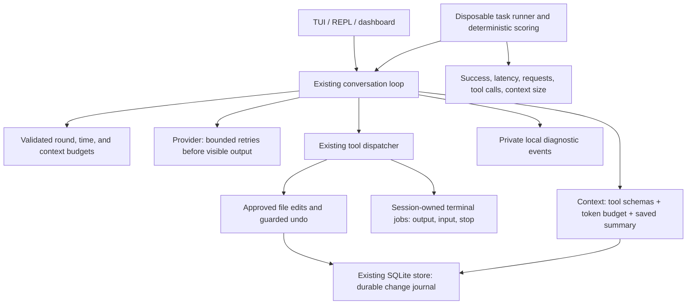

# Core reliability upgrade plan

Status: **1 and 2 implemented in existing code paths.** New context, terminal-job,
durable undo, and diagnostic/evaluation subsystems (**3, 5, 6, and 7**) await the
architecture approval required by the project's `AGENTS.md`. The diagram below mixes
implemented paths and proposed additions; this is not a claim that all boxes run today.

The requested scope is failure recovery, longer tasks, context management, terminal control,
persistent undo, and diagnostics/evaluation. Keep the existing Python provider, agent loop,
SQLite storage, tools, and interfaces separate. Use the standard library except for a token
encoder, which Python does not provide.

## Architecture

## 1. Failure recovery — implemented

- Use at most three provider attempts for HTTP 429/500/502/503/504 and eligible connection
  failures, with cancellable backoff and a bounded Retry-After delay.
- Retry only before any visible response data was emitted. Never replay a partial stream.
- Retry MCP calls only when their read-only status and transient failure are known.
- Do not repeat terminal commands, file edits, browser submissions, or uncertain mutations.
- Expose retries and final failures through the existing UI activity/event paths.
- Keep credentials and upstream response bodies out of diagnostic events.

## 2. Longer tasks — implemented

- Replace the hardcoded eight rounds with explicit validated limits.
- Start with 40 model rounds, 200 tool calls, and a 20-minute wall-time allowance per turn;
  validate user overrides and report the chosen limits. Blocking operations retain their own
  timeouts, so the turn budget is checked at execution boundaries as well as during waits.
- Expose the limits through shared launch options and report the exhausted budget clearly.
- Preserve completed tool call/output pairs and partial replies at a limit.
- A user continuation starts a new bounded turn using the saved conversation; it does not
  automatically repeat past side effects.

## 3. Context management — awaiting architecture approval

- Count message content and tool schemas, reserving space for the response.
- Use [OpenAI's tiktoken](https://github.com/openai/tiktoken) for token encoding; unknown
  model encodings are explicitly estimates. Count schemas and reserve response/formatting
  headroom rather than treating encoded text as an exact provider billing measurement.
- Use a conservative local budget by default and respect any smaller advertised model limit.
- Keep system/project instructions, the newest user request, and matched tool calls/results.
- Archive oversized tool results locally with bounded read access instead of losing them.
- Summarize older completed turns in a separate tool-free model request before discarding
  them from a request. Persist the checkpoint in SQLite; keep the original transcript.
- Summaries remain conversation data and cannot introduce new authorization/instructions.
- Fail clearly if required instructions/new input cannot fit even after compaction.

## 5. Terminal control — awaiting architecture approval

- Extend the existing Bubblewrap sandbox with session-owned subprocess jobs.
- A command can return a job ID while running; subsequent calls read new output, send input,
  or stop it. Use a PTY for interactive programs on the supported Linux platform.
- Keep command and input approval, session/root ownership checks, output caps, and timeouts.
- Stop process groups on cancellation/exit; do not leave unmanaged background jobs.
- Deliver incremental output through the existing UI tool-event paths.
- Terminal jobs remain live process state; saved job IDs do not imply restart survival.

## 6. Persistent undo — awaiting architecture approval

- Add a change journal to the existing SQLite database, scoped to session and project.
- Persist the pre-change snapshot and intended result fingerprint before touching the file.
- Record applied/undone state after the atomic operation; reconcile pending records by
  inspecting fingerprints after restart. Refuse ambiguous state instead of guessing.
- Preserve approval and current-file/permission checks, including edits made during approval.
- Keep the existing snapshot size/history limits and owner-only database permissions.
- Store bytes in SQLite BLOB columns with a prepared/applied/undoing/undone state and operation
  ID. A fresh process resolves prepared records against the old and intended fingerprints.
- Chat deletion removes its records without changing project files.

## 7. Diagnostics and evaluation — awaiting architecture approval

- Store private per-turn events with identifiers, statuses, timings, counts, and error classes.
- Avoid storing credentials, complete prompt/tool contents, or raw upstream error bodies in
  traces. The conversation and explicitly archived output have their existing private stores.
- Add a small versioned task set in disposable project directories and deterministic outcome
  checks. Offline harness scenarios are distinct from optional real-model evaluations.
- Report failures individually, together with latency, requests, tool calls, and context size.
- Add GitHub Actions for the regression suite and offline evaluations. CI uses no personal keys.
- A local evaluation set is preparation for public benchmarks, not a claimed benchmark score.

## Sequence and acceptance

1. Record the current regression baseline — done.
2. Implement recovery and budgets in existing request/loop paths — done.
3. Add durable journal/context/diagnostic storage and wire all interfaces.
4. Implement terminal jobs and output/input/cancellation behavior.
5. Add token budgeting, compaction, and archived result retrieval.
6. Run regression and task checks, inspect the TUI, and update the handbook.

Acceptance scenarios include temporary failure recovery; no partial-stream or mutation replay;
completion beyond eight tool rounds; truthful budget exhaustion; multilingual context limits;
preserved instructions and call pairing after compaction; terminal incremental output/input/stop;
no cross-chat job access; undo after reopening; interrupted journal reconciliation; refusal over
later user edits; trace redaction; and deterministic evaluations that reject a broken outcome.

## Baseline evidence

On 27 September 2026, the existing Python regression suite passed all 91 tests in 34.701
seconds before implementation. Its MCP/dashboard socket and subprocess scenarios required
running outside the restricted execution sandbox; the initial restricted run was interrupted
after stalling. No personal-account calls were required by the suite.

This plan does not change the UI theme or add subagents, plugins, product installation, or cloud
accounts. Those are outside the selected scope.

## Recovery/budget evidence and remaining work

- The final updated Python suite passed **98 tests in 35.944 seconds**. Transport failures were
  controlled, projects disposable, and no real account mutations were required.
- Checks cover transient/permanent classification, numeric/date Retry-After, partial-stream
  and mutation replay prevention, bounded cancellation, more than eight tool rounds,
  partial multi-call pauses, retained call pairs after UI callback failure, and saved
  continuation/approval expiry through TUI, REPL, and dashboard callers.
- Follow-up checks verify one saved copy after result-display failure and elapsed time
  retention on a tool-only paused reply. Its TUI was visually inspected at 120×36 and 65×26.
- Dashboard type checking, Markdown checks, and production build passed. React Doctor found
  no issues in the three changed React files; its overall score was 79/100. The existing
  production bundle-size warning remains.
- Recovery and pauses report through current UI/HTTP events. No durable diagnostic trace
  or evaluation runner exists yet. Context remains character-bounded with truncated tool
  results, undo remains memory-only, and terminal commands remain synchronous.
- The REPL's existing KeyboardInterrupt behavior still discards the active unsaved turn;
  preserved exception/paused replies do not imply crash recovery for that path.

The goal is not complete until 3, 5, 6, and 7 are approved, implemented, and checked.
