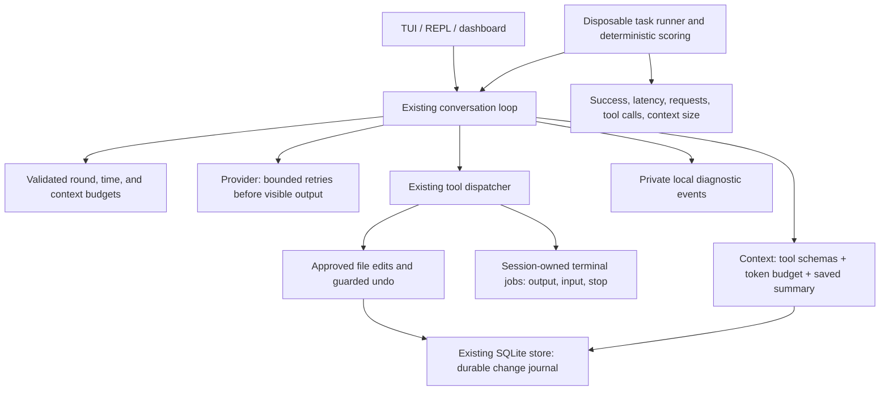

# Core reliability upgrade plan

Status: **The approved reliability upgrade is implemented and undergoing final regression checks.**
The project owner approved the 200k-token context threshold, summary prompt, managed terminal
jobs, per-chat durable undo, redacted local diagnostics, offline evaluations, regression checks,
and documentation/CI. The diagram describes the current implementation; limits are called out
below. Archived large tool-output retrieval is not part of this upgrade.

The requested scope is failure recovery, longer tasks, context management, terminal control,
persistent undo, and diagnostics/evaluation. Keep the existing Python provider, agent loop,
SQLite storage, tools, and interfaces separate. Use the standard library except for a token
encoder, which Python does not provide.

## Architecture



## 1. Failure recovery — implemented

- Use at most three provider attempts for HTTP 429/500/502/503/504 and eligible connection
  failures, with cancellable backoff and a bounded Retry-After delay.
- Retry only before any visible response data was emitted. Never replay a partial stream.
- Retry MCP calls only when their read-only status and transient failure are known.
- Do not repeat terminal commands, file edits, browser submissions, or uncertain mutations.
- Expose retries and final failures through the existing UI activity/event paths.
- Keep credentials and upstream response bodies out of diagnostic events.

## 2. Longer tasks — implemented

- Replace the hardcoded eight rounds with explicit validated limits.
- Start with 40 model rounds, 200 tool calls, and a 20-minute wall-time allowance per turn;
  validate user overrides and report the chosen limits. Blocking operations retain their own
  timeouts, so the turn budget is checked at execution boundaries as well as during waits.
- Expose the limits through shared launch options and report the exhausted budget clearly.
- Preserve completed tool call/output pairs and partial replies at a limit.
- A user continuation starts a new bounded turn using the saved conversation; it does not
  automatically repeat past side effects.

## 3. Context management — implemented

- Count serialized message content and tool schemas with an 8% estimation margin; 200k is an input-context budget, not a provider billing count.
- Use [OpenAI's tiktoken](https://github.com/openai/tiktoken) for token encoding; unknown
  model encodings are explicitly estimates. Count schemas and reserve response/formatting
  headroom rather than treating encoded text as an exact provider billing measurement.
- Use a 200,000 estimated-token pre-compaction threshold and reduce to a 180,000-token target.
- Keep system/project instructions, the newest user request, and matched tool calls/results.
- Keep the existing 20,000-character tool-result cap; archived-output retrieval is deferred.
- Summarize older completed turns in a separate tool-free model request before discarding
  them from a request. Persist the checkpoint in SQLite; keep the original transcript.
- Summaries remain conversation data and cannot introduce new authorization/instructions.
- Fail clearly if required instructions/new input cannot fit even after compaction.

## 5. Terminal control — implemented

- Extend the existing Bubblewrap sandbox with session-owned subprocess jobs.
- A command can return a job ID while running; subsequent calls read new output, send input,
  or stop it. Use a PTY for interactive programs on the supported Linux platform.
- Keep command and input approval, session/root ownership checks, output caps, and timeouts.
- Stop process groups on cancellation/exit; do not leave unmanaged background jobs.
- Deliver incremental output through the existing UI tool-event paths.
- Terminal jobs remain live process state; saved job IDs do not imply restart survival.

## 6. Persistent undo — implemented

- Add a change journal to the existing SQLite database, scoped to session and project.
- Persist the pre-change snapshot and intended result fingerprint before touching the file.
- Record applied/undone state after the atomic operation; reconcile pending records by
  inspecting fingerprints after restart. Refuse ambiguous state instead of guessing.
- Preserve approval and current-file/permission checks, including edits made during approval.
- Keep the existing snapshot size/history limits and owner-only database permissions.
- Store bytes in SQLite BLOB columns with a prepared/applied/undoing/undone state and operation
  ID. A fresh process resolves prepared records against the old and intended fingerprints.
- Chat deletion removes its records without changing project files.

## 7. Diagnostics and evaluation — implemented

- Store private per-turn events with identifiers, statuses, timings, counts, and error classes.
- Avoid storing credentials, complete prompt/tool contents, or raw upstream error bodies in
  traces. The conversation and explicitly archived output have their existing private stores.
- Add a small versioned task set in disposable project directories and deterministic outcome
  checks. Offline harness scenarios are distinct from optional real-model evaluations.
- Report failures individually, together with latency, requests, tool calls, and context size.
- Add GitHub Actions for the regression suite and offline evaluations. CI uses no personal keys.
- A local evaluation set is preparation for public benchmarks, not a claimed benchmark score.

## Sequence and acceptance

1. Record the current regression baseline — done.
2. Implement recovery and budgets in existing request/loop paths — done.
3. Add durable journal/context/diagnostic storage and wire all interfaces — done.
4. Implement terminal jobs and output/input/cancellation behavior — done.
5. Add token budgeting and compaction — done; archived result retrieval deferred.
6. Run regression and offline task checks, inspect interface wiring, and update the handbook — final verification in progress.

Acceptance scenarios include temporary failure recovery; no partial-stream or mutation replay;
completion beyond eight tool rounds; truthful budget exhaustion; multilingual context limits;
preserved instructions and call pairing after compaction; terminal incremental output/input/stop;
no cross-chat job access; undo after reopening; interrupted journal reconciliation; refusal over
later user edits; trace redaction; and deterministic evaluations that reject a broken outcome.

## Baseline evidence

On 27 September 2026, the existing Python regression suite passed all 91 tests in 34.701
seconds before implementation. Its MCP/dashboard socket and subprocess scenarios required
running outside the restricted execution sandbox; the initial restricted run was interrupted
after stalling. No personal-account calls were required by the suite.

This plan does not change the UI theme or add subagents, plugins, product installation, or cloud
accounts. Those are outside the selected scope.

## Verification and remaining limits

The complete suite and offline evaluator are run from the repository environment:

```bash
./.venv/bin/python -m unittest discover -s src/tests
./.venv/bin/python -m src.evaluation.run
git diff --check
```

The offline suite uses a deterministic scripted provider and disposable project folders. It
checks direct completion, reading actual project content, and denying a proposed write. It does
not measure model quality. The larger remaining benchmark milestone still needs more tasks,
fixed model conditions, scoring calibration, artifact capture, and comparison against a baseline.

The tokenizer normally uses `tiktoken` with a cached OpenAI encoding. If running without the
encoding data, Oryn falls back to UTF-8 byte length, a safe but overly conservative estimate that
can trigger compaction early. Token estimates also use a local image-tile approximation and do not
guarantee provider-side counts. Summary checkpoints keep the transcript but can still omit facts;
the digest prevents reuse after transcript edits, not mistakes made by the summarizer.

Terminal jobs remain Linux/Bubblewrap-dependent, limited to eight running and 20 retained jobs
per chat, and do not survive application exit. Persistent undo covers only approved native file
writes/edits, retains 20 changes per chat, and refuses ambiguous or later-edited files. Diagnostics
are allowlisted and local but are not encrypted. Large tool outputs remain truncated at the
existing context boundary; retrieving discarded output from an archive is a separate future task.

The broader public benchmark goal remains future work. The implemented local checks create a
repeatable starting point, not evidence that Oryn has passed an external benchmark.
