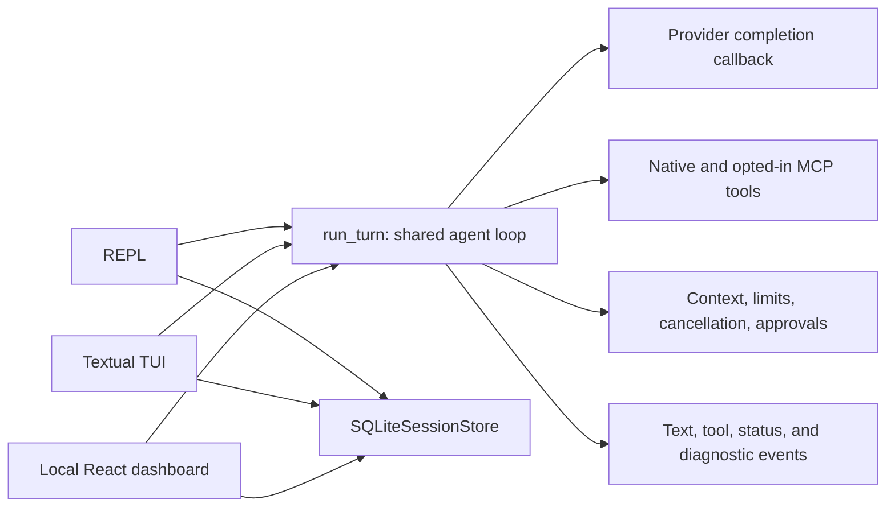
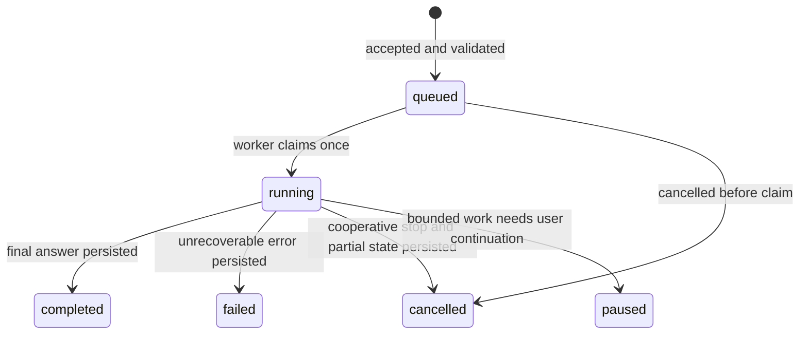

# Shared turn boundary and local API contract

[Handbook index](README.md) · [Previous: native tool reference](15-native-tool-reference.md)

Sources: [conversation loop](../agent/conversation_loop.py), [session store](../session/sqlite_store.py),
[REPL](../chat_demo.py), [TUI](../tui_app.py), and [dashboard server](../web_app.py).

## 1. Current shared boundary

Oryn's common turn entry point is `run_turn` in `src/agent/conversation_loop.py`. The REPL, TUI,
and dashboard all pass the same provider completion shape, native tool registry, active project,
approval callbacks, cancellation event, and MCP client to that loop. The loop owns context
selection, tool routing, permissions checks, retries, limits, diagnostics, and browser cleanup.
Each interface translates those events to its own display and approval controls.

Every interface uses `SQLiteSessionStore` for its transcript. It stores the user turn, completed
assistant tool-call/tool-result pairs, and the final or partial assistant message. Interrupted,
failed, and budget-paused assistant messages carry a status marker so future context does not
present partial text as finished. The REPL saves in its `finally` path; the TUI saves after the
turn-finished event; the dashboard saves before sending its terminal NDJSON event. Those are
transport-specific timings around the same transcript semantics.

There is no scheduler, background queue, or second agent engine. A new interface should reuse
`run_turn` and the existing session store instead of copying either policy. `src/gateway/` remains
a placeholder for future messaging-platform adapters; it does not replace this local turn path.

## 2. Dashboard HTTP contract

The dashboard server binds only to `127.0.0.1`. It is an internal same-machine interface between
the React UI and Python process, not a supported remote API. The HTTP endpoints use JSON unless
noted otherwise. Mutating requests require the process token from `/api/bootstrap` in
`X-Mini-Hermes-Token`, the accepted local Host, and a matching Origin when one is supplied.
JSON request bodies must use `Content-Type: application/json` and be at most 60,000 bytes.

| Request | Body | Response and failure behavior |
| --- | --- | --- |
| `GET /api/bootstrap` | None | Project, allowed project list, model, session list, MCP status, and the process token used by the local UI |
| `GET /api/sessions/{id}` | None | Saved display messages for `main` or a 32-character lowercase hex session ID; `404` for unknown sessions |
| `POST /api/sessions` | `{"project_root":"..."}`; root must be in the server's known project list | `201 {"id":"..."}` or `400` for an unlisted project |
| `POST /api/turns` | `{"session_id":"...","content":"..."}`; content is 1–10,000 characters | `200` then newline-delimited JSON events; `400/404/409` before streaming for invalid input/session, active turn, or MCP reconfiguration |
| `POST /api/turns/cancel` | `{"session_id":"..."}` | `200 {"cancelled":true/false}`; false means there was no active turn |
| `POST /api/approvals` | `{"id":"...","allow":true/false}` | `200 {"allowed":true/false}` or `404` when the approval expired |
| `POST /api/mcp` | `{"enabled":{"github":true,...}}` with every known server mapped to a boolean | `200` with status rows; `409` while any turn is active; `400` for malformed switches |
| `PATCH /api/sessions/{id}` | `{"title":"..."}` | `200` with saved title; `400/404` for invalid title/session |
| `DELETE /api/sessions/{id}` | None | `200 {"deleted":true}`; `409` while that chat is active; `404` for unknown sessions |

Session project roots are selected from known local project folders; callers cannot use a turn
request to switch a saved chat to an arbitrary path. A chat may have one active turn at a time;
separate chats can run concurrently. MCP reconfiguration waits until active turns finish.

## 3. Streaming and turn outcomes

`POST /api/turns` returns NDJSON, one JSON object per line. Events currently used by the UI:

| Event | Meaning |
| --- | --- |
| `approval` | A tool is waiting for a user decision; contains an opaque approval ID and bounded preview |
| `progress` | Human-readable retry, compaction, budget, or work status |
| `tool_start` | A tool call began; contains tool name/ID and a short display detail |
| `tool_result` | Tool call completed; UI preview is capped at 2,000 characters |
| `delta` | One streamed assistant text fragment |
| `done` | Turn completed with its final `answer` |
| `paused` | Turn reached a configured model-round, tool-call, or time limit; completed work is saved |
| `cancelled` | User stopped the turn; available partial text and completed tool pairs are saved |
| `error` | Turn failed; available partial text and completed tool pairs are saved |

Before streaming starts, protocol/input failures use ordinary HTTP status and a JSON
`{"error":"..."}` response. Once the response has started, turn failures use the terminal
`paused`, `cancelled`, or `error` event because the HTTP status can no longer be changed. Clients
should keep already received deltas and tool results if a connection drops; they must not infer
that an unreceived tool action did or did not occur. Reopen the session to read the saved record.

The TUI uses equivalent visible progress, tool, delta, approval, and turn-finished events through
Textual messages. The REPL renders them as console text. They differ in presentation, while the
same `run_turn` checks limits, cancellation, and tool approvals.

## 4. Background lifecycle before any scheduler

The current app has `running`, `completed`, `failed`, `cancelled`, and `paused` turn outcomes.
Only `running` turns exist in memory; no queue is persisted. If background/scheduled work is
added later, it must define durable states before a scheduler is built:

That future design needs a stable run ID, session/project binding, idempotent claim, timestamps,
bounded concurrency, cooperative cancellation, and persisted result/error metadata. It must use
the same `run_turn` and tool approval policy. A headless worker cannot silently approve a terminal,
file, or MCP mutation; it must wait for an explicit user decision or leave the action unexecuted.
No scheduler or queue is claimed as implemented today.

## 5. Local trust and versioning

This internal API has no remote authentication, CORS allowlist, TLS, or multi-user permission
model. Its boundary is loopback, same-origin checks, and a per-process token. Do not publish it
through a reverse proxy, port forward, or shared network. Changes to these routes should update
the dashboard frontend, endpoint tests, and this table together. It is an implementation
contract for the local UI, not a promise of public API compatibility.
