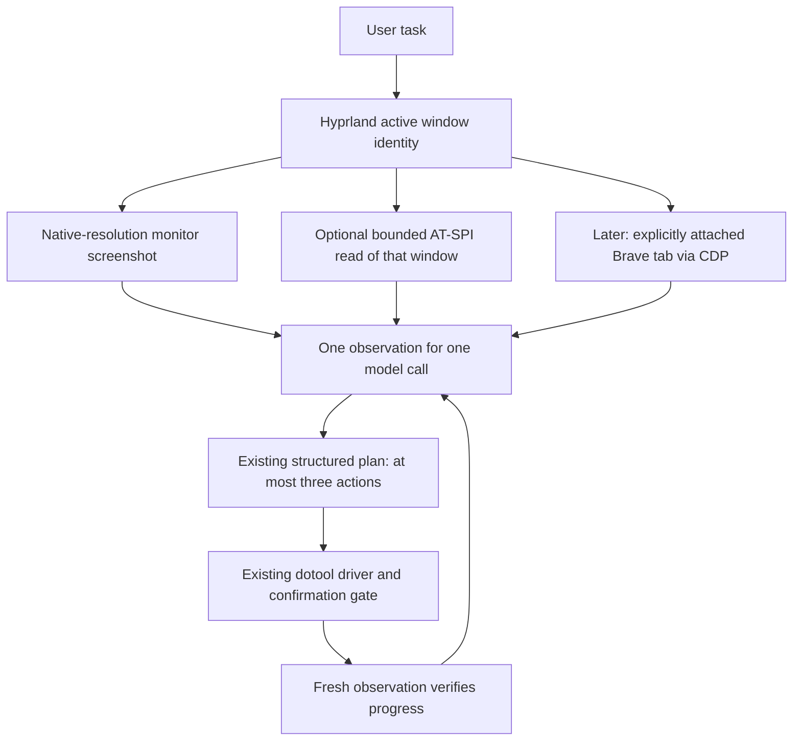

# `/computer` perception reform: measurements and staged plan

**Status: Phase 1 implemented as an opt-in experiment, with checked screenshot-pixel boxes.** Prepared and tested 2 October 2026. Browser attachment and semantic actions remain separate design stages.

This chapter records the pre-CUA dotool baseline. Since 3 October, CUA is the default `/computer` driver; see the [integration result](20-cua-driver-hyprland-experiment.md) and [current usage](../../README.md#computer-mode-selected-model). Set `ORYN_COMPUTER_DRIVER=dotool` to reproduce the path measured below.

## Goal

Make desktop tasks finish faster without increasing wrong-window actions or losing the current confirmation boundary. Measure complete tasks and model calls, not just the speed of one accessibility query.

## Baseline at measurement time

`src/computer.py` captures the focused monitor at native resolution, asks the selected model for 1–3 actions, executes those actions through `src/tools/computer_driver.py`, and captures again. It checks the active Hyprland window and its geometry before and after planning and before each action. The model gets the screenshot, task, history, dotool guide, and desktop profile. With `ORYN_COMPUTER_ATSPI=1`, it also gets bounded AT-SPI labels and checked screenshot-pixel boxes from the matched active window in that same model request. It receives no local browser DOM. Browser tools elsewhere in Oryn use Firecrawl or a separate Playwright MCP connection; they do not attach `/computer` to the user's Brave tab.

Read-only measurements on this laptop:

| Observation | Result | Interpretation |
| --- | --- | --- |
| 249 successful model responses in saved `/computer` traces | Median 5.83 s; p90 11.60 s | Removing a model turn is likely worth more than shaving tens of milliseconds from a tree walk. Traces span different models and tasks. |
| Five full-resolution screenshot captures | Median 673 ms at 1920×1080 | Screenshot capture is material but still below model latency. Images were not saved by the probe. |
| 120-node AT-SPI samples | Brave 59 ms, Codex 110 ms, Accerciser 148 ms | A bounded tree read appears affordable on these apps. These are local samples, not task benchmarks. |
| Brave tree depth probe | The `document web` node first appeared at breadth-first index 147 and the first page link at index 288; 1,000 nodes took 427 ms | A naive first-200-nodes summary would mostly describe browser chrome. Reserve observation budget for the page subtree when present. |
| Sparse AT-SPI sample | Discord: three nodes, no interactive nodes | Accessibility cannot be the only perception route. |
| Browser connection probe | No listener on localhost ports 9222, 9223, or 19988 | A local Brave CDP/extension path is not available to Oryn right now. |
| AT-SPI window geometry | Brave and Codex frames reported origin `(0, 0)` while Hyprland reported `(81, 31)` | Subtract the AT-SPI frame origin, then add the Hyprland window origin; validate both AT-SPI coordinate modes before emitting a box. |
| Targeted regression tests | 47 `/computer`, accessibility, logging, and benchmark tests passed | These catch interface regressions; the live pixel check below covers alignment. |

The saved traces contain 43 task starts, nine model-reported completions, 18 failures, and 15 cancellations. Those counts are **not** a task success rate: tasks differ, cancellations are intentional, and a model-reported completion is not independent outcome verification.

The reproducible, payload-free summary is `python scripts/computer_benchmark.py logs/computer-*.jsonl`. On this baseline it reports a 34.412 s median and six median model calls for the nine model-reported completions. Keep this summarizer fixed when comparing feature-off and feature-on traces; verify final fixture state separately.

## Proposed shape

The harness chooses which evidence is available. The model sees source labels and freshness; it does not have to guess whether a tree came from the current app. The screenshot remains the universal route during the first implementation. A useful semantic read joins the **same** model request; it never creates a separate model turn merely to choose a modality.

### Phase 1: bounded AT-SPI observation

Add one small read-only observer beside the existing screenshot driver. Use the system Python GI bindings already present on this laptop. It must:

1. Read the active Hyprland PID and window size, then find exactly one AT-SPI application with that PID and one plausible frame. If identity is ambiguous, omit the tree.
2. Walk a bounded number of descendants with a hard process timeout. When a `document web` subtree exists, reserve part of the budget for it so browser chrome does not consume the whole sample. Keep only short, visible, useful role/name/state entries; cap both entry count and total text bytes. Report `available`, `sparse`, `ambiguous`, or `timed_out` in the private trace.
3. Treat application labels as untrusted screen content. Put them in the user observation, never in developer instructions. Emit a screenshot-pixel box only when AT-SPI frame/element rectangles agree in both coordinate modes and match the Hyprland window and monitor geometry. Boxes are hints to cross-check against the screenshot, not direct element actions.
4. Recheck active-window identity and geometry after observation. If the window changed or moved, discard the entire observation under the existing focus rule.
5. On missing GI, empty trees, timeouts, or bus errors, send the existing screenshot normally. Keep the current 1–3 action schema, approvals, dotool input, and native image size.

The observer is implemented in `src/tools/computer_accessibility.py` and enabled with `ORYN_COMPUTER_ATSPI=1`. It is off by default while benefits remain unproven. It uses the system Python GI bindings, enforces a 0.9 s child-process timeout, caps output at 40 labels and 4,000 UTF-8 bytes, and records only status/count/mapped-box count/duration in the private trace. Missing GI, empty trees, ambiguous identity, and timeouts fall back to the existing screenshot. Uncertain geometry omits the box but preserves the label. The current implementation includes role and visible name, but does not yet include AT-SPI field value; add it only when a task shows it is needed.

### Controlled Phase 1 result

A disposable local GTK window exposed a `Code` field. The model was asked to type `violet`, and a separate process verified the field's actual value after each run. Two screenshot-only runs and two AT-SPI runs all completed correctly. Screenshot-only used two model calls in both runs and took 8.51 and 8.55 s. With AT-SPI, one run used two calls and took 7.41 s; the other used three and took 12.85 s. All five AT-SPI reads returned labels, at a median 123 ms per read. This tiny sample does not show a repeatable speed gain, so the observer stays opt-in. Model response variation is larger than observation time, and this fixture offered only one useful label; browser tasks may differ.

The first fixture attempt inherited `NO_AT_BRIDGE=1` and therefore had no accessibility tree. The corrected fixture clears that variable only in its child environment. The observer itself was also read against live Brave, Codex, and Discord windows; Brave and Codex supplied bounded labels, while Discord was sparse. The synthetic fixture traces are private under the Codex desktop temporary directory and are not checked into the repository.

### Coordinate validation

AT-SPI `SCREEN` coordinates on this Wayland desktop were window-local in Brave, Codex, Discord, and a disposable GTK window. The observer maps an element relative to its AT-SPI frame into the active monitor screenshot with `pixel = (Hyprland window origin + element origin - AT-SPI frame origin - monitor origin) × monitor scale`. It checks that `SCREEN` and `WINDOW` rectangles have the same frame-relative position, the frame size matches the Hyprland window, and the result fits the screenshot. A changed window position or size expires the screenshot plan, including a pending approved action.

In a disposable GTK window, red and green buttons were checked against actual `grim` pixels at window positions `(100,100)`, `(700,120)`, and `(1050,510)`. All six mapped centers differed from the visible button centers by only 0.5 pixel (the center of an even-sized rectangle lies between pixels). The live observer returned 35 mapped boxes in Codex and 37 in Brave; Discord and Foot returned sparse observations, so those apps use pixels. A scale-2 second monitor passed a deterministic mapping check, but only the laptop's single scale-1 monitor was measured against live pixels. Window animation caused temporary 5–10 pixel errors before settling, so a box remains a visual hint and should be ignored if it does not match the screenshot. This check establishes coordinate alignment in those cases, not universal AT-SPI correctness or task-speed improvement.

### Phase 2: local browser evidence, only after an exact Brave attachment works

Test an explicit, user-visible attachment to an existing Brave tab on a disposable local page. The leading candidate is the [Interpreter extension](https://github.com/openinterpreter/interpreter-extension): its tab click grants access through `chrome.debugger`, and its local relay can expose CDP/Playwright state. [Brave says](https://support.brave.com/hc/en-us/articles/360017909112-How-can-I-add-extensions-to-Brave) it supports nearly all Chromium extensions, while [Chrome's debugger API](https://developer.chrome.com/docs/extensions/reference/api/debugger) requires a declared debugger permission; actual compatibility on this laptop still needs a live test. A connected tab may supply a compact DOM/accessibility projection and exact page target identity. If attachment, tab identity, or permission is absent, `/computer` continues with AT-SPI plus pixels. Do not restart Brave or expose every tab just to make this work. This phase needs a separate design review before choosing an extension or a debug-port mechanism, because the current laptop has neither connection.

### Phase 3: consider semantic actions only if evidence justifies them

Keep dotool pixel/key actions at first. Fresh AT-SPI element actions or browser DOM actions would require new plan arguments, stale-reference checks, target binding, and confirmation tests. Add them only if phase 1 or 2 shows they remove model turns or fix repeated misses. The first implementation does not copy Interpreter's full snapshot/action/verify ladder per click.

## Test and keep/discard gates

1. **Deterministic checks:** targeted `/computer` tests cover matching PID, ambiguous/multiple frames, sparse tree, timeout, focus/geometry change, coordinate consistency, screenshot bounds, and untrusted label placement. A failed semantic read must not prevent a screenshot plan. No action may be sent from stale identity or geometry. Add any omitted edge case if a real probe exposes it.
2. **Read-only live checks:** repeat capped tree timings on Brave, Codex, Discord, and a custom UI surface; record coverage and p50/p90 overhead without printing message contents. Check frame sizes and origins against `hyprctl`; measure actual pixel alignment when adding a new compositor or monitor scale.
3. **Controlled end-to-end tasks:** the local GTK case above verifies successful output with feature off/on and rotated order. Sparse fallback also completed in the initial fixture test. Focus-change rejection is covered deterministically. A broader local UI/browser fixture set is still needed before judging speed or enabling the observer by default.
4. **Promotion:** require zero wrong-target actions and no regression in verified completions. Keep the observer enabled only if it saves at least one model call on a representative task or materially improves completion with tolerable latency. If results are mixed, retain it as an opt-in diagnostic while measuring more cases.

Current timing and failure data stay in existing private JSONL traces. The benchmark report should contain aggregate timings and fixture outcomes, not raw screenshots or personal chat text.

## Why this route

Interpreter's [CUA driver guide](https://github.com/openinterpreter/interpreter-cua/blob/main/libs/cua-driver/rust/Skills/cua-driver/SKILL.md) pairs tree and screenshot and verifies actions, while [its Workstation verification rules](https://github.com/openinterpreter/interpreter-workstation/blob/main/docs/cua-verification.md) explicitly continue with browser control or pixels when browser accessibility is sparse. [GNOME's AT-SPI API](https://gnome.pages.gitlab.gnome.org/at-spi2-core/libatspi/class.Accessible.html) exposes process IDs and children; [Hyprland IPC](https://wiki.hypr.land/ipc/) supplies compositor window identity. [Chrome's CDP Accessibility domain](https://chromedevtools.github.io/devtools-protocol/tot/Accessibility/) and [Interpreter's browser extension](https://github.com/openinterpreter/interpreter-extension) show the browser route, but it needs an actual connection. An [upstream Wayland fix](https://github.com/trycua/cua/pull/3200) illustrates why unproven window pixels should be refused rather than attributed to another surface.
