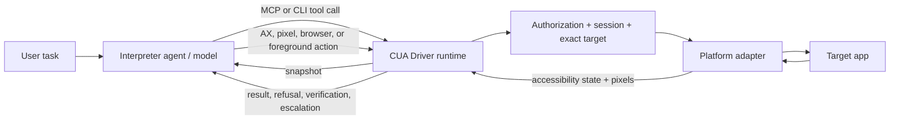

# CUA Driver research notes

**Research checked:** 3 October 2026

**Scope:** Open Interpreter's desktop computer-use driver, how it fits into Workstation, and what its Linux/Hyprland implementation really guarantees.

This is the research snapshot before the user's decision to make CUA Oryn's default `/computer` driver. The [local trial and subsequent integration](20-cua-driver-hyprland-experiment.md) record what was actually tested and adopted.

## Short answer

Open Interpreter's desktop app does not make the model itself into a privileged desktop driver. Its Workstation shell uses a maintained fork of TryCua's `cua-driver`; Open Interpreter owns the agent/runtime side, while the driver owns native desktop observation, input, target binding, and its own authorization checks. Workstation pins the driver so a desktop release can use a known revision.

The design's strongest idea for Oryn is this: **observe the target once with both its accessibility structure and a screenshot, choose the action route at the moment of acting, and let the driver return an explicit success/refusal/escalation signal.** That avoids asking the model to choose a perception “mode” before it has seen evidence. It also avoids pretending all surfaces support the same kind of background input.

This is research, not a proposed code change. The project guide says the user owns architecture decisions; nothing here changes the computer subsystem.

## First, the link points at the wrong layer

The supplied URL, [`deepwiki.com/openinterpreter/openinterpreter`](https://deepwiki.com/openinterpreter/openinterpreter), documents Open Interpreter's agent/coding harness. The desktop driver is a separate repository: [`openinterpreter/interpreter-cua`](https://github.com/openinterpreter/interpreter-cua), an Interpreter-maintained fork of [`trycua/cua`](https://github.com/trycua/cua). The desktop host is [`interpreter-workstation`](https://github.com/openinterpreter/interpreter-workstation), which pins the CUA driver as a submodule. So the useful reading path is Workstation integration → Interpreter's CUA fork → upstream CUA Driver source and docs.

DeepWiki is useful as a map, but it is generated and can lag the source. For platform claims, prefer the driver's current docs, release notes, and accepted E2E support ledger. In particular, do not use an old DeepWiki tool count or old “background everywhere” summary as a compatibility guarantee.

## Keep the product layers separate

| Layer | Responsibility |
| --- | --- |
| Open Interpreter / model harness | Conversation, model/provider calls, task reasoning, and deciding which tool to call |
| Workstation | Desktop shell, local host integration, policy/UX, and wiring the runtime to the machine |
| CUA Driver | Window/app discovery, accessibility and screenshots, native input, target checks, permission enforcement, and action results |
| Platform APIs | UI Automation (Windows), macOS Accessibility APIs, Linux AT-SPI plus X11/Wayland facilities, or browser CDP |

The driver is not the model and does not decide the whole task. It exposes typed operations through a Rust runtime, CLI, SDK, and MCP server. The agent chooses and sequences operations; the platform adapter performs the actual read/action and reports what it could prove.

The code is split along similar boundaries: `cua-driver` owns CLI/MCP and runtime lifecycle; `cua-driver-core` owns shared tool/session/authorization contracts; platform crates own OS-specific calls; `cua-driver-sdk` and generated UniFFI bindings expose the same native runtime to app code. Python/TypeScript SDK use is distinct from the agent-facing MCP boundary. The driver does not connect to a model provider. The generated Linux MCP reference documents dozens of tools (60 in its 0.28.1 snapshot); counts vary by platform and release, which is a reason to avoid dumping the whole catalog into every model request.



The daemon/proxy story is platform-specific. On macOS the launcher may proxy MCP requests to the signed app daemon so Accessibility and Screen Recording permissions remain attributed to the right app identity. Current docs say bare MCP owns the runtime directly on Linux and Windows; a daemon can still be used when a host needs a longer-lived service. Do not assume every OS uses the macOS TCC proxy design.

## The observation/action loop

### Observation returns two kinds of evidence together

`get_window_state` targets a specific native window and, by default, returns:

- a structured accessibility element list (preferred over parsing Markdown),
- a compatibility Markdown tree,
- a screenshot of that window,
- target/window metadata and status such as a degraded accessibility result.

The accessibility data can provide role, label/name, value, enabled/selected state, supported actions, parent/depth, and a frame when the platform reports usable bounds. The screenshot supplies rendered appearance, layout, text that is missing from the tree, and a way to distinguish repeated or blank labels. Either source can be incomplete or stale; the driver documentation explicitly says to cross-check them.

This is not “send three separate full inputs and make the model pick one.” The normal read is one observation. `include_screenshot:false` is a performance option when the caller only needs to refresh/re-index semantics; `query`, `max_elements`, and `max_depth` can narrow or cap tree output. A truncated tree does not prove an absent control. The model-facing client should use the structured entries instead of asking the model to reparse a large Markdown dump.

### The action address selects the rung

The agent does not choose an upfront `ax mode` or `vision mode`. It reads both, then chooses how to address a specific action:

| Action address | What it means | Typical use |
| --- | --- | --- |
| `element_index` / `element_token` | Ask the native accessibility provider to act on a semantic control | First choice for a button, field, menu item, or exposed value |
| `x, y` | Use a point from the screenshot already returned for that exact window | Repeated labels, unlabeled controls, canvas/visual target, or AX no-op |
| Browser page ref | Act on an exact bound browser tab/page through browser tools | A web page when explicit CDP/browser access is permitted |
| Desktop target | Screen-absolute coordinates rather than a single window | Work spanning windows or a control outside any one window |

Window actions use a window-local coordinate space; desktop actions use display coordinates. The exact target is supplied per call. The driver may implement a pixel-addressed click through accessibility hit-testing when that is the safe platform route, so “I passed x/y” does not prove that a raw physical pointer event occurred. Read the returned route instead of guessing from the tool name.

### The driver guides escalation using evidence

The documented agent policy starts with an accessibility action, usually in background mode. Its result can say:

- `confirmed` / `verified`: the driver read the changed state back through accessibility;
- `unverifiable`: it dispatched the action but could not prove the application changed;
- `suspected_noop`: the semantic action likely did nothing;
- `escalation.recommended`: a next route such as screenshot pixels, browser page tools, or foreground delivery, with a reason.

The caller reuses the same screenshot to choose a pixel point if needed; it does not recapture just to change action modality. It takes a new snapshot after the action to check the postcondition. Only accessibility readback can set `verified:true`; pixel/foreground dispatch success is not equivalent to task success.

Conceptually:

```text
find exact app/window
        ↓
one window snapshot: accessibility + screenshot
        ↓
semantic action (background by default)
        ├─ verified → continue from fresh state
        ├─ no-op / tree disagrees → pixel action grounded on same screenshot
        ├─ browser page route recommended → use exact page ref
        └─ background route unavailable → foreground only if authorized
```

The model still decides task intent. The driver supplies constrained mechanics and structured feedback; it does not magically infer that the user's intent is complete after one click.

## Fresh handles, target identity, and coordinates

App and window discovery happen before action. The intended window is bound by native process/window identity (PID plus window ID, where the platform supports it). Element handles belong to a particular snapshot: prefer the opaque `element_token` when available; a newer snapshot can invalidate it. Browser page refs are session/tab/snapshot scoped and are invalidated by navigation or newer snapshots. This is deliberate stale-target protection, not busywork.

The tree may expose element `frame` values and screenshot-relative geometry, but those values are not interchangeable. A model should use the exact coordinate system advertised for the action and image. On Linux, AT-SPI can return missing or unusable bounds; the driver can still return a semantic label. A coordinate copied from AT-SPI is not automatically a trustworthy screenshot pixel. Ground pixel actions on the screenshot associated with the same target and snapshot.

After an action, distinguish:

1. **Dispatch:** did the driver send/invoke something?
2. **Effect:** did the app change state?
3. **Task completion:** did the requested end result happen?

An OS API returning success can prove only dispatch. Fresh semantic state or visible pixels must prove the effect; a stronger app/file oracle may be needed to prove completion.

## What AT-SPI does and what it does not do

On Linux the Rust driver talks to AT-SPI over D-Bus; it does not require Python `pyatspi` or GI bindings at runtime. AT-SPI is how the driver gets roles, names, values, actions, and sometimes bounds. `click`/`type_text` with an element handle can use those semantic actions; it is not merely a tree printed beside a screenshot.

AT-SPI is still provided by each app/toolkit, not generated by Hyprland. A sparse tree can mean the app exposes little, the accessibility bridge is disabled/unavailable, the driver is on the wrong D-Bus session, or a Chromium/Electron renderer has not populated its tree yet. The current Linux guide says the daemon should run as the desktop user on the desktop session bus; `doctor` checks whether the actual `org.a11y.Bus` answers. A degraded/empty tree should carry a reason rather than be treated as evidence that the screen is blank. A single retry after lazy initialization can be reasonable; an indefinite retry loop is not.

For Chromium/Electron-like surfaces, accessible content may be late, incomplete, or disagree with what is rendered. In that case use fresh pixels or the separate browser route. Do not blindly type into a field just because an AX node echoed the requested text: that may not mean the app committed it.

### Optional visual parsing for sparse trees

The core driver can fall back to the screenshot and pixel coordinates. There is also an optional `cua-perception` extension that parses one retained window/desktop capture into model-neutral text and icon regions. The capture and input authority remain with the driver; a click based on a parsed region must carry the same one-use `capture_id` as the screenshot observation. This gives the agent named visual regions without pretending the app supplied accessibility semantics. It is an optional extension, not a guarantee that the base driver can semantically activate arbitrary drawn controls. Its bundled OmniParser detector is AGPL-3.0-only, while the core driver is MIT-licensed; that licensing boundary matters before redistributing or hosting the extension.

## Linux and Hyprland: do not overclaim

Linux support is compositor-specific. Wayland has no universal protocol that lets any client send raw input to an arbitrary obscured window. AT-SPI semantic actions can still work in the background, but raw keyboard/pointer input is often bound to current compositor focus. Correct coordinates alone do not create a safe per-window input channel.

| Environment | What the current source documents | Practical boundary |
| --- | --- | --- |
| X11 | Broadly tested via X11/XTest and AT-SPI, with toolkit-specific refusals | Some apps reject synthetic/background event routes; inspect the returned route and verify |
| Sway/wlroots | Native discovery/capture and tested protocol routes | Still not proof that another wlroots compositor has the same capabilities; raw input to an occluded target remains limited |
| GNOME/Mutter | AT-SPI plus a maintained WinRects helper and portal/libei foreground input | Requires helper and portal; different implementation from wlroots |
| KDE/KWin | AT-SPI and some identity/capture support | Target-specific foreground/raw input remains experimental or refused where target binding cannot be proven |
| Hyprland/Omarchy | Discovery/capture foundation and individual experimental plugin routes | Do not infer complete native foreground/background support from a working screenshot, element tree, or one successful app action |

The current driver support ledger records accepted E2E runs for X11/Openbox and Sway, and separate coverage for GNOME. Those are source-built fixture results, not a guarantee for every installed app. The same ledger says the complete native Hyprland GTK/Electron/Tauri suite still needs validation. An optional Hyprland plugin's default is discovery-only; experimental input candidates have narrower app/build/action qualification. Release notes also mention specific Hyprland fixes (such as semantic scrolling and background text routing). Those individual fixes do not mean every Hyprland app and input route is generally supported. Confirm the installed driver/plugin version, protocol, exact app, and the current support ledger before promising a behavior.

If background input is unavailable, the correct result is a structured refusal. Foreground escalation should be explicit and per action; it can raise the selected window and visibly take over the desktop. Do not silently fall back to global `wtype`/keyboard input after a failed exact-target action.

## Browser path is a separate adapter

Browser automation starts by selecting the exact native browser window, then binding that window to a browser target/tab. The browser adapter can return compact semantic page state and short-lived element refs, and can use CDP for screenshot, trusted input, or DOM/page operations.

Important boundaries:

- Reading browser state does not silently set up DevTools or launch another browser.
- `browser_prepare` is a separate setup/authorization step. Existing logged-in profile access is sensitive because CDP may expose cookies and page storage; attachment is explicit.
- Page refs expire after navigation/new snapshots and are tied to the selected session and tab.
- Trusted browser input and synthetic DOM events are different trust classes. A synthetic `el.click()` can be ignored by a trust-gated control; dispatch does not equal success.
- When the browser route is missing or unsupported, return to the native window path. Do not assume all Chromium forks, profiles, or Wayland compositor configurations have been product-validated.

This is why “AT-SPI versus DOM versus screenshot” is not a permanent three-way pick. The driver can first identify the native window; then the agent can use native accessibility, browser semantics when explicitly bound, or pixels when semantics are missing/ambiguous. The target and evidence determine the next action.

## Permissions and lifecycle

The permission mode is chosen by trusted runtime/launcher configuration and fixed for that runtime's lifetime. The current CUA docs describe `standard`, `bounded`, and `unrestricted` modes. A bounded manifest can allow specific tools, apps, browser origins, and file scopes; unrestricted requires a dangerous acknowledgement. A model tool argument cannot switch its own runtime to a wider mode. Existing-browser-profile attachment is its own explicit authorization boundary.

There are separate concepts that are easy to conflate:

- **Session:** lifecycle ownership for state such as cursor, recording, and cleanup.
- **Target:** the exact app window or display for this call.
- **Authorization:** what the runtime is allowed to do.
- **MCP connection:** how the agent sends tool requests to the driver.

The optional recording tools can save before/after accessibility snapshots, screenshots, action metadata (including arguments), and optional video. Recording is opt-in, but its files may contain private screen content and typed text; treat the output as sensitive local data. Installer telemetry is described as content-free and can be disabled separately.

## Why the system is not automatically fast

The driver can reduce unnecessary turns by combining accessibility and screenshot data in one observation, using a target-bound element handle, and providing a direct escalation hint. The model still pays for its reasoning round trip and each additional observation/action cycle. A bad prompt, overlong tree, repeated full-window snapshots, redundant pauses, poor tool schema, or waiting for an unsupported Wayland input route can erase the driver's advantages.

Useful speed principles that follow from their current design:

1. One useful snapshot before the first action; do not recapture just to switch from element to pixel targeting.
2. Prefer bounded structured rows and exact refs over sending a huge whole-app tree or parsing Markdown.
3. Skip the screenshot only when no pixel grounding is needed.
4. Verify after meaningful state changes; do not add arbitrary sleep-and-retry turns when the tool can return a precise failure.
5. Escalate the one failed action, not the whole task, and never retry an action whose delivery status is unknown without first observing the app.

## What is worth learning for Oryn

No subsystem is approved or implemented by this note. For a future design discussion, the transferable ideas are:

1. Keep observation sources and input execution as distinct responsibilities, but let one observation carry compact semantic structure and matching pixels.
2. Let action arguments select semantic versus pixel targeting; do not make the model choose an abstract perception mode before it sees the screen.
3. Make every semantic action refer to a fresh, exact target/snapshot and reject stale handles.
4. Return machine-readable `verified`, `unverifiable`, degraded, refusal, and next-route information. Do not equate command exit code with success.
5. Treat Linux support as a matrix of tested compositor × app/toolkit × action routes, not a single “Wayland supported” checkbox.
6. Use browser/CDP only after exact browser/tab binding and explicit profile authorization; keep it separate from generic desktop clicks.
7. Optimize the agent loop and evidence payload, not only the low-level click/typing implementation.

What not to copy blindly: CUA's large cross-platform tool catalog, its specific daemon/process architecture, product permissions, cursor overlay, optional perception extension, or any claim that its raw background routes work on this laptop. Oryn is intentionally narrower and educational; any new subsystem requires a separate architecture discussion.

## Reading map and source links

Primary references checked for this note:

- [DeepWiki: CUA overview](https://deepwiki.com/trycua/cua) — the repo-wide map, including the separate CUA Driver component.
- [DeepWiki: CUA Driver architecture and MCP tools](https://deepwiki.com/trycua/cua/6.1-agent-loop-architecture) — useful generated driver index; verify claims against source.
- [TryCua CUA Driver README](https://github.com/trycua/cua/blob/main/libs/cua-driver/README.md) — MCP/CLI/SDK roles, license and optional perception extension.
- [CUA Driver agent action policy](https://github.com/trycua/cua/blob/main/docs/content/docs/reference/cua-driver/action-selection-policy.mdx) — AX-first action ladder, effect/escalation signals, verification.
- [Capture and delivery modalities](https://github.com/trycua/cua/blob/main/docs/content/docs/concepts/capture-and-delivery-modalities.mdx) — observation, action rung, delivery mode, and target are separate axes.
- [Linux MCP tool reference](https://github.com/trycua/cua/blob/main/docs/content/docs/reference/cua-driver/mcp-tools-linux.mdx) — current Linux tool schemas and detailed `get_window_state` contract.
- [Linux driver skill](https://github.com/trycua/cua/blob/main/libs/cua-driver/rust/Skills/cua-driver/LINUX.md) — AT-SPI, session bus, Wayland and Hyprland limitations.
- [Empirical action-support ledger](https://github.com/trycua/cua/blob/main/libs/cua-driver/docs/action-support.md) — accepted test evidence versus gaps/refusals.
- [Bounded capability manifest guide](https://github.com/trycua/cua/blob/main/docs/content/docs/how-to-guides/driver/write-a-bounded-manifest.mdx) and [browser automation guide](https://github.com/trycua/cua/blob/main/docs/content/docs/how-to-guides/driver/drive-a-web-page.mdx) — authorization and browser boundaries.
- [Interpreter-maintained CUA fork](https://github.com/openinterpreter/interpreter-cua) and [Workstation README](https://github.com/openinterpreter/interpreter-workstation/blob/main/README.md) — how the desktop product pins and uses the driver.
- [CUA Driver 0.28.2 release notes](https://github.com/trycua/cua/releases/tag/cua-driver-rs-v0.28.2) — version-specific fixes; do not treat a fix as broad platform certification.

### Refresh this note before implementation

CUA Driver ships frequently, and its Linux/Hyprland support is especially version- and compositor-sensitive. Before using this as an implementation spec, check the installed version, the matching generated tool schema and skill pack, the current `action-support.md`, and any newer accepted Hyprland runs. Update this note with the source/version and observed behavior rather than silently carrying old claims forward.
