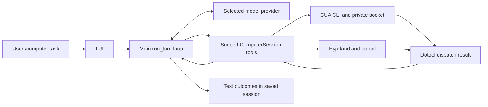

# `/computer` in the main Oryn loop

This chapter records the approved reform implemented after the CUA Hyprland trial. It describes the current TUI `/computer` path and why its boundaries were chosen. The older `src/computer.py` and `src/providers/computer.py` planner remain as legacy code but are not used by the TUI command. The measurements in the [earlier perception plan](18-computer-perception-plan.md) and [CUA trial](20-cua-driver-hyprland-experiment.md) motivated the design; they are not benchmarks of this new path.

## Goal and ownership

The selected Oryn model owns the user's task, chooses tools, interprets observations, and decides when to stop. The main conversation loop owns tool rounds, budgets, cancellation, context selection, and saved history. A `ComputerSession` supplies scoped desktop tools. CUA Driver observes windows, accessibility state, and screenshots, and verifies native predicates through the installed `cua-driver serve` process and `cua-driver call` over a private socket. Oryn does not use CUA's MCP transport or ComputerAgent planner. Dotool dispatches all input, including coordinate clicks and clicks derived from numbered CUA control frames, as well as keyboard input, text, right clicks, and scrolling.



The responsibilities stay in separate modules: the [TUI](../tui_app.py) starts the computer turn; the [conversation loop](../agent/conversation_loop.py) advertises its tools and manages history; [ComputerSession](../tools/computer_session.py) validates observations and actions; the [CUA adapter](../tools/cua_driver.py) owns the CLI/socket process; and the [Codex](../providers/codex.py) and [Gemini](../providers/gemini.py) providers translate image-bearing tool results into their API formats. The session store keeps the resulting text transcript through the existing conversation path.

## Decisions and reasons

| Decision | Reason | Cost or limit |
| --- | --- | --- |
| Let the selected model plan inside Oryn's main `run_turn` loop, with a mode-scoped tool catalog. | A computer task keeps prior chat context and can ask the user a question. It sees the four `computer_*` tools plus read-only web and project-file lookup; the harness also enforces that allowlist. Remote browser automation, terminal, writes, git, and MCP tools stay out of this mode. | A task needing those other capabilities must continue in normal chat. The model still needs a round after each input to inspect fresh state. |
| Keep CUA on `serve` plus `call` over a private CLI socket. | That is the installed route used in the local trial. Planning and transport are separate choices, so the new task flow does not need an MCP migration. | Each CLI call has process and serialization overhead. We have not compared that overhead with MCP in this flow. |
| Use CUA only for window discovery, accessibility, screenshots, and native verification; use dotool for every input, including clicks. | The accessibility tree still helps identify a control, but recent Hyprland click attempts returned an unsupported `global_input` route. Dotool already sends pointer input and keyboard/text input through the same local driver. | Dotool clicks are coordinate based and normally `unverifiable`; they require fresh state inspection. A numbered control without a safely mappable frame is refused. This does not establish that every app or Wayland surface will accept dotool input. |
| Prefer an exact CUA window, with a desktop route for launchers and surfaces without a usable window image. | A `pid` plus `window_id` keeps observations and native predicates tied to the chosen window. Desktop capture remains necessary for some Wayland surfaces and sparse accessibility trees. | When CUA cannot prove a window image, Oryn matches one Hyprland client before focusing it for a desktop capture. An ambiguous match is refused. Desktop input also rejects a changed active-window stamp. These checks cannot prove that page content stayed still. |
| Bound each observation and send its image only to the next model response. | The model needs pixels for visual UI and accessibility labels for semantic controls. A 500-element tree, 1200-pixel screenshot edge, and optional tree-only read bound the payload. Keeping old images out of later context avoids repeatedly sending the same screenshot; text outcomes remain in history. | A scaled image can hide fine details, and the saved transcript cannot reconstruct an old screenshot. The model can request a fresh view when needed. |
| Consume one `observation_id` for one input and return a fresh observation with the action result. | Clicking can change the UI before a second planned action. The ID and numbered-control mapping stop reuse of a stale snapshot. Returning the new state with the effect and route gives the model evidence for its next decision without a separate observe call. | More rounds may be needed than for a multi-action batch. A reported dispatch or `unverifiable` effect is not proof that the UI changed. |
| Keep only relevant computer skills in the computer-mode skill catalog; inline the core CUA and Dotool contract. | The core controls are already described in the computer prompt and tool schemas. The optional catalog contains only additional environment guides, so the model does not spend a round loading the same control rules or unrelated skills. When several optional skills apply, it can load them in the same response. | A non-computer skill is unavailable during `/computer`; use normal chat when the task needs it. A useful environment guide may still take one model round to load. |
| Interpret action effects as delivery evidence and recover only from fresh state. | The Driver and Hermes guidance both emphasize reading structured effects, checking state before retrying uncertain input, and treating escalation hints as signals rather than automatic commands. This addresses duplicate input after `unverifiable` results and repeated malformed calls. | Dotool reports that input was sent, not that the UI changed. The model must inspect the fresh observation before retrying. |
| Use CUA `verify_state` for exact native conditions; use `min_age_ms` for visual loading. | A native predicate can wait locally, with cancellation, for up to ten seconds without repeatedly asking the model to interpret screenshots. For a visual-only condition, model thinking time counts toward the requested image age, followed by one capture. | Native verification covers only supported window and element predicates. `unknown` stays unknown. A visual wait gives a fresh image, not an automatic proof of success. |
| Keep local desktop control separate from native `browser_*` tools. | Oryn's native browser tools use a remote Firecrawl session and are not advertised during `/computer`. Read-only web search/extraction may provide public context, but cannot operate local Brave or verify what is visible on the desktop. | Use normal chat for remote browser automation. A search result cannot prove local completion. |
| Reobserve after approval and require the model to reissue the same marked action. | An approval dialog can change focus or screen state. The user should approve a concrete action, and the model should inspect the current target before dispatch. | The model is instructed to mark sending, deleting, buying, publishing, and submitting. This is not a complete semantic classifier for every risky action; an unmarked computer action does not automatically trigger this computer-specific prompt. |

The old planner, CUA ComputerAgent, and a separate browser or site-specific polling layer are not part of this TUI path. The current tools are designed for general desktop tasks, with exact native checks where available and fresh visual evidence elsewhere. The [ComputerSession source](../tools/computer_session.py) is authoritative for supported actions and predicate fields.

## One interaction

1. The model calls `computer_observe({"mode":"windows"})` to see all visible window IDs, then chooses `mode="window"` with an exact `pid` and `window_id`. Mode-specific shapes are `{"mode":"windows"}`, `{"mode":"window","pid":811,"window_id":42}`, and `{"mode":"desktop"}`. The wrapper discards irrelevant optional fields on windows and desktop calls instead of forwarding them to CUA, but the model is instructed to omit them. The schema intentionally does not enforce the window-only PID/ID constraints globally: providers may validate irrelevant default fields before the wrapper can discard them. The window handler enforces `pid > 0` and `window_id >= 0` when that mode is selected. A listing invalidates an older actionable observation, so the model observes the selected window again before input. Desktop mode is available for launchers and surfaces without an exact window target. There is no automatic one-second switch period.
2. A window read asks CUA for at most 500 accessibility elements and a screenshot capped at a 1200-pixel long edge. A later `image=false` read can skip the image. If Wayland cannot prove a window screenshot, Oryn matches and focuses the exact Hyprland window, refreshes its tree, then captures a desktop image. The result names the image coordinate scope. If the match is ambiguous, observation fails safely and the model can choose another route.
3. The model calls `computer_act` with one allowlisted action and the current `observation_id`. The ID is consumed before dispatch. A stale ID, absent numbered control, unmappable control frame, or point outside the current image/display is rejected without the requested input. Dotool receives every click, key, text, right-click, and scroll. For `click_element`, Oryn maps the current control frame to its center in the selected monitor's screenshot coordinate frame before Dotool dispatch. CUA is never called to click. For key chords, `super+w` is valid syntax and `leftmeta` is a standalone tap; Oryn rejects `leftmeta+w` before dispatch with a correction.
4. Oryn returns the Dotool outcome and a fresh observation in that same tool result. Its text includes `screenshot_included:true/false`; when true, the matching screenshot is attached to that result. A window-scoped action returns an image of that exact window, even when the task may have changed which app is visible; use desktop mode for the current full screen in that case. A `windows` listing has no screenshot. The model inspects the image and status before choosing another action. `unverifiable` is about input-effect readback; it does not mean an image is absent or the action failed. A preflight refusal such as `active_window_changed` or `element_frame_unavailable` means the requested input was not sent. Unknown, timed-out, and interrupted actions are never replayed automatically.
5. If the next state is an exact native predicate, `computer_act.wait_for` or `computer_wait` calls CUA `verify_state` for that window, up to ten seconds, with cancellation. `unknown` remains unknown. For loading visible only in the image, `computer_observe.min_age_ms` delays only until the previous image has the requested age, counting model thinking time, and then captures once. After an app-launch/focus shortcut whose returned image is unchanged or scoped to the old window, the model may do at most one bounded desktop observation (`mode:"desktop"`, `min_age_ms` up to 5000), then inspect and replan; a windows listing is not a visual wait result.
6. For a marked external action, Oryn asks for approval, reobserves, and requires a fresh matching action before sending input. `computer_ask_user` gathers a clarification without ending the turn.

## Action outcomes and recovery

The tool's `effect` reports what the input route could establish. It does not by itself prove the user's requested outcome.

| Effect or result | Interpretation and next step |
| --- | --- |
| `confirmed` | The driver has readback evidence for the input. Check the task postcondition before reporting completion. |
| `partial` | Only part of the input may have landed. Inspect fresh state and repair only what remains. |
| `unverifiable` | The input route accepted/sent input without proving its UI effect. It says nothing about screenshot presence. Inspect the attached fresh image when `screenshot_included:true` (or request a screenshot if false) before considering another action; dotool reports this normally. |
| `suspected_noop` | The driver has evidence that the action probably did not change the target. Inspect state and choose a reasoned next step. |
| `refused` | The selected route did not send the requested input. For Oryn preflight reasons such as `active_window_changed`, `target_focus_failed`, or `element_frame_unavailable`, the requested click/key was not dispatched; inspect the fresh observation before choosing another action. An escalation hint is not permission or an automatic retry. CUA is not a click fallback. |
| `unknown`, timeout, or cancellation | Input may or may not have occurred. Never replay automatically; observe first. |

## Failure diagnosis from the Fern desktop run

The original run exposed an evidence and tool-boundary error. After the desktop shortcut, Oryn's `computer_act` path returned a fresh desktop observation with its screenshot attached. The assistant's later self-report said it had not taken a screenshot and inferred failure from `unverifiable` plus the window stamp, but the tool flow did return an image. That image could support “Brave is not visible in this frame yet”; neither `unverifiable` nor an unchanged stamp proves the launch failed permanently. The new `screenshot_included` field makes image availability explicit alongside the image itself.

The assistant then used `browser_open` and `browser_click`. Those are native Firecrawl tools operating in a remote browser session, not local Brave or CUA. A malformed/stale element reference and a guessed URL led to the wrong video. `/computer` now advertises and enforces a smaller tool set, so remote browser automation is unavailable there; read-only search can still identify a candidate page, but only `computer_*` can act on the local screen. The result must be checked in a fresh local screenshot. If launching an app appears delayed, take at most one bounded settle observation before replanning. Do not guess a URL or repeat a shortcut to create a wait.

The staged Brave smoke run found two more interface gaps. First, the model sent `leftmeta+w`; dotool warned that `leftmeta` is not a chord modifier, and Oryn reported `unknown`. The key validator now rejects that combination before dispatch and tells the model to use `super+w` for a chord or `leftmeta` alone. Second, after `super+w` returned an image scoped to the original `foot` window, the model called `computer_observe(mode="windows", min_age_ms=1000)`. That call waits then lists window metadata; it does not capture pixels. The excerpt is truncated before the full list, so it does not establish whether Brave appeared there. The updated guidance directs app-launch settling to one full-desktop screenshot before claiming the app is visibly open.

Computer traces now record an MCP status snapshot at task start and the duration of each MCP tool-directory lookup before a model request. The snapshot includes aggregate lifecycle counts and per-server state/connect duration, but no credentials, URLs, or error text. Together, these timings show whether MCP startup or directory assembly accounts for time before a model request, or whether the delay happened elsewhere.

For invalid arguments, the model should use the error's correction guidance once and should not repeat unchanged arguments. The adapter currently projects mode-specific observation arguments before calling CUA, which prevents irrelevant `pid`, `window_id`, or `image` defaults from reaching the backend on windows/desktop calls. If a corrected call fails again or no exposed route can complete the task, stop and report the limitation.

The external guidance we adapted is the [Cua Driver workflow](https://github.com/trycua/cua/blob/main/libs/cua-driver/rust/Skills/cua-driver/WORKFLOW.md), [Hermes computer-use prompt guidance at commit `762bc75`](https://github.com/NousResearch/hermes-agent/blob/762bc75/agent/prompt_builder.py#L3254-L3540), and [Hermes computer-use skill](https://github.com/NousResearch/hermes-agent/blob/main/skills/autonomous-ai-agents/computer-use/SKILL.md). Their action vocabularies and recovery rungs are specific to their wrappers; Oryn keeps its own `computer_*` schema and only adopts the general snapshot, evidence, and recovery principles.

## Example: wait for an app setting

Suppose the user asks, “Turn on dark mode in Settings, and tell me when it is on.” These IDs and labels are illustrative; the real app must expose the corresponding control before the model can use it.

1. `computer_observe({"mode":"windows"})` lists the candidate windows. The model selects Settings by its returned `pid` and `window_id`, then calls `computer_observe({"mode":"window","pid":811,"window_id":42})`.
2. If the fresh tree already reports the “Dark mode” check box selected, the model can stop. If it reports an unselected numbered control, say `[7]`, the model sends one action tied to that observation:

   ```json
   {
     "observation_id": "the-current-observation-id",
     "action": {"type": "click_element", "element_index": 7},
     "wait_for": {
       "element": {
         "selector": {"role": "check box", "label_contains": "Dark mode"},
         "selected": true
       }
     },
     "wait_timeout_ms": 5000
   }
   ```

3. `computer_act` sends that one click through Dotool, asks CUA to verify the predicate if the action was not refused or unknown, and returns the verification result plus a fresh observation. A verified selected state supports completion. If verification is `unknown` or the control disappeared, the model examines the new tree and image, then chooses another observation, a visual check, or a clarification. It does not repeat the click merely because the predicate was unknown.
4. If the app exposes only a visual toggle or spinner, the model uses the desktop or window screenshot and may call `computer_observe({"mode":"window","pid":811,"window_id":42,"min_age_ms":2000})`. Oryn waits only for any remaining part of the two seconds since the prior capture, takes one new image, and lets the model assess it. There is no repeated screenshot loop hidden inside that call.

This example shows the conditional boundary: Dotool sends the click, native facts can be checked by CUA, and visual facts still require the model to interpret a new image. It does not assume every Settings app has an accessible “Dark mode” check box.

## Boundaries and cost

Computer tool schemas and instructions are advertised only for a `/computer` turn. That turn exposes `computer_*` plus read-only web/file lookup, and the same allowlist is enforced at dispatch. It does not expose remote browser automation, terminal, file writes, git, or MCP tools. Only additional skills whose descriptions target computer work are offered; the core CUA and Dotool rules are already in the task prompt. The selected provider sends a screenshot as an image part of the corresponding tool result. After the next model response, Oryn drops the image bytes and replaces the old control list with a compact text summary; the action and verification outcomes and tool-call pairing remain in history. Normal context compaction and the normal turn budget still apply. The screenshot cap, bounded tree, optional tree-only read, one action per observation, and one final capture after a wait limit unnecessary model and image calls.

For dotool input to an exact window, Oryn matches CUA's pid and bounds to one Hyprland client, focuses it if required, and checks that focus changed. For desktop input, it rejects a changed active-window stamp. This does not prove arbitrary page content stayed unchanged during model thinking; the model still needs fresh observations and must treat tool feedback as evidence, not completion.

The dotool-only environment override retains desktop screenshots and actions, but has no CUA window directory or `verify_state`. Native CUA window screenshots can remain unavailable on Wayland. This implementation has not been exercised in a new live end-to-end desktop run; the [earlier CUA trial](20-cua-driver-hyprland-experiment.md) describes the routes tested before this reform. The local baseline measured a 5.83-second median model response across 249 saved responses and a 673-millisecond median screenshot capture across five captures; those different samples explain why we tried to avoid redundant model and image calls, but they cannot predict this flow's task latency or cost.
