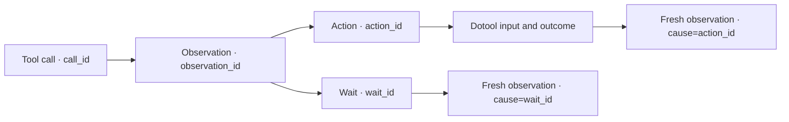

# Computer trace logging

This chapter describes the diagnostic trace written when Oryn runs with
`ORYN_COMPUTER_LOG_FILE`, normally set by `./scripts/computer-log.sh run`. It covers the
whole computer task, including any other tools the model calls during that task. The trace
is generic: it records event types and IDs, not rules for a particular website or app.

## What a trace connects

The JSONL file is the detailed record. `./scripts/computer-log.sh follow` renders it as a
timestamped, sequence-numbered terminal view, with color when connected to a terminal.
`NO_COLOR=1` disables color. `./scripts/computer-log.sh follow --raw` shows the raw records.

Each record has a `trace_id` shared by the task and a monotonically increasing `seq`. The
other IDs connect the parts that are easy to lose when reading a flat log:

| ID | Connects |
| --- | --- |
| `call_id` | A model tool call to its completion and bounded result preview |
| `observation_id` | The exact screenshot/accessibility observation used by the model and action |
| `action_id` | The requested action, mapped target, dotool input, outcome, and fresh observation |
| `wait_id` | A native predicate check and the observation captured after it |
| `cause` | A returned observation to the action or wait that led to it |

For a numbered-control click, the local trace records the control index, role, label, frame,
requested screenshot point when applicable, and the mapped monitor point. For other actions,
it records the requested input, the dotool command/result, elapsed time, and whether the next
observation included a screenshot. Startup events measure the delay from submitting the turn to
the worker, provider image-support check, computer-driver startup, and entry to the agent loop.
Each model request records preparation time separately from model-response time; failures and
retries record attempt duration and whether the provider call began. Model records include
counts and timings, not private reasoning text.



The logger keeps bounded details: at most 40 visible windows, 60 actionable controls in a
detailed observation entry, a 1,200-character accessibility excerpt, and 4,000-character
previews for tool arguments and results. It records lengths and whether a preview was cut off.
The live view abbreviates those records; use `--raw` when the full bounded local record is
needed.

## Local privacy boundary

The launcher creates each JSONL file with mode `0600`. It stores no screenshot pixels.
However, local records can contain task text, tool arguments/results, typed text, window
titles, accessibility labels and values, and a short accessibility-tree excerpt. Treat the
file as private; remove it when it is no longer useful.

The logging captures what Oryn can serialize about an observation. It does not preserve the
actual screenshot image, so it cannot later reproduce exactly what the vision model saw.
The trace does record screenshot dimensions, image scope, and whether an image was attached.

## Optional LangSmith export

LangSmith export is explicitly off unless `ORYN_LANGSMITH_TRACING=1` and `LANGSMITH_API_KEY`
are both set. `LANGSMITH_PROJECT` selects the project; the default is `oryn-computer`.
For example:

```bash
ORYN_LANGSMITH_TRACING=1 \
LANGSMITH_API_KEY='your-key' \
LANGSMITH_PROJECT='oryn-computer' \
./scripts/computer-log.sh run
```

The SDK runs on a background thread so remote tracing does not sit in the action path. Export
is best-effort: a missing SDK, bad key, or network failure is recorded in the local trace;
the local log continues. The background upload may not finish if the process is terminated
immediately after a task.

The remote trace excludes screenshot pixels, task and prompt text, final answer text, typed
text, full tool arguments/results, window titles, and full accessibility-tree excerpts. It
does retain timings, event names, IDs, action/target metadata, and control labels/frames.
Selection values for choice-like controls can also be present because they help diagnose
selection errors. Control labels and values may reveal what is on screen. Only enable remote
tracing when that data is acceptable to send to LangSmith.

The local JSONL file remains the detailed source; LangSmith is a remote overview and is not
needed for computer mode to run.

## Limits

- A screenshot is represented by metadata only, not an image artifact.
- Model reasoning is not logged. Tool calls and observable effects are logged, which is enough
  to connect choices to execution without storing hidden reasoning.
- Local tool outputs are bounded previews. Check `result_chars` and `result_truncated` before
  concluding that a result was complete.
- LangSmith delivery is asynchronous and best-effort; a local record can exist even when its
  remote span does not.
- This trace has no app-specific filtering or polling behavior. It records the general tool,
  observation, wait, input, and result events that occur during a computer task.

## Implementation map

- [`ComputerTrace`](../computer_logging.py) writes local JSONL and queues optional remote
  spans.
- [`ComputerSession`](../tools/computer_session.py) records windows, observations, targets,
  waits, actions, and resulting observations.
- [`HyprlandDriver`](../tools/computer_driver.py) records the actual dotool command and result.
- [`OrynTUI`](../tui_app.py) records all tool calls and model/turn diagnostics for computer
  tasks.
- [`computer_log_view.py`](../../scripts/computer_log_view.py) renders the readable live view.
