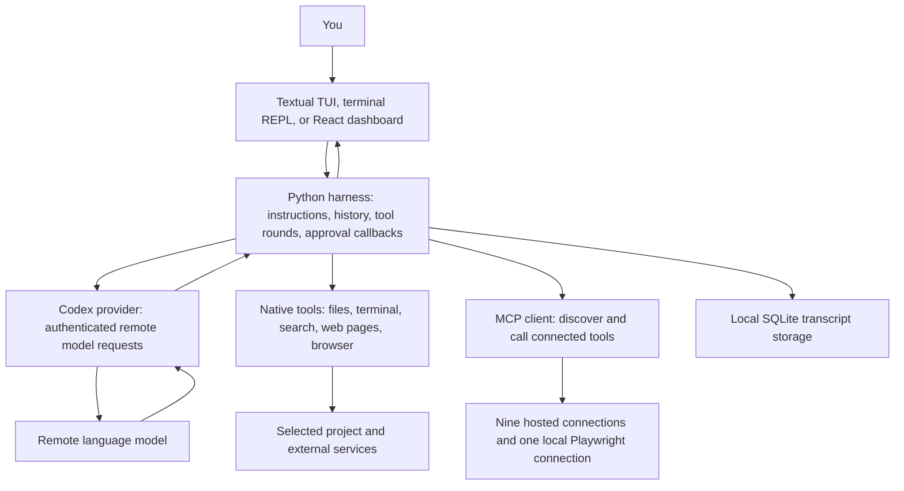

# The Oryn engineering handbook

**A detailed explanation of what we built, how it works, why it changed, and what remains unfinished.**

Documentation snapshot: **28 September 2026**. This handbook was written after inspecting the implementation, its tests, and the repository issue list. Later changes can make individual details stale; each chapter links to the code responsible for its behavior.

Follow-up chapters now include on-demand MCP schemas, explicit MCP opt-in, durable per-chat undo, scoped skills, one bounded read-only subagent, Git awareness, safe upstream traces, offline failure/context evaluations, a local first-release boundary, and a documented shared turn/API contract. The [core upgrade plan](16-core-upgrade-plan.md) records the earlier reliability milestone and its remaining limits.

Oryn is an educational local coding assistant. Its model runs remotely, while its Python harness, project tools, session database, and terminal interface run on the user's machine. It also has a local browser dashboard. The aim of this handbook is to let you explain and modify the system yourself, starting with the fundamentals and continuing through the implementation details.

## Contents

| Chapter | What it explains |
| --- | --- |
| [1. History and foundations](01-history-and-foundations.md) | Every implementation milestone, the original problems, and the difference between a model and an agent harness |
| [2. Architecture](architecture.md) | Processes, modules, data flow, responsibility boundaries, and the source tree |
| [3. Installation and configuration](02-installation-and-configuration.md) | Launchers, project selection, local credentials, dependency requirements, and configuration precedence |
| [4. Provider and models](03-provider-and-models.md) | Codex authentication, refresh, request serialization, streamed events, model effort, speed, and version compatibility |
| [5. Agent loop and context](04-agent-loop-and-context.md) | Tool rounds, callbacks, errors, cancellation, instructions, the 200k-token budget, rolling summaries, and incomplete reply annotations |
| [6. Sessions and recovery](05-session-storage-and-recovery.md) | SQLite, migrations, project binding, search, titles, pins, saved model settings, and the interrupted tea example |
| [7. Files, terminal, diffs, and undo](06-tools-files-terminal-and-undo.md) | What the LLM sends, what Python changes, exact replacement, full replacement, approval previews, Git comparisons, terminal jobs, and persistent undo |
| [8. Search, extraction, and browsing](07-web-search-extraction-and-browser.md) | The scraper failure, Tavily, Firecrawl, plain HTML extraction, browser actions, and safe retry boundaries |
| [9. MCP fundamentals and connections](08-mcp-fundamentals-and-connections.md) | Host/client/server roles, discovery, ten configured connections, identity, private repositories, and plugins |
| [10. MCP management and OAuth](09-mcp-manager-and-oauth.md) | Async ownership, reconnect, credential reload, persistent switches, TUI controls, Notion login, PKCE, and token storage |
| [11. Terminal UI](10-tui-guide-and-rendering.md) | Textual, worker messages, keyboard shortcuts, slash completion, searchable pickers, layout fixes, and theme matching |
| [12. Browser dashboard and Markdown](11-web-dashboard-and-markdown.md) | HTTP routes, browser streaming, React state, editable drafts, approval cards, code blocks, mathematical rendering, and languages |
| [13. Approvals and boundaries](12-approvals-security-and-boundaries.md) | The exact enforced checks, local HTTP protection, terminal isolation, remote permissions, and current limitations |
| [14. Testing and troubleshooting](13-testing-troubleshooting-and-operations.md) | Regression coverage, commands, local diagnostics, offline evaluations, and what verification does and does not prove |
| [15. Roadmap and benchmark preparation](14-roadmap-and-benchmark-readiness.md) | Current capability status, implementation of the ten tracked issues, remaining context work, and gradual benchmark preparation |
| [16. Native tool schema reference](15-native-tool-reference.md) | The precise arguments advertised to the model by the 22 built-in tools |
| [Core upgrade plan and progress](16-core-upgrade-plan.md) | Six selected improvements, their implementation, acceptance checks, and remaining limits |
| [17. Shared turn gateway and local API](17-shared-turn-gateway-and-api.md) | Common turn entry point, dashboard HTTP/NDJSON contract, persistence semantics, and future background lifecycle |
| [`/computer` perception reform](18-computer-perception-plan.md) | Measured baseline, opt-in AT-SPI observer, live test results, and staged browser design |
| [CUA Driver research notes](19-cua-driver-research.md) | Open Interpreter's CUA driver lineage, observation/action loop, AT-SPI and pixels, permissions, browser routing, and Linux/Hyprland limits |
| [CUA Hyprland trial](20-cua-driver-hyprland-experiment.md) | Isolated A/B result, integration decision, and remaining platform limits |
| [Manual smoke checklist](smoke-checklist.md) | A practical end-to-end checklist for the terminal and dashboard |

## Choose a reading path

### If you are learning from zero

Read chapters 1–3, then follow the worked request in [Architecture](architecture.md). Continue with the provider, loop, and file tools. These explain the core machinery before the interface and external connections.

### If you want to understand a bug

Start with [Troubleshooting](13-testing-troubleshooting-and-operations.md), find the affected layer, then follow its source links. For example, a missing tool output is a history/serialization problem; a Tavily authentication error is a search configuration problem; a wrapped tool picker row is a rendering problem.

### If you want to add a feature

Read [Architecture](architecture.md), the relevant chapter, and [Roadmap](14-roadmap-and-benchmark-readiness.md). Identify the smallest responsibility that should change. Follow the project rule: explain a proposed new subsystem and obtain the user's approval before implementing it.

### If you want to operate Oryn

Read [Installation](02-installation-and-configuration.md), [MCP management](09-mcp-manager-and-oauth.md), and the [Smoke checklist](smoke-checklist.md). Keep the troubleshooting chapter nearby.

## One picture of the whole system

## How to interpret examples

- **Current behavior** describes code that exists in this snapshot.
- **Historical behavior** describes earlier implementation choices or bugs repaired in Git history.
- **Proposed behavior** describes a future design. A diagram of a proposal does not mean it already works.
- Snippets labeled **simplified** show the mechanism while omitting surrounding validation or callbacks. They are explanations, not replacement production code.
- Tool calls and transcript examples use invented IDs, disposable files, and blank credentials. No personal token is included.
- Mermaid diagrams render in GitHub and compatible Markdown viewers. A plain text viewer shows the diagram source.

## Important distinctions to keep in mind

| Terms that sound similar | Actual distinction |
| --- | --- |
| Model / harness | The model proposes text and tool calls; the harness supplies context, executes approved calls, and manages the turn |
| Tool / MCP | A tool is an operation; MCP is a protocol through which a server advertises and executes operations |
| MCP / plugin | MCP defines communication; a plugin can package integrations, instructions, configuration, and other assets |
| Saved history / model context | SQLite keeps the transcript; each request receives only selected history that fits the budget |
| File preview / Git diff | A preview compares the file immediately before and after the proposed operation; Git compares particular repository states |
| Stopped / rolled back | Stopping prevents continued generation and upcoming work; completed approved edits remain until explicitly undone |
| Local interface / offline execution | The UI is local, but model requests and hosted tools need network access |
| Unit tests / agent benchmarks | Unit tests exercise mechanisms; benchmarks measure end-to-end task performance |
| Empty module / implemented subsystem | An empty Python file reserves a name. It does not implement its advertised responsibility |

## Glossary

| Term | Meaning in this handbook |
| --- | --- |
| API | A defined way for one program to request operations from another |
| Argument schema | A machine-readable description of the fields a tool expects |
| Atomic replacement | Install a prepared file as one replacement operation rather than first truncating the old target |
| Authentication | Establish which credential/account a request represents |
| Authorization | Decide which resources/actions that account may access |
| Callback | A function supplied by a caller that another component invokes when an event or decision is needed |
| Cancellation event | A shared signal telling ongoing work to stop at its supported cancellation points |
| Character budget | A size limit counted as text characters; distinct from a model token limit |
| Context | Instructions and evidence supplied to a particular model request |
| Context window | The model's input/output capacity, measured in tokens rather than Python characters |
| Coroutine | An async function execution that can yield while waiting for another operation |
| Developer message | A higher-priority instructional role used here for selected project guidance |
| Diff | A representation of differences between two states |
| Environment variable | A named process configuration value inherited or supplied at launch |
| Event loop | The scheduler that handles async work or UI events without blocking every task |
| Function call | A structured model request for a named tool operation |
| Harness | The program controlling model requests, context, tool execution, and turn lifecycle |
| HEAD | Git's current committed revision |
| Index / staging area | Git's prepared snapshot for the next commit |
| JSON | A structured data format for objects, arrays, strings, numbers, and related values |
| JWT | A token format with encoded claims; decoding claims locally is not signature verification |
| Markdown | Plain-text notation for headings, lists, code, links, and other document structures |
| MCP host | The application, Oryn, coordinating use of connected capabilities |
| MCP client | Protocol code communicating with an MCP server |
| MCP server | A program/endpoint exposing protocol capabilities and executing requests |
| Migration | Updating stored schema/data so older installations remain usable |
| NDJSON | A stream of independent JSON values separated by newlines |
| OAuth | An authorization flow allowing an application to obtain tokens for permitted service access |
| Owner task | The async task responsible for opening, maintaining, and closing one connection's contexts |
| PKCE | Proof Key for Code Exchange, connecting an OAuth authorization request to its code exchange |
| Project root | The selected directory against which project tool paths are resolved |
| Provider | The component translating harness requests/results to a model service protocol |
| Read-only hint | Server metadata classifying a tool; useful for policy but not a universal side-effect proof |
| REPL | A repeated read/evaluate/print-style interaction, here a line-based chat |
| SDK | A library implementing protocol/client details for an application |
| Session | A saved conversation and its project/model metadata |
| Snapshot | Captured state at a moment, such as old file bytes or a browser accessibility view |
| SSE | Server-sent events, the stream format consumed by the provider |
| SQLite | An embedded transactional database stored in a local file |
| stdio | Standard input/output pipes; used to communicate with a launched local MCP server |
| System prompt | The application's highest-level model instructions in its local history |
| Token | In models, a unit of encoded text; in authentication, a credential. These uses are unrelated |
| Tool result | Returned evidence associated with a specific tool-call ID |
| Transcript | The stored sequence of messages and tool data |
| Turn | One user request plus its model/tool rounds and outcome |
| TUI | A structured interactive interface drawn inside a terminal |
| UTF-8 | The character encoding used for project text, JSON transport, and examples |
| Working tree | The current on-disk repository files, which may differ from staged or committed content |

## Documentation maintenance

When changing a public command, tool schema, configuration file, limit, or persistence rule, update the corresponding chapter. When fixing a bug, add the failure mechanism and relevant test to the troubleshooting chapter. Keep credentials out of examples. Keep the history chapter historical rather than rewriting past milestones to resemble the latest code.

This handbook describes the actual project. It does not claim production certification, model training, persistent undo, subagent execution, or plugin loading that has not been implemented.
