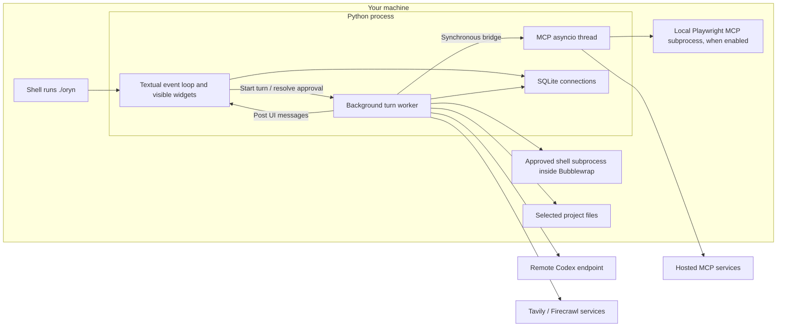
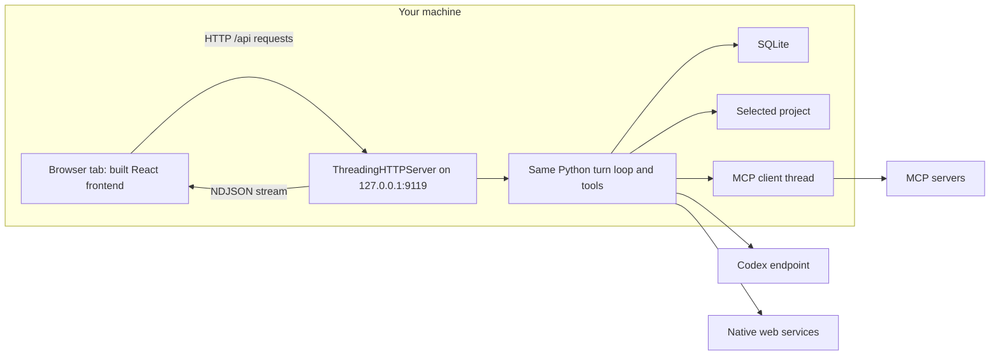
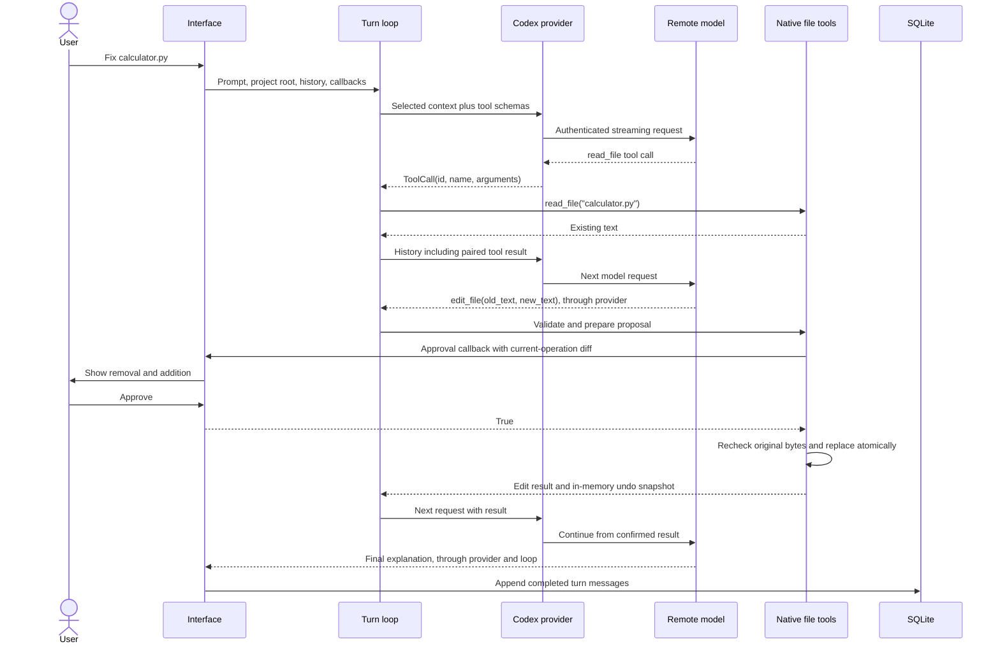
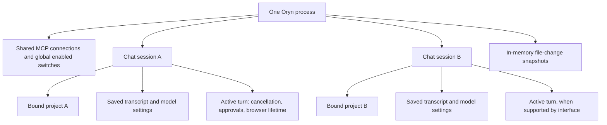

# Oryn architecture

[Handbook index](README.md) · [Previous: history](01-history-and-foundations.md) · [Next: installation](02-installation-and-configuration.md)

## 1. The problem the architecture solves

A language model produces text and structured requests. It does not directly operate your folder. Oryn supplies the program around the model: select a project, build instructions, load history, advertise tools, execute permitted requests, return results, display progress, and save the conversation.

The word **harness** means this surrounding machinery. A strong harness makes the model's capabilities usable and controlled. It cannot guarantee that every model answer is correct, but it can validate file paths, require approval, preserve call/result pairs, and report incomplete work accurately.

## 2. Responsibilities and their actual owners

| Responsibility | Implemented owner | What it does |
| --- | --- | --- |
| Codex transport | [codex.py](../providers/codex.py) | Reads login credentials, refreshes tokens, creates Responses requests, parses streaming responses |
| Provider result types | [types.py](../providers/types.py) | Defines a `ToolCall` and a `ModelResponse` |
| Turn execution | [conversation_loop.py](../agent/conversation_loop.py) | Repeats model requests and sequential tool execution, enforces round and result limits |
| Context selection | [context.py](../agent/context.py) | Keeps instructions and recent whole turns within a character budget |
| Product instructions | [system_prompt.py](../agent/system_prompt.py) | Supplies Oryn identity, formatting guidance, tool discipline, and recovery instructions |
| Project instructions | [project_context.py](../agent/project_context.py) | Reads a root `AGENTS.md` safely and with a size limit |
| Transcript storage | [sqlite_store.py](../session/sqlite_store.py) | Stores messages and session metadata, migrates schema, binds sessions to projects |
| Tool catalog and dispatch | [registry.py](../tools/registry.py) | Describes native operations and routes calls to implementations |
| File operations | [file_tools.py](../tools/file_tools.py) | Reads, searches, writes, edits, previews, records undo snapshots, and restores guarded changes |
| Terminal execution | [terminal_tool.py](../tools/terminal_tool.py) | Runs an approved command inside the configured Bubblewrap environment |
| Native web access | [web_tools.py](../tools/web_tools.py) | Tavily search, Firecrawl extraction, direct HTML extraction, public URL checks |
| Native browser interaction | [browser_tools.py](../tools/browser_tools.py) | Manages a Firecrawl cloud browser for one turn |
| Credential lookup | [secrets.py](../security/secrets.py) | Reads environment values or specific local key files |
| MCP presets | [discovery.py](../mcp/discovery.py) | Builds known server configurations and reads/writes enabled preferences |
| MCP runtime | [client.py](../mcp/client.py) | Connects servers, discovers tools, calls them, reconnects, and owns async lifetimes |
| MCP conversion | [adapter.py](../mcp/adapter.py) | Converts server tools/results into the harness's text/function format |
| Notion authorization | [oauth.py](../mcp/oauth.py) | Explicit browser OAuth login, callback validation, private token storage, CLI controls |
| Terminal REPL | [chat_demo.py](../chat_demo.py) | Original line-based chat and console approval callbacks |
| Full-screen terminal UI | [tui_app.py](../tui_app.py), [tui.tcss](../tui.tcss) | Textual widgets, worker messages, commands, pickers, approval dialogs, theme |
| Browser backend | [web_app.py](../web_app.py) | Local HTTP routes, streamed events, per-session turn state, approval waits |
| Browser frontend | [App.tsx](../../web/src/App.tsx), [components.tsx](../../web/src/components.tsx) | React state, timeline, composer, sessions, tool cards, approvals, Markdown |

Several responsibilities share a process without sharing a module. This makes the project small while keeping the important boundaries understandable.

## 3. Process layout: TUI



The TUI is an application in the terminal. It does not need to open a browser dashboard or run a separate localhost API server. Python imports the harness and uses it directly. The remote model and remote services remain separate systems.

The local Playwright server is a subprocess that Oryn starts through `npx`. Hosted MCP connections are outbound network connections; Oryn does not launch a copy of Linear, Notion, or GitHub on the laptop.

## 4. Process layout: dashboard



The browser receives rendered application data, not unlimited direct filesystem access. The Python backend decides which project a session belongs to and validates tool operations. A path displayed in the UI is project metadata, not a browser capability to read that path.

## 5. End-to-end worked request

Suppose the selected project contains `calculator.py`:

```python
def add(a, b):
    return a - b
```

You ask: **“Fix the addition bug in calculator.py.”**



This illustrates the core division of work:

1. **The model chooses** a tool and proposes arguments.
2. **Python validates** those arguments and constructs the actual operation.
3. **The interface requests approval** when the operation requires it.
4. **The tool executes** only after the applicable checks and approval.
5. **The result returns to the model**, so its next answer can use real evidence.

A model response saying “I fixed it” is not the file operation. A successful tool result is the evidence that the implementation changed the file. Verification, if run, supplies additional evidence about behavior.

## 6. Data representations at each boundary

| Boundary | Representation | Why it exists |
| --- | --- | --- |
| User → UI | Text draft | What the person is currently typing |
| UI → loop | Python history dictionaries and callbacks | Shared harness interface independent of a particular renderer |
| Provider → endpoint | JSON Responses payload | The remote API's request format |
| Endpoint → provider | Server-sent events | Text deltas, function calls, and completion/error events |
| Provider → loop | `ModelResponse` containing text and `ToolCall` objects | A small local representation |
| Loop → native tool | Named operation with JSON-derived arguments | Explicit execution boundary |
| Loop → MCP client | Namespaced tool name and arguments | Routing to the correct external server |
| Tool → history | Text result with call ID | Evidence associated with the request that caused it |
| Harness → SQLite | JSON message strings | Preserve roles, content, call metadata, and turn status |
| Web backend → browser | One JSON event per line | Stream UI activity through `fetch` |

The provider stream and dashboard stream are different formats. The provider reads SSE from Codex. The dashboard emits NDJSON to the browser. Calling both “streaming” is fine; assuming they use the same wire protocol causes confusion.

## 7. Where project access comes from

The selected project root is resolved from the current directory or an explicit `--project` option. A saved session remembers its root. The tool dispatcher passes that root to file and terminal functions.

Simplified:

```python
project_root = Path(args.project or Path.cwd()).resolve()
result = read_file(project_root, path="calculator.py")
```

Inside the tool, the path is resolved and checked against the selected root. The actual implementation also rejects private configuration paths. The model receives a project description and available operations; it does not gain unrestricted OS powers from seeing a string such as `/path/to/project`.

The program installation directory and active project directory are separate. The launcher adds the installation directory to `PYTHONPATH`, while preserving the shell's current directory for project selection. This is why one installation can operate on multiple folders.

## 8. Existing state scopes



The dashboard tracks active turns per session and can have different sessions active concurrently. The TUI presents one active conversation and blocks switching operations during its turn. MCP enable/disable state is global, so connection reconfiguration waits while turns are active.

SQLite records outlive a process. Undo snapshots do not. A native Firecrawl browser belongs to a turn and is closed when that turn ends. These lifetime differences explain many behaviors that otherwise look inconsistent.

## 9. The source tree: what exists and what is scaffolding

The implemented areas are shown above. These files or areas are still empty placeholders at this snapshot:

| Area | Placeholder files | Do not infer |
| --- | --- | --- |
| Additional agent machinery | `agent.py`, `compression.py`, `prompt_builder.py`, `turn.py` in `src/agent` | A second agent engine or automatic summarization |
| Extra providers | `base.py`, `groq.py`, `router.py` in `src/providers` | Working Groq integration or provider routing |
| Alternate session layer | `models.py`, `search.py`, `store.py` in `src/session` | Separate ORM or search subsystem; actual search is in SQLite store |
| Generic security layer | `approvals.py`, `permission.py` in `src/security` | A general policy engine; actual checks live in tools and interface bridges |
| Subagents | `manager.py`, `task.py`, `aggregation.py` in `src/subagents` | Spawned agents, task scheduling, or result aggregation |
| Memory | Files in `src/memory` | Semantic memory, embeddings, or cross-session learned facts |
| Scheduling | Files in `src/cron` | Scheduled autonomous work |
| Plugins | `hooks.py`, `loader.py`, `registry.py` in `src/plugins` | Installation, loading, or execution of plugins |
| Alternate execution environments | Files in `src/environments` | Docker, SSH, or interchangeable execution backends |
| Gateway and messaging platforms | Files in `src/gateway` and its platforms | Discord/Telegram operation or a unified gateway |
| Packaged CLI skeleton | Files in `src/hermes-cli` | An installed global CLI; the actual entrypoint is the repository launcher |
| Future native tools | `cron_tools.py`, `delegation_tools.py`, `memory_tool.py`, `toolsets.py` | Working scheduled, delegated, or memory operations |

Creating documentation here fills the previously empty architecture document. It does not implement these other placeholders.

## 10. Architectural decisions made so far

**Python for the TUI:** the existing provider, loop, tools, and store were Python. Textual lets the UI call them directly. A Go UI could work, but it would need a communication boundary to Python or a rewrite of those responsibilities. The extra processor is a consequence of keeping the Python backend while introducing a separate Go executable; Go itself does not inherently require two backends.

**SQLite for local persistence:** it ships with Python, supports transactions, and fits the local educational product. There is no database service to install.

**Standard library for native HTTP and files:** existing requirements are small. MCP and Textual are used where a real protocol/UI library helps; basic file and HTTP operations use Python facilities.

**Separate UI bridges:** the REPL, TUI, and dashboard share the core loop but supply different approval and display callbacks. A unified gateway is an open roadmap issue, not current behavior.

**Explicit side-effect boundaries:** file mutation constructs a proposal, asks approval, rechecks the file, then applies it. The LLM's plan is converted into a concrete reviewable action.

**Bounded work:** history, tool output, search results, command time, and model rounds have limits. Limits make failure behavior understandable; they are not a substitute for token-aware context engineering or production execution management.
